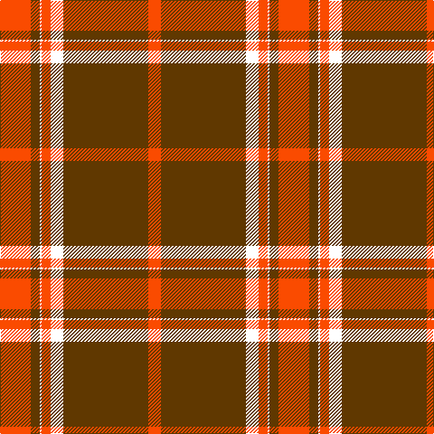

This page is one **sett** — a single exact thread-count. It belongs to the [tartan](/tartans/r17dy5w1r5w7dy47r7/)
(the same proportion at any scale), whose colour order is pattern [RGWRWGR](/stripes/rgwrwgr/).

Sourced from register-of-tartans.  It is a [7 stripe tartan](/stripes/stripes7/).

Original link https://www.tartanregister.gov.uk/tartanDetails.aspx?ref=11309

## Register references

External register numbers recorded for this tartan.

- Scottish Register of Tartans: [11309](https://www.tartanregister.gov.uk/tartanDetails.aspx?ref=11309)

## Thread count
R/34 T10 W2 R10 W14 T94 R/14

## Palette

Palette: <strong>Tartan Register</strong>
<table><thead><tr><th>Colour</th><th>Threads</th><th>Shade</th><th>Base</th><th>OKLCh</th></tr></thead><tbody><tr><td>R/</td><td style="text-align:right;font-variant-numeric:tabular-nums">34</td><td><code style="background-color:#FA4B00;">#FA4B00</code> <small style="color:#888">#FA4B00</small></td><td>R <code style="background-color:#CC0000;">#CC0000</code></td><td><small style="color:#888">oklch(65.7% 0.220 36.9)</small></td></tr><tr><td>T</td><td style="text-align:right;font-variant-numeric:tabular-nums">10</td><td><code style="background-color:#603800;">#603800</code> <small style="color:#888">#603800</small></td><td>G <code style="background-color:#006100;">#006100</code></td><td><small style="color:#888">oklch(38.1% 0.084 66.7)</small></td></tr><tr><td>W</td><td style="text-align:right;font-variant-numeric:tabular-nums">2</td><td><code style="background-color:#FFFFFF;">#FFFFFF</code> <small style="color:#888">#FFFFFF</small></td><td>W <code style="background-color:#F7F7F7;">#F7F7F7</code></td><td><small style="color:#888">oklch(100.0% 0.000 89.9)</small></td></tr><tr><td>R</td><td style="text-align:right;font-variant-numeric:tabular-nums">10</td><td><code style="background-color:#FA4B00;">#FA4B00</code> <small style="color:#888">#FA4B00</small></td><td>R <code style="background-color:#CC0000;">#CC0000</code></td><td><small style="color:#888">oklch(65.7% 0.220 36.9)</small></td></tr><tr><td>W</td><td style="text-align:right;font-variant-numeric:tabular-nums">14</td><td><code style="background-color:#FFFFFF;">#FFFFFF</code> <small style="color:#888">#FFFFFF</small></td><td>W <code style="background-color:#F7F7F7;">#F7F7F7</code></td><td><small style="color:#888">oklch(100.0% 0.000 89.9)</small></td></tr><tr><td>T</td><td style="text-align:right;font-variant-numeric:tabular-nums">94</td><td><code style="background-color:#603800;">#603800</code> <small style="color:#888">#603800</small></td><td>G <code style="background-color:#006100;">#006100</code></td><td><small style="color:#888">oklch(38.1% 0.084 66.7)</small></td></tr><tr><td>R/</td><td style="text-align:right;font-variant-numeric:tabular-nums">14</td><td><code style="background-color:#FA4B00;">#FA4B00</code> <small style="color:#888">#FA4B00</small></td><td>R <code style="background-color:#CC0000;">#CC0000</code></td><td><small style="color:#888">oklch(65.7% 0.220 36.9)</small></td></tr></tbody></table>

# Sample pattern

## Nearest tartans

The nearest existing variants by ΔTartan distance, with this tartan at the top so the swatches line up against it.

ΔTartan

Tartan

Sett

—

<a href="/ttd/edit/#slug=r17dy5w1r5w7dy47r7~x2">Pride of Cleveland Fall</a> <a class="nn-out" href="/setts/s7/r17dy5w1r5w7dy47r7~x2/" title="open its dictionary page">↗</a>

0.89

<a href="/ttd/edit/#slug=r4g24r6g4r4g6r44g1w4~x2">Baluch Regiment</a> <a class="nn-out" href="/setts/s9/r4g24r6g4r4g6r44g1w4~x2/" title="open its dictionary page">↗</a>

1.07

<a href="/ttd/edit/#slug=r2dg20r2db8r36dg1~x2">Robertson</a> <a class="nn-out" href="/setts/s6/r2dg20r2db8r36dg1~x2/" title="open its dictionary page">↗</a>

1.14

<a href="/ttd/edit/#slug=r40w2db2w2r1ly20~x2">National Defense</a> <a class="nn-out" href="/setts/s6/r40w2db2w2r1ly20~x2/" title="open its dictionary page">↗</a>

1.17

<a href="/ttd/edit/#slug=r36dg18r4dg6k1w2~x2">MacGregor #3</a> <a class="nn-out" href="/setts/s6/r36dg18r4dg6k1w2~x2/" title="open its dictionary page">↗</a>

1.19

<a href="/ttd/edit/#slug=r41g19r7g8k1w3~x2">MacGregor #4</a> <a class="nn-out" href="/setts/s6/r41g19r7g8k1w3~x2/" title="open its dictionary page">↗</a>

1.21

<a href="/ttd/edit/#slug=r3dg16r4k6r28dg1r3~x2">Maxwell Ancient</a> <a class="nn-out" href="/setts/s7/r3dg16r4k6r28dg1r3~x2/" title="open its dictionary page">↗</a>

1.27

<a href="/ttd/edit/#slug=r36g18r4g6k1w2~x2">MacGregor</a> <a class="nn-out" href="/setts/s6/r36g18r4g6k1w2~x2/" title="open its dictionary page">↗</a>

1.28

<a href="/ttd/edit/#slug=r36dg18r4dg6k1lb2">MacGregor</a> <a class="nn-out" href="/setts/s6/r36dg18r4dg6k1lb2/" title="open its dictionary page">↗</a>

1.28

<a href="/ttd/edit/#slug=r3g16r4k6r28g1r3~x2">Maxwell</a> <a class="nn-out" href="/setts/s7/r3g16r4k6r28g1r3~x2/" title="open its dictionary page">↗</a>

1.30

<a href="/ttd/edit/#slug=r5g20r5g3r4g5r36g1w4~x2">Fitzgerald/Baluchistan</a> <a class="nn-out" href="/setts/s9/r5g20r5g3r4g5r36g1w4~x2/" title="open its dictionary page">↗</a>

## Neighbour map

Every grey dot is one of 14299 variants placed by the first two principal components of the ΔTartan feature space (44% of its variance). Red is this tartan; blue dots are its nearest — click one to open its page.

<svg viewBox="0 0 640 380" role="img" style="max-width:100%;height:auto;border:1px solid #e0e0e0;border-radius:4px;display:block" xmlns="http://www.w3.org/2000/svg"><image href="/nn/cloud.v1.png" width="640" height="380"/><a href="/setts/s9/r4g24r6g4r4g6r44g1w4~x2/"><circle cx="449.0" cy="121.8" r="4" fill="#3465a4"><title>Baluch Regiment</title></circle></a><a href="/setts/s6/r2dg20r2db8r36dg1~x2/"><circle cx="424.9" cy="154.0" r="4" fill="#3465a4"><title>Robertson</title></circle></a><a href="/setts/s6/r40w2db2w2r1ly20~x2/"><circle cx="409.3" cy="104.2" r="4" fill="#3465a4"><title>National Defense</title></circle></a><a href="/setts/s6/r36dg18r4dg6k1w2~x2/"><circle cx="422.0" cy="134.2" r="4" fill="#3465a4"><title>MacGregor #3</title></circle></a><a href="/setts/s6/r41g19r7g8k1w3~x2/"><circle cx="428.4" cy="137.8" r="4" fill="#3465a4"><title>MacGregor #4</title></circle></a><a href="/setts/s7/r3dg16r4k6r28dg1r3~x2/"><circle cx="428.6" cy="156.0" r="4" fill="#3465a4"><title>Maxwell Ancient</title></circle></a><a href="/setts/s6/r36g18r4g6k1w2~x2/"><circle cx="422.3" cy="138.7" r="4" fill="#3465a4"><title>MacGregor</title></circle></a><a href="/setts/s6/r36dg18r4dg6k1lb2/"><circle cx="426.0" cy="139.6" r="4" fill="#3465a4"><title>MacGregor</title></circle></a><a href="/setts/s7/r3g16r4k6r28g1r3~x2/"><circle cx="436.9" cy="163.2" r="4" fill="#3465a4"><title>Maxwell</title></circle></a><a href="/setts/s9/r5g20r5g3r4g5r36g1w4~x2/"><circle cx="434.1" cy="138.0" r="4" fill="#3465a4"><title>Fitzgerald/Baluchistan</title></circle></a><circle cx="417.9" cy="123.7" r="5" fill="#c00000"/></svg>

ID: /setts/s7/r17dy5w1r5w7dy47r7~x2/
