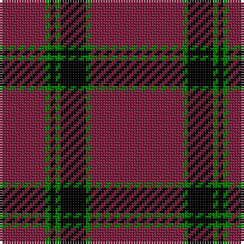

In pattern [RGKGKGR](/patterns/rgkgkgr/).

This was sourced from weddslist.  It is a [7 stripes tartan](/stripes/stripes7/).

Original link http://www.weddslist.com/cgi-bin/tartans/pg.pl?source=sts

## Thread count
DR/18 G2 K2 G2 K10 G2 DR/36

## Palette
Each colour and its ΔE from the base-6 reference it is a variant of.

| Colour | Shade | Base | ΔE (OKLab) |
|---|---|---|---|
| DR | <code style="background-color:#802040;">#802040</code> `#802040` | R <code style="background-color:#CC0000;">#CC0000</code> | 0.17 |
| G | <code style="background-color:#008000;">#008000</code> `#008000` | G <code style="background-color:#006100;">#006100</code> | 0.10 |
| K | <code style="background-color:#000000;">#000000</code> `#000000` | K <code style="background-color:#000000;">#000000</code> | 0.00 |

# Sample pattern

## Nearest tartans

The nearest existing variants by ΔTartan distance.

1. [Inverness - 2000 (Fashion)](/setts/s8/r64k8w3k8w3b4w3r18x2~b3850c8-k101010-r880000-wfcfcfc/) — ΔT 1.52
1. [Southern Illinois University - Carbondale](/setts/s9/k5b40k4w2k4b10w4b5w1x2~b75263d-k101010-wffffff/) — ΔT 1.60
1. [University of Chicago (Corporate)](/setts/s8/r32k2r4k2r2k8r30w3x2~k000000-r8c0000-wc8c8c8/) — ΔT 1.64
1. [Southern Illinois University (Corp.)](/setts/s9/k5r40k4w2k4r10w4r5w1x2~k101010-r901c38-we0e0e0/) — ΔT 1.65
1. [Royal Army PTC Assoc. (Military)](/setts/s8/k59r3k6r3k8r15k2y3x2~k101010-rc80000-ye8c000/) — ΔT 1.65
1. [Murray of Ochtertyre #2](/setts/s8/k30r3k2r3k2r27k30r4x2~k101010-rc80000/) — ΔT 1.66
1. [Lynch Variant](/setts/s6/r12b3r7b52g4b4x2~b500050-g005020-rdc0000/) — ΔT 1.66
1. [Rose](/setts/s9/g2r28b6r5b2r2b2r11y2x2~b000052-g11450d-raa0000-yaaaaaa/) — ΔT 1.67
1. [Rose](/setts/s9/g2r28b6r5b2r2b2r11y2~b000052-g11450d-raa0000-yaaaaaa/) — ΔT 1.67
1. [Highland Brewing Company](/setts/s8/k42b2r3k5r16k8y2k3x2~b2888c4-k101010-ra00000-ye8c000/) — ΔT 1.69

## Neighbour map

Every grey dot is one of 15726 variants placed by the first two principal components of the ΔTartan feature space (44% of its variance). Red is this tartan; blue dots are its nearest — click one to open its page.

<svg viewBox="0 0 640 380" role="img" style="max-width:100%;height:auto;border:1px solid #e0e0e0;border-radius:4px;display:block" xmlns="http://www.w3.org/2000/svg"><image href="/nn/cloud.v1.png" width="640" height="380"/><a href="/setts/s8/r64k8w3k8w3b4w3r18x2~b3850c8-k101010-r880000-wfcfcfc/"><circle cx="484.8" cy="133.5" r="4" fill="#3465a4"><title>Inverness - 2000 (Fashion)</title></circle></a><a href="/setts/s9/k5b40k4w2k4b10w4b5w1x2~b75263d-k101010-wffffff/"><circle cx="513.2" cy="126.9" r="4" fill="#3465a4"><title>Southern Illinois University - Carbondale</title></circle></a><a href="/setts/s8/r32k2r4k2r2k8r30w3x2~k000000-r8c0000-wc8c8c8/"><circle cx="565.7" cy="183.8" r="4" fill="#3465a4"><title>University of Chicago (Corporate)</title></circle></a><a href="/setts/s9/k5r40k4w2k4r10w4r5w1x2~k101010-r901c38-we0e0e0/"><circle cx="525.9" cy="126.0" r="4" fill="#3465a4"><title>Southern Illinois University (Corp.)</title></circle></a><a href="/setts/s8/k59r3k6r3k8r15k2y3x2~k101010-rc80000-ye8c000/"><circle cx="538.8" cy="154.8" r="4" fill="#3465a4"><title>Royal Army PTC Assoc. (Military)</title></circle></a><a href="/setts/s8/k30r3k2r3k2r27k30r4x2~k101010-rc80000/"><circle cx="437.3" cy="210.3" r="4" fill="#3465a4"><title>Murray of Ochtertyre #2</title></circle></a><a href="/setts/s6/r12b3r7b52g4b4x2~b500050-g005020-rdc0000/"><circle cx="530.4" cy="193.7" r="4" fill="#3465a4"><title>Lynch Variant</title></circle></a><a href="/setts/s9/g2r28b6r5b2r2b2r11y2x2~b000052-g11450d-raa0000-yaaaaaa/"><circle cx="509.0" cy="162.2" r="4" fill="#3465a4"><title>Rose</title></circle></a><a href="/setts/s9/g2r28b6r5b2r2b2r11y2~b000052-g11450d-raa0000-yaaaaaa/"><circle cx="509.0" cy="162.2" r="4" fill="#3465a4"><title>Rose</title></circle></a><a href="/setts/s8/k42b2r3k5r16k8y2k3x2~b2888c4-k101010-ra00000-ye8c000/"><circle cx="480.2" cy="164.2" r="4" fill="#3465a4"><title>Highland Brewing Company</title></circle></a><circle cx="508.3" cy="186.3" r="5" fill="#c00000"/></svg>

ID: /setts/s7/r18g1k5g1k1g1r9x2~g008000-k000000-r802040/
