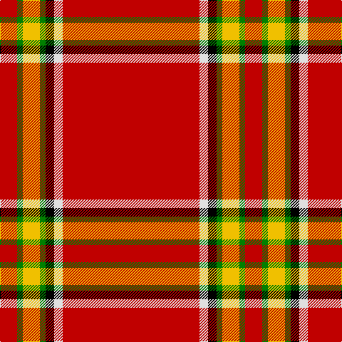

In pattern [RGYGKWR](/patterns/rgygkwr/).

This was sourced from weddslist.  It is a [7 stripes tartan](/stripes/stripes7/).

Original link http://www.weddslist.com/cgi-bin/tartans/pg.pl?source=sts

## Thread count
R/24 G8 Y24 G8 K12 LN12 R/192

## Palette
Each colour and its ΔE from the base-6 reference it is a variant of.

| Colour | Shade | Base | ΔE (OKLab) |
|---|---|---|---|
| G | <code style="background-color:#008000;">#008000</code> `#008000` | G <code style="background-color:#006100;">#006100</code> | 0.10 |
| K | <code style="background-color:#000000;">#000000</code> `#000000` | K <code style="background-color:#000000;">#000000</code> | 0.00 |
| LN | <code style="background-color:#E0E0E0;">#E0E0E0</code> `#E0E0E0` | W <code style="background-color:#F7F7F7;">#F7F7F7</code> | 0.07 |
| R | <code style="background-color:#C00000;">#C00000</code> `#C00000` | R <code style="background-color:#CC0000;">#CC0000</code> | 0.03 |
| Y | <code style="background-color:#F0C000;">#F0C000</code> `#F0C000` | Y <code style="background-color:#F2BF00;">#F2BF00</code> | 0.00 |

# Sample pattern

## Nearest tartans

The nearest existing variants by ΔTartan distance.

1. [Ferguson the Astronomer](/setts/s7/r192w12k12g8y24g8r24-g006818-k101010-rc80000-wfcfcfc-ye8c000/) — ΔT 0.31
1. [Hackston, or Halkerston](/setts/s8/r112w4k24y6r24y6r24g6-g008000-k000000-rc00000-we0e0e0-yf0c000/) — ΔT 0.91
1. [Princess Elizabeth (Royal)](/setts/s8/r144k12w4k22y4b4y4r36-b2c2c80-k101010-rc80000-wc0c0c0-ye8c000/) — ΔT 0.98
1. [Earl of Inverness (Royal)](/setts/s8/r100b10w5b14y4ba8y4r24-b1c1c50-ba2c2c80-rc80000-we0e0e0-ye8c000/) — ΔT 1.01
1. [Hackston (Green stripe) (Portrait)](/setts/s8/r102y4k22ya6r22ya6r22g6-g006818-k101010-rc80000-yb8b8b8-yabc8c00/) — ΔT 1.05
1. [Junor](/setts/s9/r144g12y4g22b4g4b4r18k4-b8080d0-g30a010-k000000-rc00000-yf0c000/) — ΔT 1.16
1. [Princess Elizabeth Royal Family Tartan Tartan Number: 1613. Earliest known date: pre 2003 Also Earl of Inverness See products available Copyright © Blair Urquhart, Comrie, 2015](/setts/s8/r84k8w2k12y2b2y2r24-b2c2c80-k101010-rc80000-we0e0e0-ye8c000/) — ΔT 1.21
1. [Swiss National (Fashion)](/setts/s8/w20r94b4r4b4r36ba6w8-b2c2c80-ba202060-rc80000-we0e0e0/) — ΔT 1.23
1. [Brodie, of that Ilk and the Burn](/setts/s8/r96w8b8k8r24b8r2y8-b304080-k000000-rc00000-we0e0e0-yf0c000/) — ΔT 1.26
1. [Brodie of that Ilk & the Burn Clan Tartan Tartan Number: 1684. Earliest known date: 1856 Peters' book, 'The Baronage of Angus and Mearns' (1856), provides the full title of this tartan which also appears in the manuscript prepared for the Vestiarium Scoticum. Peters did not give any clue to the origin of the tartan. See products available Copyright © Blair Urquhart, Comrie, 2015](/setts/s8/r96w8b8k8r24b8r2y8-b2c2c80-k101010-rc80000-we0e0e0-ye8c000/) — ΔT 1.28

## Neighbour map

Every grey dot is one of 15726 variants placed by the first two principal components of the ΔTartan feature space (44% of its variance). Red is this tartan; blue dots are its nearest — click one to open its page.

<svg viewBox="0 0 640 380" role="img" style="max-width:100%;height:auto;border:1px solid #e0e0e0;border-radius:4px;display:block" xmlns="http://www.w3.org/2000/svg"><image href="/nn/cloud.v1.png" width="640" height="380"/><a href="/setts/s7/r192w12k12g8y24g8r24-g006818-k101010-rc80000-wfcfcfc-ye8c000/"><circle cx="520.8" cy="101.5" r="4" fill="#3465a4"><title>Ferguson the Astronomer</title></circle></a><a href="/setts/s8/r112w4k24y6r24y6r24g6-g008000-k000000-rc00000-we0e0e0-yf0c000/"><circle cx="501.2" cy="99.3" r="4" fill="#3465a4"><title>Hackston, or Halkerston</title></circle></a><a href="/setts/s8/r144k12w4k22y4b4y4r36-b2c2c80-k101010-rc80000-wc0c0c0-ye8c000/"><circle cx="553.0" cy="86.8" r="4" fill="#3465a4"><title>Princess Elizabeth (Royal)</title></circle></a><a href="/setts/s8/r100b10w5b14y4ba8y4r24-b1c1c50-ba2c2c80-rc80000-we0e0e0-ye8c000/"><circle cx="485.6" cy="101.5" r="4" fill="#3465a4"><title>Earl of Inverness (Royal)</title></circle></a><a href="/setts/s8/r102y4k22ya6r22ya6r22g6-g006818-k101010-rc80000-yb8b8b8-yabc8c00/"><circle cx="524.7" cy="116.5" r="4" fill="#3465a4"><title>Hackston (Green stripe) (Portrait)</title></circle></a><a href="/setts/s9/r144g12y4g22b4g4b4r18k4-b8080d0-g30a010-k000000-rc00000-yf0c000/"><circle cx="532.8" cy="75.1" r="4" fill="#3465a4"><title>Junor</title></circle></a><a href="/setts/s8/r84k8w2k12y2b2y2r24-b2c2c80-k101010-rc80000-we0e0e0-ye8c000/"><circle cx="569.0" cy="82.4" r="4" fill="#3465a4"><title>Princess Elizabeth Royal Family Tartan Tartan Number: 1613. Earliest known date: pre 2003 Also Earl of Inverness See products available Copyright © Blair Urquhart, Comrie, 2015</title></circle></a><a href="/setts/s8/w20r94b4r4b4r36ba6w8-b2c2c80-ba202060-rc80000-we0e0e0/"><circle cx="513.7" cy="119.5" r="4" fill="#3465a4"><title>Swiss National (Fashion)</title></circle></a><a href="/setts/s8/r96w8b8k8r24b8r2y8-b304080-k000000-rc00000-we0e0e0-yf0c000/"><circle cx="514.6" cy="75.5" r="4" fill="#3465a4"><title>Brodie, of that Ilk and the Burn</title></circle></a><a href="/setts/s8/r96w8b8k8r24b8r2y8-b2c2c80-k101010-rc80000-we0e0e0-ye8c000/"><circle cx="522.4" cy="77.1" r="4" fill="#3465a4"><title>Brodie of that Ilk &amp; the Burn Clan Tartan Tartan Number: 1684. Earliest known date: 1856 Peters' book, 'The Baronage of Angus and Mearns' (1856), provides the full title of this tartan which also appears in the manuscript prepared for the Vestiarium Scoticum. Peters did not give any clue to the origin of the tartan. See products available Copyright © Blair Urquhart, Comrie, 2015</title></circle></a><circle cx="513.7" cy="100.2" r="5" fill="#c00000"/></svg>

ID: /setts/s7/r192w12k12g8y24g8r24-g008000-k000000-rc00000-we0e0e0-yf0c000/
