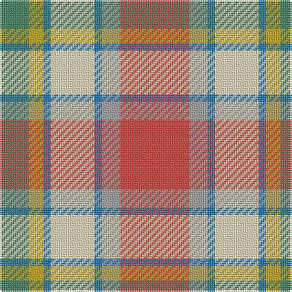

**Bands:** [GYBWBYR](/stripes/gybwbyr/) · **Stripes:** [G LY B W B LR R](/stripes/stripes7/) G LY B W B LR R

This was sourced from tartans-authority.  It is a [7 band tartan](/bands/bands7/).

Original link http://www.tartansauthority.com/tartan-ferret/display/956/

## Attestations

This cloth appears in 2 source records; the oldest owns this page.

- 1959 — Northern Ontario (District) (tartans-authority, [record](http://www.tartansauthority.com/tartan-ferret/display/956/))
- 01/01/2002 — Ontario, Northern (register-of-tartans, [record](https://www.tartanregister.gov.uk/tartanDetails.aspx?ref=3255))

## Register references

External register numbers recorded for this tartan.

- Scottish Register of Tartans: [3255](https://www.tartanregister.gov.uk/tartanDetails.aspx?ref=3255)
- Scottish Tartans Authority (ITI): 956
- Scottish Tartans World Register: 956

## Thread count
G/16 DY8 B4 W24 B4 N10 R/38

## Palette
Each colour and its ΔE from the base-6 reference it is a variant of.

| Colour | Shade | Base | ΔE (OKLab) |
|---|---|---|---|
| B | <code style="background-color:#1474B4;">#1474B4</code> `#1474B4` | B <code style="background-color:#2A418A;">#2A418A</code> | 0.15 |
| DY | <code style="background-color:#C8A400;">#C8A400</code> `#C8A400` | Y <code style="background-color:#F2BF00;">#F2BF00</code> | 0.10 |
| G | <code style="background-color:#408060;">#408060</code> `#408060` | G <code style="background-color:#006100;">#006100</code> | 0.14 |
| N | <code style="background-color:#A0A0A0;">#A0A0A0</code> `#A0A0A0` | Y <code style="background-color:#F2BF00;">#F2BF00</code> | 0.21 |
| R | <code style="background-color:#DC4038;">#DC4038</code> `#DC4038` | R <code style="background-color:#CC0000;">#CC0000</code> | 0.07 |
| W | <code style="background-color:#F8E4BC;">#F8E4BC</code> `#F8E4BC` | W <code style="background-color:#F7F7F7;">#F7F7F7</code> | 0.08 |

# Sample pattern

## Nearest tartans

The nearest existing variants by ΔTartan distance.

1. [Porcupine City of](/setts/s7/r10n3db1lb8db1lo2g5~x4/) — ΔT 1.13
1. [Christie (London) (Personal)](/setts/s6/ly5k2g4t18r25w5~x2/) — ΔT 1.30
1. [Ontario, Northern](/setts/s7/o17y5db2w12db2ly4g7~x2/) — ΔT 1.40
1. [Ball](/setts/s6/lo13b8r5k3w2g1~x4/) — ΔT 1.42
1. [Barbour Dress](/setts/s7/o4do2o21db11w2o20r3~x2/) — ΔT 1.48
1. [Satchidananda (Personal)](/setts/s9/dy18ly4t10w2r20ly5r2w2dy6~x2/) — ΔT 1.51
1. [Jacobite, Silk sash](/setts/s10/w2r8o5ly6w5g21w6r8r4w2/) — ΔT 1.53
1. [Bruce of Kinnaird (Fashion)](/setts/s10/lo22ly22dr2lb6dr2lo2dr16lg5lo8lb2~x2/) — ΔT 1.54
1. [Brittany Hunting French Fancy Tartan Tartan Number: 5977. Earliest known date: 2003 For Richard and Anne-Marie Duclos of Le Coudray-Montceaux, France. Based on the Breton National at 3902. The term Randonnée (Walking) is used in the sense of the Scottish category, Hunting. See products available Copyright © Blair Urquhart, Comrie, 2015](/setts/s9/t4dy27lr8k4lr8k4lr8r11ly3~x2/) — ΔT 1.57
1. [MacLean, dress](/setts/s6/ly1t3r8g6w12r1~x4/) — ΔT 1.58

## Neighbour map

Every grey dot is one of 14313 variants placed by the first two principal components of the ΔTartan feature space (44% of its variance). Red is this tartan; blue dots are its nearest — click one to open its page.

<svg viewBox="0 0 640 380" role="img" style="max-width:100%;height:auto;border:1px solid #e0e0e0;border-radius:4px;display:block" xmlns="http://www.w3.org/2000/svg"><image href="/nn/cloud.v1.png" width="640" height="380"/><a href="/setts/s7/r10n3db1lb8db1lo2g5~x4/"><circle cx="116.6" cy="163.2" r="4" fill="#3465a4"><title>Porcupine City of</title></circle></a><a href="/setts/s6/ly5k2g4t18r25w5~x2/"><circle cx="189.9" cy="148.2" r="4" fill="#3465a4"><title>Christie (London) (Personal)</title></circle></a><a href="/setts/s7/o17y5db2w12db2ly4g7~x2/"><circle cx="105.2" cy="173.7" r="4" fill="#3465a4"><title>Ontario, Northern</title></circle></a><a href="/setts/s6/lo13b8r5k3w2g1~x4/"><circle cx="151.2" cy="151.4" r="4" fill="#3465a4"><title>Ball</title></circle></a><a href="/setts/s7/o4do2o21db11w2o20r3~x2/"><circle cx="190.0" cy="167.3" r="4" fill="#3465a4"><title>Barbour Dress</title></circle></a><a href="/setts/s9/dy18ly4t10w2r20ly5r2w2dy6~x2/"><circle cx="152.6" cy="153.9" r="4" fill="#3465a4"><title>Satchidananda (Personal)</title></circle></a><a href="/setts/s10/w2r8o5ly6w5g21w6r8r4w2/"><circle cx="89.7" cy="138.0" r="4" fill="#3465a4"><title>Jacobite, Silk sash</title></circle></a><a href="/setts/s10/lo22ly22dr2lb6dr2lo2dr16lg5lo8lb2~x2/"><circle cx="132.9" cy="134.1" r="4" fill="#3465a4"><title>Bruce of Kinnaird (Fashion)</title></circle></a><a href="/setts/s9/t4dy27lr8k4lr8k4lr8r11ly3~x2/"><circle cx="119.6" cy="150.4" r="4" fill="#3465a4"><title>Brittany Hunting French Fancy Tartan Tartan Number: 5977. Earliest known date: 2003 For Richard and Anne-Marie Duclos of Le Coudray-Montceaux, France. Based on the Breton National at 3902. The term Randonnée (Walking) is used in the sense of the Scottish category, Hunting. See products available Copyright © Blair Urquhart, Comrie, 2015</title></circle></a><a href="/setts/s6/ly1t3r8g6w12r1~x4/"><circle cx="159.2" cy="164.8" r="4" fill="#3465a4"><title>MacLean, dress</title></circle></a><circle cx="135.9" cy="160.6" r="5" fill="#c00000"/></svg>

ID: /setts/s7/r19lr5b2w12b2ly4g8~x2/
