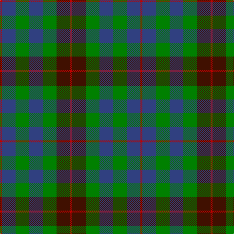

In pattern [RBGBGBR](/patterns/rbgbgbr/).

This was sourced from weddslist.  It is a [7 stripes tartan](/stripes/stripes7/).

Original link http://www.weddslist.com/cgi-bin/tartans/pg.pl?source=sts

## Thread count
R/4 B28 G28 B28 G28 DR28 R/4

## Palette
Each colour and its ΔE from the base-6 reference it is a variant of.

| Colour | Shade | Base | ΔE (OKLab) |
|---|---|---|---|
| B | <code style="background-color:#304080;">#304080</code> `#304080` | B <code style="background-color:#2A418A;">#2A418A</code> | 0.02 |
| DR | <code style="background-color:#401000;">#401000</code> `#401000` | B <code style="background-color:#2A418A;">#2A418A</code> | 0.24 |
| G | <code style="background-color:#008000;">#008000</code> `#008000` | G <code style="background-color:#006100;">#006100</code> | 0.10 |
| R | <code style="background-color:#C00000;">#C00000</code> `#C00000` | R <code style="background-color:#CC0000;">#CC0000</code> | 0.03 |

# Sample pattern

## Nearest tartans

The nearest existing variants by ΔTartan distance.

1. [Hebrides #8](/setts/s8/b7r3g7r1g7r3b7ba1x2~b2c2c80-ba5c8ca8-g006818-rc80000/) — ΔT 0.85
1. [Fletcher of Dunans](/setts/s7/b10k3b10k14r2g14r5x2~b1870a4-g006818-k101010-rc80000/) — ΔT 0.89
1. [Unidentified Pinafore](/setts/s7/g24k4g24k24b7r24b7x2~b3c82af-g005020-k101010-r960028/) — ΔT 0.90
1. [MacIntyre Hunting Clan Tartan Tartan Number: 56. Earliest known date: 1930-50 This sample comes from the MacGregor-Hastie collection which forms the basis of the cloth archive of the Scottish Tartans Society. Some of the samples, including this one, were unmarked. One can assume that the sample dates between 1930 and 1950. See products available Copyright © Blair Urquhart, Comrie, 2015](/setts/s7/k12g12k2g12k12b12ba3x2~b2c2c80-ba5c8ca8-g006818-k101010/) — ΔT 0.93
1. [MacCallum](/setts/s7/g21k6b3g11k17ba17k3x2~b5c8ca8-ba2c2c80-g006818-k101010/) — ΔT 0.94
1. [MacNeil of Colonsay Clan Tartan Tartan Number: 196. Earliest known date: 1906 This sett is the usual modern form that appeared in Johnston's publication of 1906. MacNeil tartans had been produced by Wilson's of Bannockburn since the earliest pattern book of 1819 and various changes were made to the sett. The present form of the tartan appears to be developed from Wilson's early samples. It is substantially different from the certified version in the Highland Society of London collection. See products available Copyright © Blair Urquhart, Comrie, 2015](/setts/s7/b4g6w1g6k6b6k2x4~b2c2c80-g006818-k101010-we0e0e0/) — ΔT 0.95
1. [MacNeil of Colonsay (Clan)](/setts/s7/b16g14w2g14k13b12k4x2~b202060-g006818-k101010-wfcfcfc/) — ΔT 0.97
1. [MacNeil of Colonsay](/setts/s7/b4g6w1g6k6b6k2x2~b2c2c80-g285800-k101010-wffffff/) — ΔT 0.97
1. [Wellington or Waterloo Commemorative Tartan Tartan Number: 154. Earliest known date: pre 2003 Name derived from Wilson letters 1821 and 1824 See products available Copyright © Blair Urquhart, Comrie, 2015](/setts/s6/b3g6k6b4r1b1x2~b5c8ca8-g006818-k101010-rc80000/) — ΔT 1.00
1. [MacKay](/setts/s7/b8g8b1g8k8b8y2x2~b2c4084-g005020-k101010-ye8c000/) — ΔT 1.02

## Neighbour map

Every grey dot is one of 15726 variants placed by the first two principal components of the ΔTartan feature space (44% of its variance). Red is this tartan; blue dots are its nearest — click one to open its page.

<svg viewBox="0 0 640 380" role="img" style="max-width:100%;height:auto;border:1px solid #e0e0e0;border-radius:4px;display:block" xmlns="http://www.w3.org/2000/svg"><image href="/nn/cloud.v1.png" width="640" height="380"/><a href="/setts/s8/b7r3g7r1g7r3b7ba1x2~b2c2c80-ba5c8ca8-g006818-rc80000/"><circle cx="191.2" cy="243.8" r="4" fill="#3465a4"><title>Hebrides #8</title></circle></a><a href="/setts/s7/b10k3b10k14r2g14r5x2~b1870a4-g006818-k101010-rc80000/"><circle cx="138.6" cy="247.3" r="4" fill="#3465a4"><title>Fletcher of Dunans</title></circle></a><a href="/setts/s7/g24k4g24k24b7r24b7x2~b3c82af-g005020-k101010-r960028/"><circle cx="190.1" cy="264.1" r="4" fill="#3465a4"><title>Unidentified Pinafore</title></circle></a><a href="/setts/s7/k12g12k2g12k12b12ba3x2~b2c2c80-ba5c8ca8-g006818-k101010/"><circle cx="177.2" cy="279.9" r="4" fill="#3465a4"><title>MacIntyre Hunting Clan Tartan Tartan Number: 56. Earliest known date: 1930-50 This sample comes from the MacGregor-Hastie collection which forms the basis of the cloth archive of the Scottish Tartans Society. Some of the samples, including this one, were unmarked. One can assume that the sample dates between 1930 and 1950. See products available Copyright © Blair Urquhart, Comrie, 2015</title></circle></a><a href="/setts/s7/g21k6b3g11k17ba17k3x2~b5c8ca8-ba2c2c80-g006818-k101010/"><circle cx="202.6" cy="257.0" r="4" fill="#3465a4"><title>MacCallum</title></circle></a><a href="/setts/s7/b4g6w1g6k6b6k2x4~b2c2c80-g006818-k101010-we0e0e0/"><circle cx="154.5" cy="275.2" r="4" fill="#3465a4"><title>MacNeil of Colonsay Clan Tartan Tartan Number: 196. Earliest known date: 1906 This sett is the usual modern form that appeared in Johnston's publication of 1906. MacNeil tartans had been produced by Wilson's of Bannockburn since the earliest pattern book of 1819 and various changes were made to the sett. The present form of the tartan appears to be developed from Wilson's early samples. It is substantially different from the certified version in the Highland Society of London collection. See products available Copyright © Blair Urquhart, Comrie, 2015</title></circle></a><a href="/setts/s7/b16g14w2g14k13b12k4x2~b202060-g006818-k101010-wfcfcfc/"><circle cx="170.5" cy="265.1" r="4" fill="#3465a4"><title>MacNeil of Colonsay (Clan)</title></circle></a><a href="/setts/s7/b4g6w1g6k6b6k2x2~b2c2c80-g285800-k101010-wffffff/"><circle cx="158.5" cy="275.8" r="4" fill="#3465a4"><title>MacNeil of Colonsay</title></circle></a><a href="/setts/s6/b3g6k6b4r1b1x2~b5c8ca8-g006818-k101010-rc80000/"><circle cx="153.7" cy="253.9" r="4" fill="#3465a4"><title>Wellington or Waterloo Commemorative Tartan Tartan Number: 154. Earliest known date: pre 2003 Name derived from Wilson letters 1821 and 1824 See products available Copyright © Blair Urquhart, Comrie, 2015</title></circle></a><a href="/setts/s7/b8g8b1g8k8b8y2x2~b2c4084-g005020-k101010-ye8c000/"><circle cx="197.5" cy="270.3" r="4" fill="#3465a4"><title>MacKay</title></circle></a><circle cx="177.3" cy="260.8" r="5" fill="#c00000"/></svg>

ID: /setts/s7/r1b7g7b7g7ba7r1x4~b304080-ba401000-g008000-rc00000/
