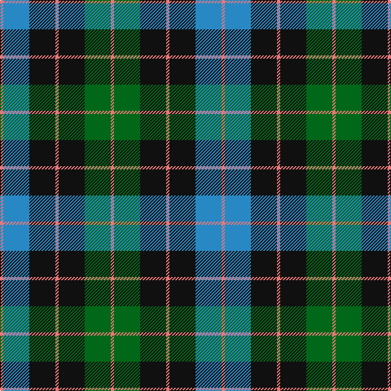

In pattern [RBKRKGR](/patterns/rbkrkgr/).

This was sourced from register-of-tartans.  It is a [7 stripes tartan](/stripes/stripes7/).

Original link https://www.tartanregister.gov.uk/tartanDetails.aspx?ref=4149

## Attestations

This cloth appears in 2 source records; the oldest owns this page.

- 01/02/2003 — Triad Highland Games Proposed (register-of-tartans, [record](https://www.tartanregister.gov.uk/tartanDetails.aspx?ref=4149))
- 2003 Feb — Triad Highland Games (Corporate) (tartans-authority, [record](http://www.tartansauthority.com/tartan-ferret/display/6527/))

## Thread count
LR/4 B32 K32 LR4 K32 G32 LR/4

## Palette
Each colour and its ΔE from the base-6 reference it is a variant of.

| Colour | Shade | Base | ΔE (OKLab) |
|---|---|---|---|
| B | <code style="background-color:#2888C4;">#2888C4</code> `#2888C4` | B <code style="background-color:#2A418A;">#2A418A</code> | 0.21 |
| G | <code style="background-color:#006818;">#006818</code> `#006818` | G <code style="background-color:#006100;">#006100</code> | 0.02 |
| K | <code style="background-color:#101010;">#101010</code> `#101010` | K <code style="background-color:#000000;">#000000</code> | 0.17 |
| LR | <code style="background-color:#E87878;">#E87878</code> `#E87878` | R <code style="background-color:#CC0000;">#CC0000</code> | 0.19 |

# Sample pattern

## Nearest tartans

The nearest existing variants by ΔTartan distance.

1. [Melville](/setts/s6/k4w2g13k13b12k2~b608c9c-g408060-k101010-wfcfcfc~x2/) — ΔT 0.74
1. [Flower of Scotland](/setts/s6/b3g28b3k16b28r3~b304080-g008000-k000000-rc00000/) — ΔT 0.79
1. [Daks, Navy](/setts/s8/r5g12b4ba4b22g18b4r5~b000050-ba304080-g008000-rc00000/) — ΔT 0.83
1. [MacArthur of Milton, hunting](/setts/s6/g14b2g2k8ba9k2~b304080-ba800080-g008000-k000000~x2/) — ΔT 0.86
1. [Scotsburn Croft](/setts/s9/y16k3y16k26b4k26r20k3r8~b780078-k101010-r888888-y48a4c0/) — ΔT 0.89
1. [Blair](/setts/s7/b3r1b10k8g10r1g3~b304080-g008000-k000000-rc00000~x4/) — ΔT 0.93
1. [MacTavish / Thom(p)son, hunting](/setts/s6/b4r28g6b12k12b3~b5480b0-g008000-k000000-r806050~x2/) — ΔT 0.94
1. [Fletcher of Dunans](/setts/s7/b6k1b6k8r1g8r2~b304080-g008000-k000000-rc00000~x2/) — ΔT 0.95
1. [U.S. Border Patrol](/setts/s8/k10b10k15g40k15b10k10y3~b1474b4-g408060-k101010-ye8c000~x2/) — ΔT 0.95
1. [Murray](/setts/s6/b2k2b12k8g11r2~b304080-g008000-k000000-rc00000~x2/) — ΔT 0.96

## Neighbour map

Every grey dot is one of 15726 variants placed by the first two principal components of the ΔTartan feature space (44% of its variance). Red is this tartan; blue dots are its nearest — click one to open its page.

<svg viewBox="0 0 640 380" role="img" style="max-width:100%;height:auto;border:1px solid #e0e0e0;border-radius:4px;display:block" xmlns="http://www.w3.org/2000/svg"><image href="/nn/cloud.v1.png" width="640" height="380"/><a href="/setts/s6/k4w2g13k13b12k2~b608c9c-g408060-k101010-wfcfcfc~x2/"><circle cx="163.3" cy="238.3" r="4" fill="#3465a4"><title>Melville</title></circle></a><a href="/setts/s6/b3g28b3k16b28r3~b304080-g008000-k000000-rc00000/"><circle cx="203.5" cy="215.8" r="4" fill="#3465a4"><title>Flower of Scotland</title></circle></a><a href="/setts/s8/r5g12b4ba4b22g18b4r5~b000050-ba304080-g008000-rc00000/"><circle cx="171.6" cy="230.7" r="4" fill="#3465a4"><title>Daks, Navy</title></circle></a><a href="/setts/s6/g14b2g2k8ba9k2~b304080-ba800080-g008000-k000000~x2/"><circle cx="174.5" cy="226.4" r="4" fill="#3465a4"><title>MacArthur of Milton, hunting</title></circle></a><a href="/setts/s9/y16k3y16k26b4k26r20k3r8~b780078-k101010-r888888-y48a4c0/"><circle cx="194.5" cy="210.6" r="4" fill="#3465a4"><title>Scotsburn Croft</title></circle></a><a href="/setts/s7/b3r1b10k8g10r1g3~b304080-g008000-k000000-rc00000~x4/"><circle cx="163.6" cy="212.9" r="4" fill="#3465a4"><title>Blair</title></circle></a><a href="/setts/s6/b4r28g6b12k12b3~b5480b0-g008000-k000000-r806050~x2/"><circle cx="199.7" cy="212.9" r="4" fill="#3465a4"><title>MacTavish / Thom(p)son, hunting</title></circle></a><a href="/setts/s7/b6k1b6k8r1g8r2~b304080-g008000-k000000-rc00000~x2/"><circle cx="143.6" cy="227.6" r="4" fill="#3465a4"><title>Fletcher of Dunans</title></circle></a><a href="/setts/s8/k10b10k15g40k15b10k10y3~b1474b4-g408060-k101010-ye8c000~x2/"><circle cx="225.2" cy="202.5" r="4" fill="#3465a4"><title>U.S. Border Patrol</title></circle></a><a href="/setts/s6/b2k2b12k8g11r2~b304080-g008000-k000000-rc00000~x2/"><circle cx="148.6" cy="240.0" r="4" fill="#3465a4"><title>Murray</title></circle></a><circle cx="191.7" cy="225.2" r="5" fill="#c00000"/></svg>

ID: /setts/s7/r1b8k8r1k8g8r1~b2888c4-g006818-k101010-re87878~x4/
