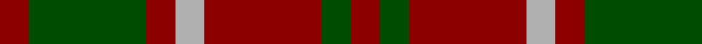
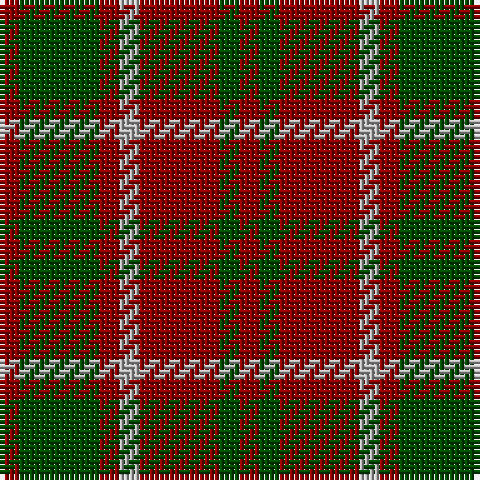

In pattern [RGRYRGR](/stripes/rgryrgr/).

This was sourced from register-of-tartans.  It is a [7 stripe tartan](/stripes/stripes7/).

Original link https://www.tartanregister.gov.uk/tartanDetails.aspx?ref=4260

## Register references

External register numbers recorded for this tartan.

- Scottish Register of Tartans: [4260](https://www.tartanregister.gov.uk/tartanDetails.aspx?ref=4260)
- Scottish Tartans Authority (ITI): 4615

## Thread count
DR/4 G16 DR4 N4 DR16 G4 DR/4

## Palette
Each colour and its ΔE from the base-6 reference it is a variant of.

| Colour | Shade | Base | ΔE (OKLab) |
|---|---|---|---|
| DR | <code style="background-color:#8C0000;">#8C0000</code> `#8C0000` | R <code style="background-color:#CC0000;">#CC0000</code> | 0.14 |
| G | <code style="background-color:#004C00;">#004C00</code> `#004C00` | G <code style="background-color:#006100;">#006100</code> | 0.07 |
| N | <code style="background-color:#B0B0B0;">#B0B0B0</code> `#B0B0B0` | Y <code style="background-color:#F2BF00;">#F2BF00</code> | 0.18 |

# Sample pattern

## Nearest tartans

The nearest existing variants by ΔTartan distance.

1. [Lumsden Boghead](/setts/s9/dg1r5dg4r1dg1r1dt4r5dt1~x14/) — ΔT 1.18
1. [Lumsden of Kintore (Clan?)](/setts/s9/dt1r5dt4r1g1r1g4r5g1~x12/) — ΔT 1.20
1. [Crossnor School](/setts/s7/dg4r2dg13lb2r13dg2r4~x2/) — ΔT 1.21
1. [Lumsden 1797](/setts/s9/db1r5db4r1g1r1g4r5g1~x20/) — ΔT 1.24
1. [Bruce](/setts/s11/lr1r4dg1r1dg3r1dg3r1dg1r4ly1~x2/) — ΔT 1.40
1. [Skene Clan Tartan Tartan Number: 516. Earliest known date: 1886 Smith No 53 has ROSE in place of RED. Grant's version is similar to the sample named Skene in the 1830 pattern book of Wilson's of Bannockburn. See products available Copyright © Blair Urquhart, Comrie, 2015](/setts/s7/db6r3g2r3g12r3g2~x2/) — ΔT 1.45
1. [MacKinnon Hunting](/setts/s7/dg1r8dg8r1dg8r8lb1~x2/) — ΔT 1.46
1. [MacDonald of Sleat](/setts/s5/dg16r5dg2r18k2/) — ΔT 1.51
1. [MacIan](/setts/s7/r2k4r2k4r6k1lo1~x4/) — ΔT 1.53
1. [Unidentified #42](/setts/s7/ly1r3dg7r3dg7r3ly1~x4/) — ΔT 1.63

## Neighbour map

Every grey dot is one of 14299 variants placed by the first two principal components of the ΔTartan feature space (44% of its variance). Red is this tartan; blue dots are its nearest — click one to open its page.

<svg viewBox="0 0 640 380" role="img" style="max-width:100%;height:auto;border:1px solid #e0e0e0;border-radius:4px;display:block" xmlns="http://www.w3.org/2000/svg"><image href="/nn/cloud.v1.png" width="640" height="380"/><a href="/setts/s9/dg1r5dg4r1dg1r1dt4r5dt1~x14/"><circle cx="279.9" cy="246.2" r="4" fill="#3465a4"><title>Lumsden Boghead</title></circle></a><a href="/setts/s9/dt1r5dt4r1g1r1g4r5g1~x12/"><circle cx="272.8" cy="243.5" r="4" fill="#3465a4"><title>Lumsden of Kintore (Clan?)</title></circle></a><a href="/setts/s7/dg4r2dg13lb2r13dg2r4~x2/"><circle cx="327.1" cy="250.2" r="4" fill="#3465a4"><title>Crossnor School</title></circle></a><a href="/setts/s9/db1r5db4r1g1r1g4r5g1~x20/"><circle cx="274.3" cy="244.2" r="4" fill="#3465a4"><title>Lumsden 1797</title></circle></a><a href="/setts/s11/lr1r4dg1r1dg3r1dg3r1dg1r4ly1~x2/"><circle cx="263.4" cy="239.9" r="4" fill="#3465a4"><title>Bruce</title></circle></a><a href="/setts/s7/db6r3g2r3g12r3g2~x2/"><circle cx="284.0" cy="253.3" r="4" fill="#3465a4"><title>Skene Clan Tartan Tartan Number: 516. Earliest known date: 1886 Smith No 53 has ROSE in place of RED. Grant's version is similar to the sample named Skene in the 1830 pattern book of Wilson's of Bannockburn. See products available Copyright © Blair Urquhart, Comrie, 2015</title></circle></a><a href="/setts/s7/dg1r8dg8r1dg8r8lb1~x2/"><circle cx="303.7" cy="240.3" r="4" fill="#3465a4"><title>MacKinnon Hunting</title></circle></a><a href="/setts/s5/dg16r5dg2r18k2/"><circle cx="363.1" cy="249.6" r="4" fill="#3465a4"><title>MacDonald of Sleat</title></circle></a><a href="/setts/s7/r2k4r2k4r6k1lo1~x4/"><circle cx="309.6" cy="272.6" r="4" fill="#3465a4"><title>MacIan</title></circle></a><a href="/setts/s7/ly1r3dg7r3dg7r3ly1~x4/"><circle cx="301.1" cy="244.0" r="4" fill="#3465a4"><title>Unidentified #42</title></circle></a><circle cx="316.3" cy="274.6" r="5" fill="#c00000"/></svg>

ID: /setts/s7/r1dg4r1lr1r4dg1r1~x4/
