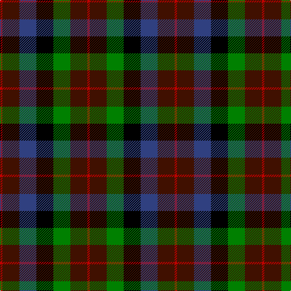

In pattern [RBBKGBR](/stripes/rbbkgbr/).

This was sourced from weddslist.  It is a [7 stripe tartan](/stripes/stripes7/).

Original link http://www.weddslist.com/cgi-bin/tartans/pg.pl?source=sts

## Thread count
R/4 DR28 G28 K28 B28 DR28 R/4

## Palette
Each colour and the base-6 reference it is a variant of.

| Colour | Shade | Base |
|---|---|---|
| B | <code style="background-color:#304080;">#304080</code> `oklch(39.4% 0.109 270.2)` <small>#304080</small> | B <code style="background-color:#2A418A;">#2A418A</code> |
| DR | <code style="background-color:#401000;">#401000</code> `oklch(25.3% 0.079 39.9)` <small>#401000</small> | B <code style="background-color:#2A418A;">#2A418A</code> |
| G | <code style="background-color:#008000;">#008000</code> `oklch(52.0% 0.177 142.5)` <small>#008000</small> | G <code style="background-color:#006100;">#006100</code> |
| K | <code style="background-color:#000000;">#000000</code> `oklch(0.0% 0.000 0.0)` <small>#000000</small> | K <code style="background-color:#000000;">#000000</code> |
| R | <code style="background-color:#C00000;">#C00000</code> `oklch(50.7% 0.208 29.2)` <small>#C00000</small> | R <code style="background-color:#CC0000;">#CC0000</code> |

# Sample pattern

## Nearest tartans

The nearest existing variants by ΔTartan distance, with this tartan at the top so the swatches line up against it.

ΔTartan

Tartan

Sett

—

<a href="/ttd/edit/#slug=r1dr7db7k7g7dr7r1~x4">Tennant</a> <a class="nn-out" href="/setts/s7/r1dr7db7k7g7dr7r1~x4/" title="open its dictionary page">↗</a>

0.86

<a href="/ttd/edit/#slug=k11g12w2g12k12dp12r3~x2">Cunningham / Wilson's No 120</a> <a class="nn-out" href="/setts/s7/k11g12w2g12k12dp12r3~x2/" title="open its dictionary page">↗</a>

0.92

<a href="/ttd/edit/#slug=db14g18k3g18r20k14lo3~x2">Scottish Parliament (unofficial)</a> <a class="nn-out" href="/setts/s7/db14g18k3g18r20k14lo3~x2/" title="open its dictionary page">↗</a>

0.98

<a href="/ttd/edit/#slug=k18db12k5g4r6g12k2lo4~x2">MacLeish</a> <a class="nn-out" href="/setts/s8/k18db12k5g4r6g12k2lo4~x2/" title="open its dictionary page">↗</a>

0.99

<a href="/setts/s8/dp11y2k10g10lo2~x2/">Selkirk (Personal) Original</a>

1.02

<a href="/setts/s8/dp11t2k10g10ly3~x2/">Wilson's No.217</a>

1.07

<a href="/ttd/edit/#slug=r2dg8ly1k8dg8db8r2">Brodie Hunting</a> <a class="nn-out" href="/setts/s7/r2dg8ly1k8dg8db8r2/" title="open its dictionary page">↗</a>

1.11

<a href="/ttd/edit/#slug=dp9k7dg5r4dg7k1ly1~x2">MacLaren #2</a> <a class="nn-out" href="/setts/s7/dp9k7dg5r4dg7k1ly1~x2/" title="open its dictionary page">↗</a>

1.12

<a href="/setts/s8/k8t3g13dp12ly2~x2/">Wilson's No.176</a>

1.13

<a href="/ttd/edit/#slug=r2k8lo1k8g8t8r2~x4">Brodie Hunting</a> <a class="nn-out" href="/setts/s7/r2k8lo1k8g8t8r2~x4/" title="open its dictionary page">↗</a>

1.21

<a href="/ttd/edit/#slug=db8k4lo2k3r2k3lo2k4g8~x4">Vosko</a> <a class="nn-out" href="/setts/s9/db8k4lo2k3r2k3lo2k4g8~x4/" title="open its dictionary page">↗</a>

## Neighbour map

Every grey dot is one of 14299 variants placed by the first two principal components of the ΔTartan feature space (44% of its variance). Red is this tartan; blue dots are its nearest — click one to open its page.

<svg viewBox="0 0 640 380" role="img" style="max-width:100%;height:auto;border:1px solid #e0e0e0;border-radius:4px;display:block" xmlns="http://www.w3.org/2000/svg"><image href="/nn/cloud.v1.png" width="640" height="380"/><a href="/setts/s7/k11g12w2g12k12dp12r3~x2/"><circle cx="131.2" cy="255.0" r="4" fill="#3465a4"><title>Cunningham / Wilson's No 120</title></circle></a><a href="/setts/s7/db14g18k3g18r20k14lo3~x2/"><circle cx="143.3" cy="245.8" r="4" fill="#3465a4"><title>Scottish Parliament (unofficial)</title></circle></a><a href="/setts/s8/k18db12k5g4r6g12k2lo4~x2/"><circle cx="156.5" cy="209.9" r="4" fill="#3465a4"><title>MacLeish</title></circle></a><a href="/setts/s8/dp11y2k10g10lo2~x2/"><circle cx="119.0" cy="236.2" r="4" fill="#3465a4"><title>Selkirk (Personal) Original</title></circle></a><a href="/setts/s8/dp11t2k10g10ly3~x2/"><circle cx="106.5" cy="240.9" r="4" fill="#3465a4"><title>Wilson's No.217</title></circle></a><a href="/setts/s7/r2dg8ly1k8dg8db8r2/"><circle cx="154.1" cy="224.2" r="4" fill="#3465a4"><title>Brodie Hunting</title></circle></a><a href="/setts/s7/dp9k7dg5r4dg7k1ly1~x2/"><circle cx="143.7" cy="220.9" r="4" fill="#3465a4"><title>MacLaren #2</title></circle></a><a href="/setts/s8/k8t3g13dp12ly2~x2/"><circle cx="150.4" cy="233.5" r="4" fill="#3465a4"><title>Wilson's No.176</title></circle></a><a href="/setts/s7/r2k8lo1k8g8t8r2~x4/"><circle cx="155.6" cy="218.0" r="4" fill="#3465a4"><title>Brodie Hunting</title></circle></a><a href="/setts/s9/db8k4lo2k3r2k3lo2k4g8~x4/"><circle cx="104.6" cy="241.3" r="4" fill="#3465a4"><title>Vosko</title></circle></a><circle cx="121.8" cy="237.6" r="5" fill="#c00000"/></svg>

ID: /setts/s7/r1dr7db7k7g7dr7r1~x4/
