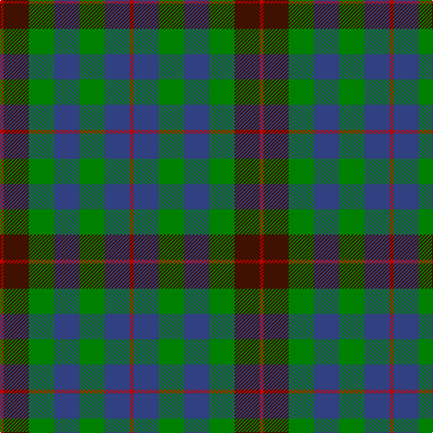

This page is one **sett** — a single exact thread-count. It belongs to the [tartan](/tartans/r1dr7g7b7g7b7r1/)
(the same proportion at any scale), whose colour order is pattern [RBGBGBR](/stripes/rbgbgbr/).

Sourced from weddslist.  It is a [7 stripe tartan](/stripes/stripes7/).

Original link http://www.weddslist.com/cgi-bin/tartans/pg.pl?source=sts

## Thread count
R/4 DR28 G28 B28 G28 B28 R/4

## Palette
Each colour and the base-6 reference it is a variant of.

| Colour | Shade | Base |
|---|---|---|
| B | <code style="background-color:#304080;">#304080</code> `oklch(39.4% 0.109 270.2)` <small>#304080</small> | B <code style="background-color:#2A418A;">#2A418A</code> |
| DR | <code style="background-color:#401000;">#401000</code> `oklch(25.3% 0.079 39.9)` <small>#401000</small> | B <code style="background-color:#2A418A;">#2A418A</code> |
| G | <code style="background-color:#008000;">#008000</code> `oklch(52.0% 0.177 142.5)` <small>#008000</small> | G <code style="background-color:#006100;">#006100</code> |
| R | <code style="background-color:#C00000;">#C00000</code> `oklch(50.7% 0.208 29.2)` <small>#C00000</small> | R <code style="background-color:#CC0000;">#CC0000</code> |

# Sample pattern

## Nearest tartans

The nearest existing variants by ΔTartan distance, with this tartan at the top so the swatches line up against it.

ΔTartan

Tartan

Sett

—

<a href="/ttd/edit/#slug=r1dr7g7db7g7db7r1~x4">Tennant</a> <a class="nn-out" href="/setts/s7/r1dr7g7db7g7db7r1~x4/" title="open its dictionary page">↗</a>

0.85

<a href="/ttd/edit/#slug=db7r3g7r1g7r3db7t1~x2">Hebrides #8</a> <a class="nn-out" href="/setts/s8/db7r3g7r1g7r3db7t1~x2/" title="open its dictionary page">↗</a>

0.88

<a href="/ttd/edit/#slug=b10k3b10k14r2g14r5~x2">Fletcher of Dunans</a> <a class="nn-out" href="/setts/s7/b10k3b10k14r2g14r5~x2/" title="open its dictionary page">↗</a>

0.90

<a href="/ttd/edit/#slug=dg24k4dg24k24t7r24t7~x2">Unidentified Pinafore</a> <a class="nn-out" href="/setts/s7/dg24k4dg24k24t7r24t7~x2/" title="open its dictionary page">↗</a>

0.94

<a href="/ttd/edit/#slug=g21k6t3g11k17db17k3~x2">MacCallum</a> <a class="nn-out" href="/setts/s7/g21k6t3g11k17db17k3~x2/" title="open its dictionary page">↗</a>

0.97

<a href="/ttd/edit/#slug=db16g14w2g14k13db12k4~x2">MacNeil of Colonsay (Clan)</a> <a class="nn-out" href="/setts/s7/db16g14w2g14k13db12k4~x2/" title="open its dictionary page">↗</a>

0.97

<a href="/ttd/edit/#slug=db4dg6w1dg6k6db6k2~x2">MacNeil of Colonsay</a> <a class="nn-out" href="/setts/s7/db4dg6w1dg6k6db6k2~x2/" title="open its dictionary page">↗</a>

1.01

<a href="/ttd/edit/#slug=db8dg8db1dg8k8db8ly2~x2">MacKay</a> <a class="nn-out" href="/setts/s7/db8dg8db1dg8k8db8ly2~x2/" title="open its dictionary page">↗</a>

1.07

<a href="/ttd/edit/#slug=r1dy7g7db7g7db7r1~x8">Tennant (Yules)</a> <a class="nn-out" href="/setts/s7/r1dy7g7db7g7db7r1~x8/" title="open its dictionary page">↗</a>

1.08

<a href="/ttd/edit/#slug=y3dg6k6y4r1y1~x2">Waterloo</a> <a class="nn-out" href="/setts/s6/y3dg6k6y4r1y1~x2/" title="open its dictionary page">↗</a>

1.14

<a href="/ttd/edit/#slug=db7k2db2k2db2k7g7w1g7~x4">Abercrombie</a> <a class="nn-out" href="/setts/s9/db7k2db2k2db2k7g7w1g7~x4/" title="open its dictionary page">↗</a>

## Neighbour map

Every grey dot is one of 14299 variants placed by the first two principal components of the ΔTartan feature space (44% of its variance). Red is this tartan; blue dots are its nearest — click one to open its page.

<svg viewBox="0 0 640 380" role="img" style="max-width:100%;height:auto;border:1px solid #e0e0e0;border-radius:4px;display:block" xmlns="http://www.w3.org/2000/svg"><image href="/nn/cloud.v1.png" width="640" height="380"/><a href="/setts/s8/db7r3g7r1g7r3db7t1~x2/"><circle cx="193.7" cy="247.0" r="4" fill="#3465a4"><title>Hebrides #8</title></circle></a><a href="/setts/s7/b10k3b10k14r2g14r5~x2/"><circle cx="141.8" cy="250.5" r="4" fill="#3465a4"><title>Fletcher of Dunans</title></circle></a><a href="/setts/s7/dg24k4dg24k24t7r24t7~x2/"><circle cx="192.5" cy="268.7" r="4" fill="#3465a4"><title>Unidentified Pinafore</title></circle></a><a href="/setts/s7/g21k6t3g11k17db17k3~x2/"><circle cx="205.9" cy="262.1" r="4" fill="#3465a4"><title>MacCallum</title></circle></a><a href="/setts/s7/db16g14w2g14k13db12k4~x2/"><circle cx="173.9" cy="269.3" r="4" fill="#3465a4"><title>MacNeil of Colonsay (Clan)</title></circle></a><a href="/setts/s7/db4dg6w1dg6k6db6k2~x2/"><circle cx="161.7" cy="279.7" r="4" fill="#3465a4"><title>MacNeil of Colonsay</title></circle></a><a href="/setts/s7/db8dg8db1dg8k8db8ly2~x2/"><circle cx="200.5" cy="276.6" r="4" fill="#3465a4"><title>MacKay</title></circle></a><a href="/setts/s7/r1dy7g7db7g7db7r1~x8/"><circle cx="208.3" cy="280.5" r="4" fill="#3465a4"><title>Tennant (Yules)</title></circle></a><a href="/setts/s6/y3dg6k6y4r1y1~x2/"><circle cx="157.5" cy="254.1" r="4" fill="#3465a4"><title>Waterloo</title></circle></a><a href="/setts/s9/db7k2db2k2db2k7g7w1g7~x4/"><circle cx="179.1" cy="242.8" r="4" fill="#3465a4"><title>Abercrombie</title></circle></a><circle cx="180.1" cy="265.0" r="5" fill="#c00000"/></svg>

ID: /setts/s7/r1dr7g7db7g7db7r1~x4/
