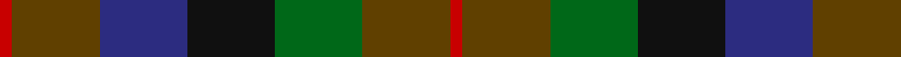

**Bands:** [RGBKGGR](/stripes/rgbkggr/) · **Stripes:** [R DY DB K G DY R](/stripes/stripes7/) R DY DB K G DY R

This was sourced from house-of-tartan.  It is a [7 band tartan](/bands/bands7/).

Original link http://www.house-of-tartan.scotland.net/house/TartanViewjs.asp?colr=Def&tnam=1653

## Thread count
R/4 T28 DB28 K28 G28 T28 R/4

## Palette
Each colour and its ΔE from the base-6 reference it is a variant of.

| Colour | Shade | Base | ΔE (OKLab) |
|---|---|---|---|
| DB | <code style="background-color:#2C2C80;">#2C2C80</code> `#2C2C80` | B <code style="background-color:#2A418A;">#2A418A</code> | 0.06 |
| G | <code style="background-color:#006818;">#006818</code> `#006818` | G <code style="background-color:#006100;">#006100</code> | 0.02 |
| K | <code style="background-color:#101010;">#101010</code> `#101010` | K <code style="background-color:#000000;">#000000</code> | 0.17 |
| R | <code style="background-color:#C80000;">#C80000</code> `#C80000` | R <code style="background-color:#CC0000;">#CC0000</code> | 0.01 |
| T | <code style="background-color:#604000;">#604000</code> `#604000` | G <code style="background-color:#006100;">#006100</code> | 0.14 |

# Sample pattern

## Nearest tartans

The nearest existing variants by ΔTartan distance.

1. [Tennant (Clan)](/setts/s7/r1dy7b7k7g7dy7r1~x4/) — ΔT 0.63
1. [MacDuff Hunting](/setts/s8/do10r2do10g17k12db9do9r2~x2/) — ΔT 0.64
1. [Casely](/setts/s6/r4g11k11g2n11y3~x4/) — ΔT 0.98
1. [MacDuff Hunting Clan Tartan Tartan Number: 1654. Earliest known date: 1906 STS records (sic) 'Sett may be quite wrong. (S.S. May 86)' See products available Copyright © Blair Urquhart, Comrie, 2015](/setts/s8/dy8r1dy8g8k8db8dy8r2~x2/) — ΔT 1.03
1. [Styrian](/setts/s8/o16dg29n19g8n19dg29o16r4~x2/) — ΔT 1.14
1. [Forres](/setts/s6/g2lo1g5k4do5r1~x4/) — ΔT 1.16
1. [Dorward/Dogwood](/setts/s7/dy7r3dy9g15db19dy14r4~x2/) — ΔT 1.21
1. [Huntly #3](/setts/s10/dy2lr1dy5k4do5o1do5k4dy5lr1~x4/) — ΔT 1.23
1. [Styrian (Fashion)](/setts/s5/g8n19dg29o16r4~x2/) — ΔT 1.24
1. [Gleneagles Group Corporate Tartan Tartan Number: 2107. Earliest known date: 1989 Designed for a range of tartan goods called the Gleneagles Collection. See products available Copyright © Blair Urquhart, Comrie, 2015](/setts/s7/dr5g6dy1g6dr5db6dr1~x2/) — ΔT 1.26

## Neighbour map

Every grey dot is one of 14313 variants placed by the first two principal components of the ΔTartan feature space (44% of its variance). Red is this tartan; blue dots are its nearest — click one to open its page.

<svg viewBox="0 0 640 380" role="img" style="max-width:100%;height:auto;border:1px solid #e0e0e0;border-radius:4px;display:block" xmlns="http://www.w3.org/2000/svg"><image href="/nn/cloud.v1.png" width="640" height="380"/><a href="/setts/s7/r1dy7b7k7g7dy7r1~x4/"><circle cx="151.4" cy="253.2" r="4" fill="#3465a4"><title>Tennant (Clan)</title></circle></a><a href="/setts/s8/do10r2do10g17k12db9do9r2~x2/"><circle cx="191.4" cy="248.7" r="4" fill="#3465a4"><title>MacDuff Hunting</title></circle></a><a href="/setts/s6/r4g11k11g2n11y3~x4/"><circle cx="132.8" cy="263.4" r="4" fill="#3465a4"><title>Casely</title></circle></a><a href="/setts/s8/dy8r1dy8g8k8db8dy8r2~x2/"><circle cx="215.7" cy="263.7" r="4" fill="#3465a4"><title>MacDuff Hunting Clan Tartan Tartan Number: 1654. Earliest known date: 1906 STS records (sic) 'Sett may be quite wrong. (S.S. May 86)' See products available Copyright © Blair Urquhart, Comrie, 2015</title></circle></a><a href="/setts/s8/o16dg29n19g8n19dg29o16r4~x2/"><circle cx="195.0" cy="266.5" r="4" fill="#3465a4"><title>Styrian</title></circle></a><a href="/setts/s6/g2lo1g5k4do5r1~x4/"><circle cx="166.3" cy="268.5" r="4" fill="#3465a4"><title>Forres</title></circle></a><a href="/setts/s7/dy7r3dy9g15db19dy14r4~x2/"><circle cx="229.6" cy="279.7" r="4" fill="#3465a4"><title>Dorward/Dogwood</title></circle></a><a href="/setts/s10/dy2lr1dy5k4do5o1do5k4dy5lr1~x4/"><circle cx="167.0" cy="260.1" r="4" fill="#3465a4"><title>Huntly #3</title></circle></a><a href="/setts/s5/g8n19dg29o16r4~x2/"><circle cx="194.6" cy="273.1" r="4" fill="#3465a4"><title>Styrian (Fashion)</title></circle></a><a href="/setts/s7/dr5g6dy1g6dr5db6dr1~x2/"><circle cx="212.8" cy="283.4" r="4" fill="#3465a4"><title>Gleneagles Group Corporate Tartan Tartan Number: 2107. Earliest known date: 1989 Designed for a range of tartan goods called the Gleneagles Collection. See products available Copyright © Blair Urquhart, Comrie, 2015</title></circle></a><circle cx="167.4" cy="261.0" r="5" fill="#c00000"/></svg>

ID: /setts/s7/r1dy7db7k7g7dy7r1~x4/
