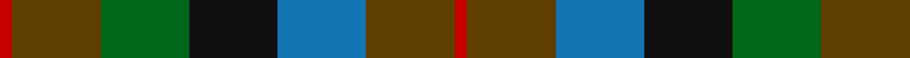
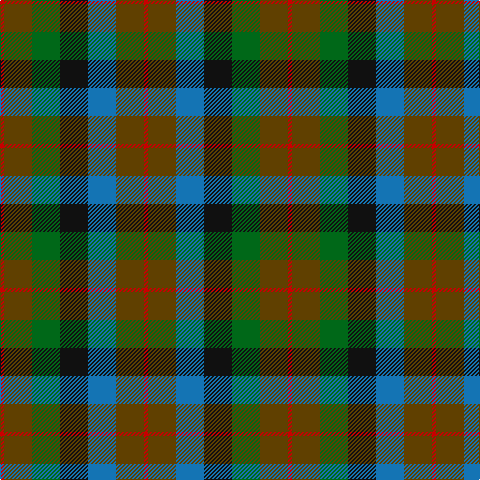

**Bands:** [RGGKBGR](/stripes/rggkbgr/) · **Stripes:** [R DY G K B DY R](/stripes/stripes7/) R DY G K B DY R

This was sourced from tartans-authority.  It is a [7 band tartan](/bands/bands7/).

Original link http://www.tartansauthority.com/tartan-ferret/display/1653/

## Also known as

This cloth is also recorded under:

- Tennant #2

## Attestations

This cloth appears in 2 source records; the oldest owns this page.

- circa 1930 — Tennant (Clan) (tartans-authority, [record](http://www.tartansauthority.com/tartan-ferret/display/1653/))
- 01/01/1950 — Tennant #2 (register-of-tartans, [record](https://www.tartanregister.gov.uk/tartanDetails.aspx?ref=4089))

## Register references

External register numbers recorded for this tartan.

- Scottish Register of Tartans: [4089](https://www.tartanregister.gov.uk/tartanDetails.aspx?ref=4089)
- Scottish Tartans Authority (ITI): 1653
- Scottish Tartans World Register: 1653

## Thread count
R/4 T28 G28 K28 B28 T28 R/4

## Palette
Each colour and its ΔE from the base-6 reference it is a variant of.

| Colour | Shade | Base | ΔE (OKLab) |
|---|---|---|---|
| B | <code style="background-color:#1474B4;">#1474B4</code> `#1474B4` | B <code style="background-color:#2A418A;">#2A418A</code> | 0.15 |
| G | <code style="background-color:#006818;">#006818</code> `#006818` | G <code style="background-color:#006100;">#006100</code> | 0.02 |
| K | <code style="background-color:#101010;">#101010</code> `#101010` | K <code style="background-color:#000000;">#000000</code> | 0.17 |
| R | <code style="background-color:#C80000;">#C80000</code> `#C80000` | R <code style="background-color:#CC0000;">#CC0000</code> | 0.01 |
| T | <code style="background-color:#604000;">#604000</code> `#604000` | G <code style="background-color:#006100;">#006100</code> | 0.14 |

# Sample pattern

## Nearest tartans

The nearest existing variants by ΔTartan distance.

1. [Tennant Family Tartan Tartan Number: 1653. Earliest known date: 1930 MacGregor-Hastie made few notes about his sample collection. In December 1967, Captain Tennant wrote to the Scottish Tartans Society, saying, ".. and I have no objection to other Tennants wearing it (Tennant tartan) but their problem will be to get hold of it ... I don't know of any other Tennant tartan and that is why I think my father designed this one." The head of the Tennant family is Lord Glenconner, descended from John Tennant of Blairston, Ayr. (1635). See products available Copyright © Blair Urquhart, Comrie, 2015](/setts/s7/r1dy7db7k7g7dy7r1~x4/) — ΔT 0.63
1. [Scottish Parliament (unofficial)](/setts/s7/db14g18k3g18r20k14lo3~x2/) — ΔT 0.91
1. [Casely](/setts/s6/r4g11k11g2n11y3~x4/) — ΔT 0.91
1. [Forres](/setts/s6/g2lo1g5k4do5r1~x4/) — ΔT 0.95
1. [Parliament Trade Tartan Tartan Number: 2477. Earliest known date: 1998 Created to celebrate the referendum result for the re-establishment of a Scottish Parliament as well as to provide a Parliamentary livery tartan. See products available Copyright © Blair Urquhart, Comrie, 2015](/setts/s7/db8g11k3g11r12dt10ly2~x2/) — ΔT 0.97
1. [MacDuff Hunting](/setts/s8/do10r2do10g17k12db9do9r2~x2/) — ΔT 1.02
1. [Unidentified Pinafore](/setts/s7/dg24k4dg24k24t7r24t7~x2/) — ΔT 1.15
1. [Birse](/setts/s6/k4g16k14lo3n16r4~x2/) — ΔT 1.18
1. [Styrian](/setts/s8/o16dg29n19g8n19dg29o16r4~x2/) — ΔT 1.18
1. [Thompson's Fancy Personal Tartan Tartan Number: 286. Earliest known date: pre 2003 Designed for his own use. See products available Copyright © Blair Urquhart, Comrie, 2015](/setts/s6/r2dy8db2t4k4t1~x6/) — ΔT 1.25

## Neighbour map

Every grey dot is one of 14299 variants placed by the first two principal components of the ΔTartan feature space (44% of its variance). Red is this tartan; blue dots are its nearest — click one to open its page.

<svg viewBox="0 0 640 380" role="img" style="max-width:100%;height:auto;border:1px solid #e0e0e0;border-radius:4px;display:block" xmlns="http://www.w3.org/2000/svg"><image href="/nn/cloud.v1.png" width="640" height="380"/><a href="/setts/s7/r1dy7db7k7g7dy7r1~x4/"><circle cx="167.6" cy="261.1" r="4" fill="#3465a4"><title>Tennant Family Tartan Tartan Number: 1653. Earliest known date: 1930 MacGregor-Hastie made few notes about his sample collection. In December 1967, Captain Tennant wrote to the Scottish Tartans Society, saying, &quot;.. and I have no objection to other Tennants wearing it (Tennant tartan) but their problem will be to get hold of it ... I don't know of any other Tennant tartan and that is why I think my father designed this one.&quot; The head of the Tennant family is Lord Glenconner, descended from John Tennant of Blairston, Ayr. (1635). See products available Copyright © Blair Urquhart, Comrie, 2015</title></circle></a><a href="/setts/s7/db14g18k3g18r20k14lo3~x2/"><circle cx="143.3" cy="245.8" r="4" fill="#3465a4"><title>Scottish Parliament (unofficial)</title></circle></a><a href="/setts/s6/r4g11k11g2n11y3~x4/"><circle cx="132.9" cy="263.6" r="4" fill="#3465a4"><title>Casely</title></circle></a><a href="/setts/s6/g2lo1g5k4do5r1~x4/"><circle cx="166.4" cy="268.6" r="4" fill="#3465a4"><title>Forres</title></circle></a><a href="/setts/s7/db8g11k3g11r12dt10ly2~x2/"><circle cx="115.4" cy="247.2" r="4" fill="#3465a4"><title>Parliament Trade Tartan Tartan Number: 2477. Earliest known date: 1998 Created to celebrate the referendum result for the re-establishment of a Scottish Parliament as well as to provide a Parliamentary livery tartan. See products available Copyright © Blair Urquhart, Comrie, 2015</title></circle></a><a href="/setts/s8/do10r2do10g17k12db9do9r2~x2/"><circle cx="191.5" cy="248.8" r="4" fill="#3465a4"><title>MacDuff Hunting</title></circle></a><a href="/setts/s7/dg24k4dg24k24t7r24t7~x2/"><circle cx="192.5" cy="268.7" r="4" fill="#3465a4"><title>Unidentified Pinafore</title></circle></a><a href="/setts/s6/k4g16k14lo3n16r4~x2/"><circle cx="127.2" cy="254.5" r="4" fill="#3465a4"><title>Birse</title></circle></a><a href="/setts/s8/o16dg29n19g8n19dg29o16r4~x2/"><circle cx="195.1" cy="266.6" r="4" fill="#3465a4"><title>Styrian</title></circle></a><a href="/setts/s6/r2dy8db2t4k4t1~x6/"><circle cx="163.3" cy="225.3" r="4" fill="#3465a4"><title>Thompson's Fancy Personal Tartan Tartan Number: 286. Earliest known date: pre 2003 Designed for his own use. See products available Copyright © Blair Urquhart, Comrie, 2015</title></circle></a><circle cx="151.6" cy="253.3" r="5" fill="#c00000"/></svg>

ID: /setts/s7/r1dy7g7k7b7dy7r1~x4/
