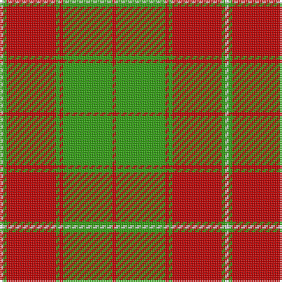

In pattern [RGRGRGW](/patterns/rgrgrgw/).

This was sourced from weddslist.  It is a [7 stripes tartan](/stripes/stripes7/).

Original link http://www.weddslist.com/cgi-bin/tartans/pg.pl?source=sts

## Thread count
LN/2 G2 R28 G2 R2 G28 R/2

## Palette
Each colour and its ΔE from the base-6 reference it is a variant of.

| Colour | Shade | Base | ΔE (OKLab) |
|---|---|---|---|
| G | <code style="background-color:#30A010;">#30A010</code> `#30A010` | G <code style="background-color:#006100;">#006100</code> | 0.20 |
| LN | <code style="background-color:#E0E0E0;">#E0E0E0</code> `#E0E0E0` | W <code style="background-color:#F7F7F7;">#F7F7F7</code> | 0.07 |
| R | <code style="background-color:#C00000;">#C00000</code> `#C00000` | R <code style="background-color:#CC0000;">#CC0000</code> | 0.03 |

# Sample pattern

## Nearest tartans

The nearest existing variants by ΔTartan distance.

1. [MacKintosh Fragment](/setts/s7/r1g14r1g1r14g1w1~g309c18-rdc0000-we0e0e0~x2/) — ΔT 0.32
1. [MacDonald of Glenaladale (symmetrical)](/setts/s6/g5w2r27g27r5w2~g006818-rc80000-we0e0e0~x2/) — ΔT 1.13
1. [Livingston](/setts/s9/g20k2r3k2r6g20r29g3r10~g008000-k000000-rc00000~x2/) — ΔT 1.34
1. [MacDonald of Kingsburgh](/setts/s9/r3g3y1r18w1g21y1g1y3~g008000-rc00000-we0e0e0-yf0c000~x2/) — ΔT 1.35
1. [MacPhee, MacFie](/setts/s9/w1r12g2r1g16r1g2r12y1~g008000-rc00000-we0e0e0-yf0c000~x2/) — ΔT 1.38
1. [MacDonald of Kingsburgh Clan Tartan Tartan Number: 1562. Earliest known date: 1746 D.W.Stewart recorded this pattern from a relic, worn by Prince Charles Edward, and hidden in a cleft of a rock, to be recovered later and eventually preserved in the Advocates' Library in Edinburgh. See products available Copyright © Blair Urquhart, Comrie, 2015](/setts/s9/r3g3y1r18w1g21y1g1y3~g006818-rc80000-we0e0e0-ye8c000~x2/) — ΔT 1.42
1. [Unidentified Cant #09](/setts/s8/r44b2g26r3b2r3g26b2~b2c2c80-g006818-rc80000/) — ΔT 1.46
1. [Brisbane (Artefact)](/setts/s8/g18w3y1r2y1r3y1r10~g006818-rc80000-wc0c0c0-ye8c000~x4/) — ΔT 1.46
1. [MacRea ? MacRae](/setts/s11/g22r4g22r22g2r3g2r3g2r3y2~g008000-rc00000-yf0c000~x2/) — ΔT 1.52
1. [Brisbane (Artefact)](/setts/s8/g18w3y1r2y1r3y1r10~g006818-rc80000-wffffff-ye8c000~x4/) — ΔT 1.53

## Neighbour map

Every grey dot is one of 15726 variants placed by the first two principal components of the ΔTartan feature space (44% of its variance). Red is this tartan; blue dots are its nearest — click one to open its page.

<svg viewBox="0 0 640 380" role="img" style="max-width:100%;height:auto;border:1px solid #e0e0e0;border-radius:4px;display:block" xmlns="http://www.w3.org/2000/svg"><image href="/nn/cloud.v1.png" width="640" height="380"/><a href="/setts/s7/r1g14r1g1r14g1w1~g309c18-rdc0000-we0e0e0~x2/"><circle cx="358.6" cy="173.3" r="4" fill="#3465a4"><title>MacKintosh Fragment</title></circle></a><a href="/setts/s6/g5w2r27g27r5w2~g006818-rc80000-we0e0e0~x2/"><circle cx="334.5" cy="202.0" r="4" fill="#3465a4"><title>MacDonald of Glenaladale (symmetrical)</title></circle></a><a href="/setts/s9/g20k2r3k2r6g20r29g3r10~g008000-k000000-rc00000~x2/"><circle cx="335.1" cy="189.3" r="4" fill="#3465a4"><title>Livingston</title></circle></a><a href="/setts/s9/r3g3y1r18w1g21y1g1y3~g008000-rc00000-we0e0e0-yf0c000~x2/"><circle cx="324.7" cy="132.1" r="4" fill="#3465a4"><title>MacDonald of Kingsburgh</title></circle></a><a href="/setts/s9/w1r12g2r1g16r1g2r12y1~g008000-rc00000-we0e0e0-yf0c000~x2/"><circle cx="360.2" cy="157.7" r="4" fill="#3465a4"><title>MacPhee, MacFie</title></circle></a><a href="/setts/s9/r3g3y1r18w1g21y1g1y3~g006818-rc80000-we0e0e0-ye8c000~x2/"><circle cx="326.5" cy="132.4" r="4" fill="#3465a4"><title>MacDonald of Kingsburgh Clan Tartan Tartan Number: 1562. Earliest known date: 1746 D.W.Stewart recorded this pattern from a relic, worn by Prince Charles Edward, and hidden in a cleft of a rock, to be recovered later and eventually preserved in the Advocates' Library in Edinburgh. See products available Copyright © Blair Urquhart, Comrie, 2015</title></circle></a><a href="/setts/s8/r44b2g26r3b2r3g26b2~b2c2c80-g006818-rc80000/"><circle cx="375.9" cy="171.0" r="4" fill="#3465a4"><title>Unidentified Cant #09</title></circle></a><a href="/setts/s8/g18w3y1r2y1r3y1r10~g006818-rc80000-wc0c0c0-ye8c000~x4/"><circle cx="296.8" cy="147.3" r="4" fill="#3465a4"><title>Brisbane (Artefact)</title></circle></a><a href="/setts/s11/g22r4g22r22g2r3g2r3g2r3y2~g008000-rc00000-yf0c000~x2/"><circle cx="379.5" cy="186.1" r="4" fill="#3465a4"><title>MacRea ? MacRae</title></circle></a><a href="/setts/s8/g18w3y1r2y1r3y1r10~g006818-rc80000-wffffff-ye8c000~x4/"><circle cx="281.6" cy="140.8" r="4" fill="#3465a4"><title>Brisbane (Artefact)</title></circle></a><circle cx="356.5" cy="175.4" r="5" fill="#c00000"/></svg>

ID: /setts/s7/r1g14r1g1r14g1w1~g30a010-rc00000-we0e0e0~x2/
