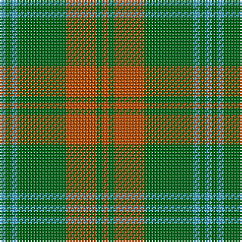

In pattern [RGRGYGY](/patterns/rgrgygy/).

This was sourced from tartans-authority.  It is a [7 stripes tartan](/stripes/stripes7/).

Original link http://www.tartansauthority.com/tartan-ferret/display/5536/

## Thread count
B/4 G4 B4 G32 DO20 G4 DO/4

## Palette
Each colour and its ΔE from the base-6 reference it is a variant of.

| Colour | Shade | Base | ΔE (OKLab) |
|---|---|---|---|
| B | <code style="background-color:#48A4C0;">#48A4C0</code> `#48A4C0` | Y <code style="background-color:#F2BF00;">#F2BF00</code> | 0.29 |
| DO | <code style="background-color:#B84C00;">#B84C00</code> `#B84C00` | R <code style="background-color:#CC0000;">#CC0000</code> | 0.08 |
| G | <code style="background-color:#006818;">#006818</code> `#006818` | G <code style="background-color:#006100;">#006100</code> | 0.02 |

# Sample pattern

## Nearest tartans

The nearest existing variants by ΔTartan distance.

1. [O'Neill Pipe Band 1983](/setts/s12/g1y1g8r5g1r1g1r5g8y1g1y1~g006818-rb84c00-y48a4c0~x4/) — ΔT 1.17
1. [Campbell & Co (Beauly) (Corporate)](/setts/s9/g4r5g31r5g31y5g4y27ya3~g006818-rc8002c-ya08858-yafccc00~x2/) — ΔT 1.23
1. [Forget Family (Personal)](/setts/s6/g8y1g8y12r1y1~g006818-rc8002c-ybc8c00~x4/) — ΔT 1.25
1. [Armagh Irish County Tartan Tartan Number: 2276. Earliest known date: 1996 One of a series of Irish District tartans designed by Polly Wittering of the House of Edgar, with colours reminiscent of the Country with soft warm colours dominating. See products available Copyright © Blair Urquhart, Comrie, 2015](/setts/s9/g4y2g17ga2r4ga2g3ga11g2~g407c40-ga043828-ra81830-ybcac20~x2/) — ΔT 1.27
1. [Lister (Name)](/setts/s7/g8r29g8y3g8r8y3~g604000-r888888-ye8c000~x2/) — ΔT 1.35
1. [Maxwell Htg (Clan)](/setts/s7/g3r16g4k6g28r2g3~g006818-k101010-r880000~x2/) — ΔT 1.37
1. [North Dakota State University (Corp.](/setts/s6/y11g5y10ga4g26y4~g006818-ga289c18-ybc8c00~x2/) — ΔT 1.43
1. [Daks, Tartan-Loden](/setts/s8/b3r7g2ra2g14r2g2b3~b304080-g008000-r806050-rac00000~x2/) — ΔT 1.46
1. [Romsdal](/setts/s5/g22b5r4b5r3~b1c1c1c-g006818-rc80000~x2/) — ΔT 1.48
1. [Confederate Cavalry (Military)](/setts/s6/g2ga14g8ga3g12y2~g003820-ga8c7038-yd09800~x2/) — ΔT 1.49

## Neighbour map

Every grey dot is one of 15726 variants placed by the first two principal components of the ΔTartan feature space (44% of its variance). Red is this tartan; blue dots are its nearest — click one to open its page.

<svg viewBox="0 0 640 380" role="img" style="max-width:100%;height:auto;border:1px solid #e0e0e0;border-radius:4px;display:block" xmlns="http://www.w3.org/2000/svg"><image href="/nn/cloud.v1.png" width="640" height="380"/><a href="/setts/s12/g1y1g8r5g1r1g1r5g8y1g1y1~g006818-rb84c00-y48a4c0~x4/"><circle cx="377.4" cy="219.8" r="4" fill="#3465a4"><title>O'Neill Pipe Band 1983</title></circle></a><a href="/setts/s9/g4r5g31r5g31y5g4y27ya3~g006818-rc8002c-ya08858-yafccc00~x2/"><circle cx="373.0" cy="207.9" r="4" fill="#3465a4"><title>Campbell &amp; Co (Beauly) (Corporate)</title></circle></a><a href="/setts/s6/g8y1g8y12r1y1~g006818-rc8002c-ybc8c00~x4/"><circle cx="374.3" cy="240.7" r="4" fill="#3465a4"><title>Forget Family (Personal)</title></circle></a><a href="/setts/s9/g4y2g17ga2r4ga2g3ga11g2~g407c40-ga043828-ra81830-ybcac20~x2/"><circle cx="334.1" cy="216.3" r="4" fill="#3465a4"><title>Armagh Irish County Tartan Tartan Number: 2276. Earliest known date: 1996 One of a series of Irish District tartans designed by Polly Wittering of the House of Edgar, with colours reminiscent of the Country with soft warm colours dominating. See products available Copyright © Blair Urquhart, Comrie, 2015</title></circle></a><a href="/setts/s7/g8r29g8y3g8r8y3~g604000-r888888-ye8c000~x2/"><circle cx="361.3" cy="231.9" r="4" fill="#3465a4"><title>Lister (Name)</title></circle></a><a href="/setts/s7/g3r16g4k6g28r2g3~g006818-k101010-r880000~x2/"><circle cx="418.8" cy="220.9" r="4" fill="#3465a4"><title>Maxwell Htg (Clan)</title></circle></a><a href="/setts/s6/y11g5y10ga4g26y4~g006818-ga289c18-ybc8c00~x2/"><circle cx="344.7" cy="274.6" r="4" fill="#3465a4"><title>North Dakota State University (Corp.</title></circle></a><a href="/setts/s8/b3r7g2ra2g14r2g2b3~b304080-g008000-r806050-rac00000~x2/"><circle cx="303.0" cy="231.5" r="4" fill="#3465a4"><title>Daks, Tartan-Loden</title></circle></a><a href="/setts/s5/g22b5r4b5r3~b1c1c1c-g006818-rc80000~x2/"><circle cx="340.1" cy="255.8" r="4" fill="#3465a4"><title>Romsdal</title></circle></a><a href="/setts/s6/g2ga14g8ga3g12y2~g003820-ga8c7038-yd09800~x2/"><circle cx="335.4" cy="272.1" r="4" fill="#3465a4"><title>Confederate Cavalry (Military)</title></circle></a><circle cx="367.8" cy="236.0" r="5" fill="#c00000"/></svg>

ID: /setts/s7/r1g1r5g8y1g1y1~g006818-rb84c00-y48a4c0~x4/
