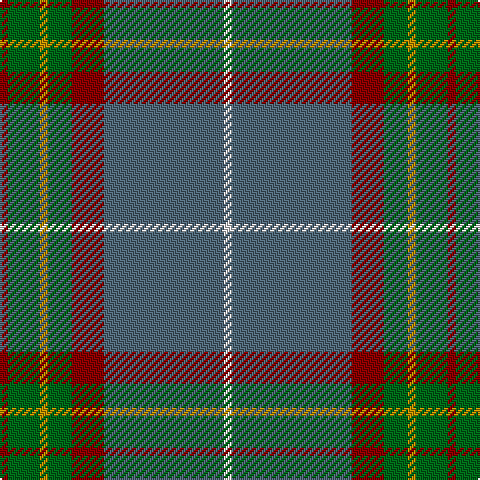

In pattern [RGYGRBW](/stripes/rgygrbw/).

This was sourced from tartans-authority.  It is a [7 stripe tartan](/stripes/stripes7/).

Original link http://www.tartansauthority.com/tartan-ferret/display/10260/

## Thread count
DR/4 G16 DY4 G12 DR16 N60 LN/4

## Palette
Each colour and its ΔE from the base-6 reference it is a variant of.

| Colour | Shade | Base | ΔE (OKLab) |
|---|---|---|---|
| DR | <code style="background-color:#880000;">#880000</code> `#880000` | R <code style="background-color:#CC0000;">#CC0000</code> | 0.15 |
| DY | <code style="background-color:#BC8C00;">#BC8C00</code> `#BC8C00` | Y <code style="background-color:#F2BF00;">#F2BF00</code> | 0.16 |
| G | <code style="background-color:#006818;">#006818</code> `#006818` | G <code style="background-color:#006100;">#006100</code> | 0.02 |
| LN | <code style="background-color:#E0E0E0;">#E0E0E0</code> `#E0E0E0` | W <code style="background-color:#F7F7F7;">#F7F7F7</code> | 0.07 |
| N | <code style="background-color:#506878;">#506878</code> `#506878` | B <code style="background-color:#2A418A;">#2A418A</code> | 0.14 |

# Sample pattern

## Nearest tartans

The nearest existing variants by ΔTartan distance.

1. [Hebridean Granite Fashion Tartan Tartan Number: 6821. Earliest known date: 2005 For a new House of Edgar collection. Intended to emulate the gray morning suit perhaps. See products available Copyright © Blair Urquhart, Comrie, 2015](/setts/s8/o3lr4o4do4o18do3n36w3~x2/) — ΔT 0.86
1. [Royal Deeside (District)](/setts/s6/r4y2db4y35t27r3~x2/) — ΔT 0.95
1. [Deeside, Royal](/setts/s6/lp4dy2dp4dy35n27r3~x2/) — ΔT 0.96
1. [Scotch Mist](/setts/s8/n4o4n4k4n18k3do38w3~x2/) — ΔT 0.99
1. [Hebridean Granite (Fashion)](/setts/s8/o3lr4o4k4o18k3n36w3~x2/) — ΔT 1.11
1. [Hesco](/setts/s7/dp3n24n10n2g11n8w3~x2/) — ΔT 1.13
1. [Gammell (Personal)](/setts/s8/t32r3t3r3t3r10g24r3~x2/) — ΔT 1.22
1. [New South Wales Waratah](/setts/s10/y12db2r2db2dt26dg2y3dg3y24r4~x2/) — ΔT 1.24
1. [Chisholm hunting](/setts/s10/o6w1o24db6g2db1g2db1g12r1~x2/) — ΔT 1.28
1. [Graeme Heckenberg Hunting](/setts/s7/db3g13lr1o3lr1db10lo1~x2/) — ΔT 1.30

## Neighbour map

Every grey dot is one of 14299 variants placed by the first two principal components of the ΔTartan feature space (44% of its variance). Red is this tartan; blue dots are its nearest — click one to open its page.

<svg viewBox="0 0 640 380" role="img" style="max-width:100%;height:auto;border:1px solid #e0e0e0;border-radius:4px;display:block" xmlns="http://www.w3.org/2000/svg"><image href="/nn/cloud.v1.png" width="640" height="380"/><a href="/setts/s8/o3lr4o4do4o18do3n36w3~x2/"><circle cx="303.0" cy="173.3" r="4" fill="#3465a4"><title>Hebridean Granite Fashion Tartan Tartan Number: 6821. Earliest known date: 2005 For a new House of Edgar collection. Intended to emulate the gray morning suit perhaps. See products available Copyright © Blair Urquhart, Comrie, 2015</title></circle></a><a href="/setts/s6/r4y2db4y35t27r3~x2/"><circle cx="341.8" cy="186.8" r="4" fill="#3465a4"><title>Royal Deeside (District)</title></circle></a><a href="/setts/s6/lp4dy2dp4dy35n27r3~x2/"><circle cx="337.9" cy="188.3" r="4" fill="#3465a4"><title>Deeside, Royal</title></circle></a><a href="/setts/s8/n4o4n4k4n18k3do38w3~x2/"><circle cx="329.9" cy="186.1" r="4" fill="#3465a4"><title>Scotch Mist</title></circle></a><a href="/setts/s8/o3lr4o4k4o18k3n36w3~x2/"><circle cx="291.6" cy="166.8" r="4" fill="#3465a4"><title>Hebridean Granite (Fashion)</title></circle></a><a href="/setts/s7/dp3n24n10n2g11n8w3~x2/"><circle cx="324.2" cy="217.5" r="4" fill="#3465a4"><title>Hesco</title></circle></a><a href="/setts/s8/t32r3t3r3t3r10g24r3~x2/"><circle cx="303.8" cy="201.7" r="4" fill="#3465a4"><title>Gammell (Personal)</title></circle></a><a href="/setts/s10/y12db2r2db2dt26dg2y3dg3y24r4~x2/"><circle cx="323.7" cy="184.3" r="4" fill="#3465a4"><title>New South Wales Waratah</title></circle></a><a href="/setts/s10/o6w1o24db6g2db1g2db1g12r1~x2/"><circle cx="382.7" cy="152.0" r="4" fill="#3465a4"><title>Chisholm hunting</title></circle></a><a href="/setts/s7/db3g13lr1o3lr1db10lo1~x2/"><circle cx="261.7" cy="190.9" r="4" fill="#3465a4"><title>Graeme Heckenberg Hunting</title></circle></a><circle cx="332.7" cy="183.3" r="5" fill="#c00000"/></svg>

ID: /setts/s7/r1g4lo1g3r4n15w1~x4/
