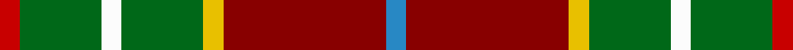
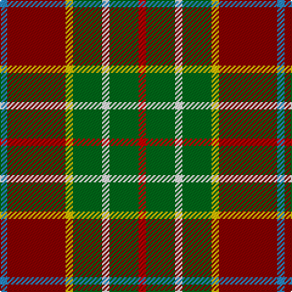

**Bands:** [RGWGYRB](/stripes/rgwgyrb/) · **Stripes:** [R G W G LY R T](/stripes/stripes7/) R G W G LY R T

This was sourced from register-of-tartans.  It is a [7 band tartan](/bands/bands7/).

Original link https://www.tartanregister.gov.uk/tartanDetails.aspx?ref=1332

## Attestations

This cloth appears in 2 source records; the oldest owns this page.

- 01/01/1997 — George Watson's College (register-of-tartans, [record](https://www.tartanregister.gov.uk/tartanDetails.aspx?ref=1332))
- pre 1997 — George Watson's College (Corporate) (tartans-authority, [record](http://www.tartansauthority.com/tartan-ferret/display/4973/))

## Register references

External register numbers recorded for this tartan.

- Scottish Register of Tartans: [1332](https://www.tartanregister.gov.uk/tartanDetails.aspx?ref=1332)
- Scottish Tartans Authority (ITI): 4973

## Thread count
R/6 G24 W6 G24 Y6 DR48 B/6

## Palette
Each colour and its ΔE from the base-6 reference it is a variant of.

| Colour | Shade | Base | ΔE (OKLab) |
|---|---|---|---|
| B | <code style="background-color:#2888C4;">#2888C4</code> `#2888C4` | B <code style="background-color:#2A418A;">#2A418A</code> | 0.21 |
| DR | <code style="background-color:#880000;">#880000</code> `#880000` | R <code style="background-color:#CC0000;">#CC0000</code> | 0.15 |
| G | <code style="background-color:#006818;">#006818</code> `#006818` | G <code style="background-color:#006100;">#006100</code> | 0.02 |
| R | <code style="background-color:#C80000;">#C80000</code> `#C80000` | R <code style="background-color:#CC0000;">#CC0000</code> | 0.01 |
| W | <code style="background-color:#FCFCFC;">#FCFCFC</code> `#FCFCFC` | W <code style="background-color:#F7F7F7;">#F7F7F7</code> | 0.01 |
| Y | <code style="background-color:#E8C000;">#E8C000</code> `#E8C000` | Y <code style="background-color:#F2BF00;">#F2BF00</code> | 0.02 |

# Sample pattern

## Nearest tartans

The nearest existing variants by ΔTartan distance.

1. [Sawyer](/setts/s8/r2lb1r8k4db1g10lr1g2~x4/) — ΔT 0.82
1. [Sawyer](/setts/s8/r2t1r8k4db1g10w1g2~x4/) — ΔT 1.00
1. [Barbour - Classic](/setts/s7/o4ly2o21dy11w2k20r3~x2/) — ΔT 1.01
1. [Craik, of Assington](/setts/s8/db4r11db1g8r2g4k1ly2~x4/) — ΔT 1.05
1. [Elystan Glodrydd (Name)](/setts/s7/w3g24r13g4lo11r8db2~x2/) — ΔT 1.07
1. [Barbour](/setts/s7/r3k20w2dy11o21ly2o2~x2/) — ΔT 1.09
1. [Wilson's, No 109](/setts/s8/g8r11k3ly2p8g15r5w2~x2/) — ΔT 1.10
1. [MacShane (Clan)](/setts/s8/dg9w2dg9k2lo14lo4w2r2~x4/) — ΔT 1.16
1. [Sikh (Corporate)](/setts/s8/o30k4o3k4o3g20dt20ly4~x2/) — ΔT 1.17
1. [Sachie Hara Scottish Check (Personal)](/setts/s5/k5db4g24r21w3~x2/) — ΔT 1.19

## Neighbour map

Every grey dot is one of 14299 variants placed by the first two principal components of the ΔTartan feature space (44% of its variance). Red is this tartan; blue dots are its nearest — click one to open its page.

<svg viewBox="0 0 640 380" role="img" style="max-width:100%;height:auto;border:1px solid #e0e0e0;border-radius:4px;display:block" xmlns="http://www.w3.org/2000/svg"><image href="/nn/cloud.v1.png" width="640" height="380"/><a href="/setts/s8/r2lb1r8k4db1g10lr1g2~x4/"><circle cx="191.2" cy="163.0" r="4" fill="#3465a4"><title>Sawyer</title></circle></a><a href="/setts/s8/r2t1r8k4db1g10w1g2~x4/"><circle cx="160.8" cy="146.2" r="4" fill="#3465a4"><title>Sawyer</title></circle></a><a href="/setts/s7/o4ly2o21dy11w2k20r3~x2/"><circle cx="172.6" cy="160.6" r="4" fill="#3465a4"><title>Barbour - Classic</title></circle></a><a href="/setts/s8/db4r11db1g8r2g4k1ly2~x4/"><circle cx="188.5" cy="170.1" r="4" fill="#3465a4"><title>Craik, of Assington</title></circle></a><a href="/setts/s7/w3g24r13g4lo11r8db2~x2/"><circle cx="162.6" cy="166.2" r="4" fill="#3465a4"><title>Elystan Glodrydd (Name)</title></circle></a><a href="/setts/s7/r3k20w2dy11o21ly2o2~x2/"><circle cx="167.3" cy="156.1" r="4" fill="#3465a4"><title>Barbour</title></circle></a><a href="/setts/s8/g8r11k3ly2p8g15r5w2~x2/"><circle cx="132.8" cy="178.4" r="4" fill="#3465a4"><title>Wilson's, No 109</title></circle></a><a href="/setts/s8/dg9w2dg9k2lo14lo4w2r2~x4/"><circle cx="128.0" cy="170.8" r="4" fill="#3465a4"><title>MacShane (Clan)</title></circle></a><a href="/setts/s8/o30k4o3k4o3g20dt20ly4~x2/"><circle cx="195.5" cy="175.2" r="4" fill="#3465a4"><title>Sikh (Corporate)</title></circle></a><a href="/setts/s5/k5db4g24r21w3~x2/"><circle cx="194.2" cy="201.6" r="4" fill="#3465a4"><title>Sachie Hara Scottish Check (Personal)</title></circle></a><circle cx="177.8" cy="171.8" r="5" fill="#c00000"/></svg>

ID: /setts/s7/r1g4w1g4ly1r8t1~x6/
