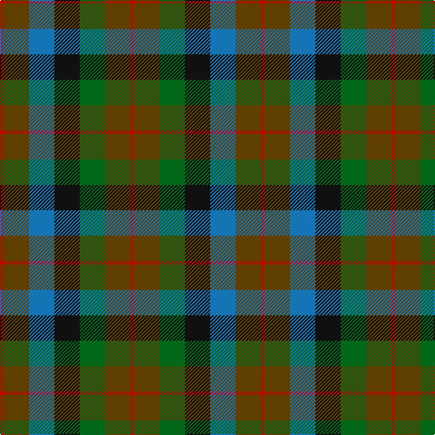

In pattern [RGBKGGR](/patterns/rgbkggr/).

This was sourced from tartans-authority.  It is a [7 stripes tartan](/stripes/stripes7/).

Original link http://www.tartansauthority.com/tartan-ferret/display/1653/

## Attestations

This cloth appears in 2 source records; the oldest owns this page.

- circa 1930 — Tennant (Clan) (tartans-authority, [record](http://www.tartansauthority.com/tartan-ferret/display/1653/))
- 01/01/1950 — Tennant #2 (register-of-tartans, [record](https://www.tartanregister.gov.uk/tartanDetails.aspx?ref=4089))

## Thread count
R/4 T28 B28 K28 G28 T28 R/4

## Palette
Each colour and its ΔE from the base-6 reference it is a variant of.

| Colour | Shade | Base | ΔE (OKLab) |
|---|---|---|---|
| B | <code style="background-color:#1474B4;">#1474B4</code> `#1474B4` | B <code style="background-color:#2A418A;">#2A418A</code> | 0.15 |
| G | <code style="background-color:#006818;">#006818</code> `#006818` | G <code style="background-color:#006100;">#006100</code> | 0.02 |
| K | <code style="background-color:#101010;">#101010</code> `#101010` | K <code style="background-color:#000000;">#000000</code> | 0.17 |
| R | <code style="background-color:#C80000;">#C80000</code> `#C80000` | R <code style="background-color:#CC0000;">#CC0000</code> | 0.01 |
| T | <code style="background-color:#604000;">#604000</code> `#604000` | G <code style="background-color:#006100;">#006100</code> | 0.14 |

# Sample pattern

## Nearest tartans

The nearest existing variants by ΔTartan distance.

1. [Tennant Family Tartan Tartan Number: 1653. Earliest known date: 1930 MacGregor-Hastie made few notes about his sample collection. In December 1967, Captain Tennant wrote to the Scottish Tartans Society, saying, ".. and I have no objection to other Tennants wearing it (Tennant tartan) but their problem will be to get hold of it ... I don't know of any other Tennant tartan and that is why I think my father designed this one." The head of the Tennant family is Lord Glenconner, descended from John Tennant of Blairston, Ayr. (1635). See products available Copyright © Blair Urquhart, Comrie, 2015](/setts/s7/r1g7b7k7ga7g7r1~b2c2c80-g604000-ga006818-k101010-rc80000~x4/) — ΔT 0.63
1. [Scottish Parliament (unofficial)](/setts/s7/b14g18k3g18r20k14y3~b1c0070-g006818-k101010-r880000-yd09800~x2/) — ΔT 0.91
1. [Casely](/setts/s6/r4g11k11g2b11ga3~b506878-g30644c-ga446428-k101010-rc80000~x4/) — ΔT 0.91
1. [Forres](/setts/s6/g2y1g5k4b5r1~b4c3428-g006818-k101010-r880000-yd09800~x4/) — ΔT 0.95
1. [Parliament Trade Tartan Tartan Number: 2477. Earliest known date: 1998 Created to celebrate the referendum result for the re-establishment of a Scottish Parliament as well as to provide a Parliamentary livery tartan. See products available Copyright © Blair Urquhart, Comrie, 2015](/setts/s7/b8g11k3g11r12ba10y2~b2c2c80-ba003c64-g006818-k101010-r880000-ye8c000~x2/) — ΔT 0.97
1. [MacDuff Hunting](/setts/s8/b10r2b10g17k12ba9b9r2~b441800-ba2c2c80-g006818-k101010-rc80000~x2/) — ΔT 1.02
1. [Unidentified Pinafore](/setts/s7/g24k4g24k24b7r24b7~b3c82af-g005020-k101010-r960028~x2/) — ΔT 1.15
1. [Birse](/setts/s6/k4g16k14y3b16r4~b105880-g00643c-k101010-rc80000-ybc8c00~x2/) — ΔT 1.18
1. [Styrian](/setts/s8/r16g29b19ga8b19g29r16ra4~b5c5c5c-g003820-ga006818-r888888-ra880000~x2/) — ΔT 1.18
1. [Thompson's Fancy Personal Tartan Tartan Number: 286. Earliest known date: pre 2003 Designed for his own use. See products available Copyright © Blair Urquhart, Comrie, 2015](/setts/s6/r2g8b2ba4k4ba1~b2c2c80-ba5c8ca8-g604000-k101010-rc80000~x6/) — ΔT 1.25

## Neighbour map

Every grey dot is one of 15726 variants placed by the first two principal components of the ΔTartan feature space (44% of its variance). Red is this tartan; blue dots are its nearest — click one to open its page.

<svg viewBox="0 0 640 380" role="img" style="max-width:100%;height:auto;border:1px solid #e0e0e0;border-radius:4px;display:block" xmlns="http://www.w3.org/2000/svg"><image href="/nn/cloud.v1.png" width="640" height="380"/><a href="/setts/s7/r1g7b7k7ga7g7r1~b2c2c80-g604000-ga006818-k101010-rc80000~x4/"><circle cx="165.5" cy="252.8" r="4" fill="#3465a4"><title>Tennant Family Tartan Tartan Number: 1653. Earliest known date: 1930 MacGregor-Hastie made few notes about his sample collection. In December 1967, Captain Tennant wrote to the Scottish Tartans Society, saying, &quot;.. and I have no objection to other Tennants wearing it (Tennant tartan) but their problem will be to get hold of it ... I don't know of any other Tennant tartan and that is why I think my father designed this one.&quot; The head of the Tennant family is Lord Glenconner, descended from John Tennant of Blairston, Ayr. (1635). See products available Copyright © Blair Urquhart, Comrie, 2015</title></circle></a><a href="/setts/s7/b14g18k3g18r20k14y3~b1c0070-g006818-k101010-r880000-yd09800~x2/"><circle cx="140.7" cy="241.8" r="4" fill="#3465a4"><title>Scottish Parliament (unofficial)</title></circle></a><a href="/setts/s6/r4g11k11g2b11ga3~b506878-g30644c-ga446428-k101010-rc80000~x4/"><circle cx="130.4" cy="255.6" r="4" fill="#3465a4"><title>Casely</title></circle></a><a href="/setts/s6/g2y1g5k4b5r1~b4c3428-g006818-k101010-r880000-yd09800~x4/"><circle cx="164.1" cy="261.9" r="4" fill="#3465a4"><title>Forres</title></circle></a><a href="/setts/s7/b8g11k3g11r12ba10y2~b2c2c80-ba003c64-g006818-k101010-r880000-ye8c000~x2/"><circle cx="112.9" cy="240.2" r="4" fill="#3465a4"><title>Parliament Trade Tartan Tartan Number: 2477. Earliest known date: 1998 Created to celebrate the referendum result for the re-establishment of a Scottish Parliament as well as to provide a Parliamentary livery tartan. See products available Copyright © Blair Urquhart, Comrie, 2015</title></circle></a><a href="/setts/s8/b10r2b10g17k12ba9b9r2~b441800-ba2c2c80-g006818-k101010-rc80000~x2/"><circle cx="189.6" cy="240.8" r="4" fill="#3465a4"><title>MacDuff Hunting</title></circle></a><a href="/setts/s7/g24k4g24k24b7r24b7~b3c82af-g005020-k101010-r960028~x2/"><circle cx="190.1" cy="264.1" r="4" fill="#3465a4"><title>Unidentified Pinafore</title></circle></a><a href="/setts/s6/k4g16k14y3b16r4~b105880-g00643c-k101010-rc80000-ybc8c00~x2/"><circle cx="124.0" cy="248.6" r="4" fill="#3465a4"><title>Birse</title></circle></a><a href="/setts/s8/r16g29b19ga8b19g29r16ra4~b5c5c5c-g003820-ga006818-r888888-ra880000~x2/"><circle cx="193.0" cy="257.0" r="4" fill="#3465a4"><title>Styrian</title></circle></a><a href="/setts/s6/r2g8b2ba4k4ba1~b2c2c80-ba5c8ca8-g604000-k101010-rc80000~x6/"><circle cx="161.1" cy="221.5" r="4" fill="#3465a4"><title>Thompson's Fancy Personal Tartan Tartan Number: 286. Earliest known date: pre 2003 Designed for his own use. See products available Copyright © Blair Urquhart, Comrie, 2015</title></circle></a><circle cx="149.3" cy="246.5" r="5" fill="#c00000"/></svg>

ID: /setts/s7/r1g7b7k7ga7g7r1~b1474b4-g604000-ga006818-k101010-rc80000~x4/
