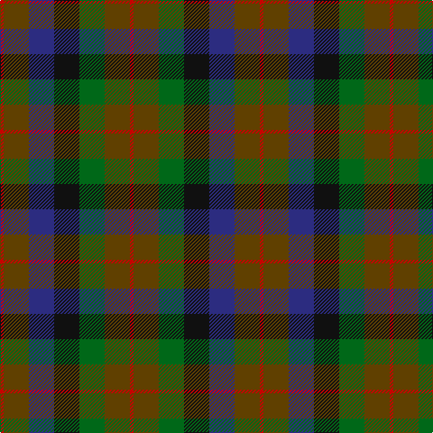

In pattern [RGBKGGR](/patterns/rgbkggr/).

This was sourced from house-of-tartan.  It is a [7 stripes tartan](/stripes/stripes7/).

Original link http://www.house-of-tartan.scotland.net/house/TartanViewjs.asp?colr=Def&tnam=1653

## Thread count
R/4 T28 DB28 K28 G28 T28 R/4

## Palette
Each colour and its ΔE from the base-6 reference it is a variant of.

| Colour | Shade | Base | ΔE (OKLab) |
|---|---|---|---|
| DB | <code style="background-color:#2C2C80;">#2C2C80</code> `#2C2C80` | B <code style="background-color:#2A418A;">#2A418A</code> | 0.06 |
| G | <code style="background-color:#006818;">#006818</code> `#006818` | G <code style="background-color:#006100;">#006100</code> | 0.02 |
| K | <code style="background-color:#101010;">#101010</code> `#101010` | K <code style="background-color:#000000;">#000000</code> | 0.17 |
| R | <code style="background-color:#C80000;">#C80000</code> `#C80000` | R <code style="background-color:#CC0000;">#CC0000</code> | 0.01 |
| T | <code style="background-color:#604000;">#604000</code> `#604000` | G <code style="background-color:#006100;">#006100</code> | 0.14 |

# Sample pattern

## Nearest tartans

The nearest existing variants by ΔTartan distance.

1. [Tennant (Clan)](/setts/s7/r1g7b7k7ga7g7r1~b1474b4-g604000-ga006818-k101010-rc80000~x4/) — ΔT 0.63
1. [MacDuff Hunting](/setts/s8/b10r2b10g17k12ba9b9r2~b441800-ba2c2c80-g006818-k101010-rc80000~x2/) — ΔT 0.64
1. [Casely](/setts/s6/r4g11k11g2b11ga3~b506878-g30644c-ga446428-k101010-rc80000~x4/) — ΔT 0.98
1. [MacDuff Hunting Clan Tartan Tartan Number: 1654. Earliest known date: 1906 STS records (sic) 'Sett may be quite wrong. (S.S. May 86)' See products available Copyright © Blair Urquhart, Comrie, 2015](/setts/s8/g8r1g8ga8k8b8g8r2~b2c2c80-g604000-ga006818-k101010-rc80000~x2/) — ΔT 1.04
1. [Styrian](/setts/s8/r16g29b19ga8b19g29r16ra4~b5c5c5c-g003820-ga006818-r888888-ra880000~x2/) — ΔT 1.14
1. [Forres](/setts/s6/g2y1g5k4b5r1~b4c3428-g006818-k101010-r880000-yd09800~x4/) — ΔT 1.16
1. [Dorward/Dogwood](/setts/s7/g7r3g9ga15b19g14r4~b2c2c80-g604000-ga006818-rc80000~x2/) — ΔT 1.21
1. [Huntly #3](/setts/s10/g2y1g5k4b5r1b5k4g5y1~b4c3428-g604000-k101010-rb84c00-yb8b8b8~x4/) — ΔT 1.23
1. [Styrian (Fashion)](/setts/s5/g8b19ga29r16ra4~b5c5c5c-g006818-ga003820-r888888-ra880000~x2/) — ΔT 1.24
1. [Gleneagles Group Corporate Tartan Tartan Number: 2107. Earliest known date: 1989 Designed for a range of tartan goods called the Gleneagles Collection. See products available Copyright © Blair Urquhart, Comrie, 2015](/setts/s7/b5g6ga1g6b5ba6b1~b680028-ba2c2c80-g006818-ga604000~x2/) — ΔT 1.26

## Neighbour map

Every grey dot is one of 15726 variants placed by the first two principal components of the ΔTartan feature space (44% of its variance). Red is this tartan; blue dots are its nearest — click one to open its page.

<svg viewBox="0 0 640 380" role="img" style="max-width:100%;height:auto;border:1px solid #e0e0e0;border-radius:4px;display:block" xmlns="http://www.w3.org/2000/svg"><image href="/nn/cloud.v1.png" width="640" height="380"/><a href="/setts/s7/r1g7b7k7ga7g7r1~b1474b4-g604000-ga006818-k101010-rc80000~x4/"><circle cx="149.3" cy="246.5" r="4" fill="#3465a4"><title>Tennant (Clan)</title></circle></a><a href="/setts/s8/b10r2b10g17k12ba9b9r2~b441800-ba2c2c80-g006818-k101010-rc80000~x2/"><circle cx="189.6" cy="240.8" r="4" fill="#3465a4"><title>MacDuff Hunting</title></circle></a><a href="/setts/s6/r4g11k11g2b11ga3~b506878-g30644c-ga446428-k101010-rc80000~x4/"><circle cx="130.4" cy="255.6" r="4" fill="#3465a4"><title>Casely</title></circle></a><a href="/setts/s8/g8r1g8ga8k8b8g8r2~b2c2c80-g604000-ga006818-k101010-rc80000~x2/"><circle cx="214.3" cy="255.7" r="4" fill="#3465a4"><title>MacDuff Hunting Clan Tartan Tartan Number: 1654. Earliest known date: 1906 STS records (sic) 'Sett may be quite wrong. (S.S. May 86)' See products available Copyright © Blair Urquhart, Comrie, 2015</title></circle></a><a href="/setts/s8/r16g29b19ga8b19g29r16ra4~b5c5c5c-g003820-ga006818-r888888-ra880000~x2/"><circle cx="193.0" cy="257.0" r="4" fill="#3465a4"><title>Styrian</title></circle></a><a href="/setts/s6/g2y1g5k4b5r1~b4c3428-g006818-k101010-r880000-yd09800~x4/"><circle cx="164.1" cy="261.9" r="4" fill="#3465a4"><title>Forres</title></circle></a><a href="/setts/s7/g7r3g9ga15b19g14r4~b2c2c80-g604000-ga006818-rc80000~x2/"><circle cx="228.1" cy="271.9" r="4" fill="#3465a4"><title>Dorward/Dogwood</title></circle></a><a href="/setts/s10/g2y1g5k4b5r1b5k4g5y1~b4c3428-g604000-k101010-rb84c00-yb8b8b8~x4/"><circle cx="165.6" cy="251.0" r="4" fill="#3465a4"><title>Huntly #3</title></circle></a><a href="/setts/s5/g8b19ga29r16ra4~b5c5c5c-g006818-ga003820-r888888-ra880000~x2/"><circle cx="192.6" cy="263.5" r="4" fill="#3465a4"><title>Styrian (Fashion)</title></circle></a><a href="/setts/s7/b5g6ga1g6b5ba6b1~b680028-ba2c2c80-g006818-ga604000~x2/"><circle cx="211.0" cy="277.3" r="4" fill="#3465a4"><title>Gleneagles Group Corporate Tartan Tartan Number: 2107. Earliest known date: 1989 Designed for a range of tartan goods called the Gleneagles Collection. See products available Copyright © Blair Urquhart, Comrie, 2015</title></circle></a><circle cx="165.5" cy="252.8" r="5" fill="#c00000"/></svg>

ID: /setts/s7/r1g7b7k7ga7g7r1~b2c2c80-g604000-ga006818-k101010-rc80000~x4/
