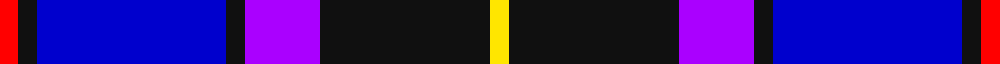

In pattern [RKBKBKY](/stripes/rkbkbky/).

This was sourced from register-of-tartans.  It is a [7 stripe tartan](/stripes/stripes7/).

Original link https://www.tartanregister.gov.uk/tartanDetails.aspx?ref=10221

## Register references

External register numbers recorded for this tartan.

- Scottish Register of Tartans: [10221](https://www.tartanregister.gov.uk/tartanDetails.aspx?ref=10221)

## Thread count
R/4 K4 B40 K4 P16 K36 Y/4

## Palette
Each colour and its ΔE from the base-6 reference it is a variant of.

| Colour | Shade | Base | ΔE (OKLab) |
|---|---|---|---|
| B | <code style="background-color:#0000CD;">#0000CD</code> `#0000CD` | B <code style="background-color:#2A418A;">#2A418A</code> | 0.14 |
| K | <code style="background-color:#101010;">#101010</code> `#101010` | K <code style="background-color:#000000;">#000000</code> | 0.17 |
| P | <code style="background-color:#AA00FF;">#AA00FF</code> `#AA00FF` | B <code style="background-color:#2A418A;">#2A418A</code> | 0.28 |
| R | <code style="background-color:#FF0000;">#FF0000</code> `#FF0000` | R <code style="background-color:#CC0000;">#CC0000</code> | 0.11 |
| Y | <code style="background-color:#FFE600;">#FFE600</code> `#FFE600` | Y <code style="background-color:#F2BF00;">#F2BF00</code> | 0.10 |

# Sample pattern

## Nearest tartans

The nearest existing variants by ΔTartan distance.

1. [The Open Championship](/setts/s6/w2db15y2db20r9w2~x2/) — ΔT 1.32
1. [Immanuel Presbyterian Church (Milwaukee)](/setts/s8/k3r2k14lt2db6lt2db16lt3~x2/) — ΔT 1.35
1. [Mina Perhonen Japanese Corporate Tartan Tartan Number: 5797. Earliest known date: pre 2003 Designed by Fiona Hall of Lochcarron as a corporate tartan for the Mina Company of Tokyo whose logo is a butterfly. The blues are from the company's colours and represent the sky, the yellow represents the butterfly and the white is for the clouds.'Perhonen' is Finnish for butterfly and chosen because the Japanese design world has a great affinity with some Scandinavian countries. See products available Copyright © Blair Urquhart, Comrie, 2015](/setts/s7/w4db24ly2db24t5db4ly4~x2/) — ΔT 1.38
1. [Saint Margaret of Scotland Youth Group](/setts/s8/p30db5p3db33lg8k3db8w2~x2/) — ΔT 1.46
1. [Banff, and Buchan](/setts/s8/db26w2db3db15t26db2t3ly4~x2/) — ΔT 1.48
1. [USCBP - Office of Field Operations](/setts/s9/k6db3k3db33k16b21k3b3r4~x2/) — ΔT 1.52
1. [Banff and Buchan](/setts/s8/k17lb2k3db16t28db2t3lo2~x2/) — ΔT 1.53
1. [Mary Washington](/setts/s7/k1db6b1k6b6k1w1~x6/) — ΔT 1.55
1. [DeCloud-McMasters (Personal)](/setts/s8/r3db2w2db26k22w3db3w3~x2/) — ΔT 1.58
1. [Bryson (1988)](/setts/s5/y16r8b57db56lb8/) — ΔT 1.61

## Neighbour map

Every grey dot is one of 14299 variants placed by the first two principal components of the ΔTartan feature space (44% of its variance). Red is this tartan; blue dots are its nearest — click one to open its page.

<svg viewBox="0 0 640 380" role="img" style="max-width:100%;height:auto;border:1px solid #e0e0e0;border-radius:4px;display:block" xmlns="http://www.w3.org/2000/svg"><image href="/nn/cloud.v1.png" width="640" height="380"/><a href="/setts/s6/w2db15y2db20r9w2~x2/"><circle cx="177.1" cy="188.2" r="4" fill="#3465a4"><title>The Open Championship</title></circle></a><a href="/setts/s8/k3r2k14lt2db6lt2db16lt3~x2/"><circle cx="209.5" cy="198.9" r="4" fill="#3465a4"><title>Immanuel Presbyterian Church (Milwaukee)</title></circle></a><a href="/setts/s7/w4db24ly2db24t5db4ly4~x2/"><circle cx="212.8" cy="176.4" r="4" fill="#3465a4"><title>Mina Perhonen Japanese Corporate Tartan Tartan Number: 5797. Earliest known date: pre 2003 Designed by Fiona Hall of Lochcarron as a corporate tartan for the Mina Company of Tokyo whose logo is a butterfly. The blues are from the company's colours and represent the sky, the yellow represents the butterfly and the white is for the clouds.'Perhonen' is Finnish for butterfly and chosen because the Japanese design world has a great affinity with some Scandinavian countries. See products available Copyright © Blair Urquhart, Comrie, 2015</title></circle></a><a href="/setts/s8/p30db5p3db33lg8k3db8w2~x2/"><circle cx="280.0" cy="156.9" r="4" fill="#3465a4"><title>Saint Margaret of Scotland Youth Group</title></circle></a><a href="/setts/s8/db26w2db3db15t26db2t3ly4~x2/"><circle cx="182.2" cy="164.4" r="4" fill="#3465a4"><title>Banff, and Buchan</title></circle></a><a href="/setts/s9/k6db3k3db33k16b21k3b3r4~x2/"><circle cx="206.0" cy="185.0" r="4" fill="#3465a4"><title>USCBP - Office of Field Operations</title></circle></a><a href="/setts/s8/k17lb2k3db16t28db2t3lo2~x2/"><circle cx="199.5" cy="156.4" r="4" fill="#3465a4"><title>Banff and Buchan</title></circle></a><a href="/setts/s7/k1db6b1k6b6k1w1~x6/"><circle cx="101.5" cy="203.5" r="4" fill="#3465a4"><title>Mary Washington</title></circle></a><a href="/setts/s8/r3db2w2db26k22w3db3w3~x2/"><circle cx="256.7" cy="161.2" r="4" fill="#3465a4"><title>DeCloud-McMasters (Personal)</title></circle></a><a href="/setts/s5/y16r8b57db56lb8/"><circle cx="177.2" cy="220.1" r="4" fill="#3465a4"><title>Bryson (1988)</title></circle></a><circle cx="189.3" cy="173.5" r="5" fill="#c00000"/></svg>

ID: /setts/s7/r1k1db10k1p4k9ly1~x4/
