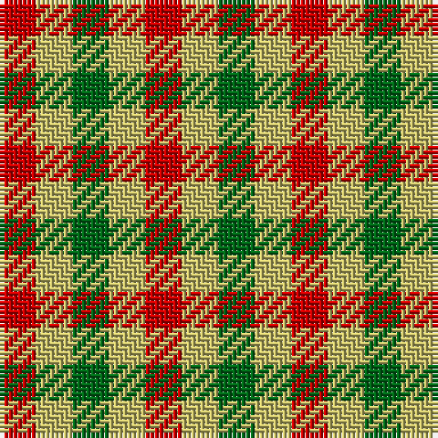

This page is one **sett** — a single exact thread-count. It belongs to the [tartan](/tartans/r1lg1ga1lg1r1lg1g1/)
(the same proportion at any scale), whose colour order is pattern [GYRYGYR](/stripes/gyrygyr/).

Sourced from tartans-authority.  It is a [7 stripe tartan](/stripes/stripes7/).

Original link http://www.tartansauthority.com/tartan-ferret/display/5471/

## Thread count
R/8 LG8 Ga8 LG8 R8 LG8 G/8

## Palette
Each colour and the base-6 reference it is a variant of.

| Colour | Shade | Base |
|---|---|---|
| G | <code style="background-color:#006818;">#006818</code> `oklch(45.0% 0.142 145.0)` <small>#006818</small> | G <code style="background-color:#006100;">#006100</code> |
| Ga | <code style="background-color:#006818;">#006818</code> `oklch(45.0% 0.142 145.0)` <small>#006818</small> | G <code style="background-color:#006100;">#006100</code> |
| LG | <code style="background-color:#C4BC68;">#C4BC68</code> `oklch(78.4% 0.107 103.7)` <small>#C4BC68</small> | Y <code style="background-color:#F2BF00;">#F2BF00</code> |
| R | <code style="background-color:#C80000;">#C80000</code> `oklch(52.3% 0.215 29.2)` <small>#C80000</small> | R <code style="background-color:#CC0000;">#CC0000</code> |

# Sample pattern

## Nearest tartans

The nearest existing variants by ΔTartan distance, with this tartan at the top so the swatches line up against it.

ΔTartan

Tartan

Sett

—

<a href="/ttd/edit/#slug=r1ly1g1ly1r1ly1g1~x8">Lochwood (Estate Check)</a> <a class="nn-out" href="/setts/s7/r1ly1g1ly1r1ly1g1~x8/" title="open its dictionary page">↗</a>

1.47

<a href="/ttd/edit/#slug=r4ly3g4ly4b4ly4g4~x2">Lochwood Estate Check</a> <a class="nn-out" href="/setts/s7/r4ly3g4ly4b4ly4g4~x2/" title="open its dictionary page">↗</a>

1.97

<a href="/ttd/edit/#slug=r1o1k1o1y1o1k1o1y1~x12">Seaforth (Estate Check)</a> <a class="nn-out" href="/setts/s9/r1o1k1o1y1o1k1o1y1~x12/" title="open its dictionary page">↗</a>

1.97

<a href="/ttd/edit/#slug=r1o1k1o1y1o1k1o1y1~x6">Seaforth Estate Check Estate Check Weavers Tartan Tartan Number: 5344. Earliest known date: pre 1990 No details. See products available Copyright © Blair Urquhart, Comrie, 2015</a> <a class="nn-out" href="/setts/s9/r1o1k1o1y1o1k1o1y1~x6/" title="open its dictionary page">↗</a>

2.33

<a href="/ttd/edit/#slug=dr1o1dr1o1dg1~x8">Ballindalloch Check</a> <a class="nn-out" href="/setts/s5/dr1o1dr1o1dg1~x8/" title="open its dictionary page">↗</a>

2.40

<a href="/ttd/edit/#slug=do1w1k1w1do1w1k1w1dt1~x6">Strathspey (Estate Check)</a> <a class="nn-out" href="/setts/s9/do1w1k1w1do1w1k1w1dt1~x6/" title="open its dictionary page">↗</a>

2.58

<a href="/setts/s4/k1g1r1~x8/">Wilson's No.187</a>

2.61

<a href="/ttd/edit/#slug=do1lb1k1lb1do1lb1k1lb1r1~x6">Dupplin Check</a> <a class="nn-out" href="/setts/s9/do1lb1k1lb1do1lb1k1lb1r1~x6/" title="open its dictionary page">↗</a>

2.67

<a href="/ttd/edit/#slug=r1db1ly1~x40">Mothers Pride</a> <a class="nn-out" href="/setts/s3/r1db1ly1~x40/" title="open its dictionary page">↗</a>

2.69

<a href="/ttd/edit/#slug=ly1r1ly1r1ly1lo1ly1lo1ly1~x6">Compaq Check (Corporate)</a> <a class="nn-out" href="/setts/s9/ly1r1ly1r1ly1lo1ly1lo1ly1~x6/" title="open its dictionary page">↗</a>

2.71

<a href="/setts/s16/r1o1k1o1y1o1k1o1y1~x12/">Seaforth Estate Check</a>

## Neighbour map

Every grey dot is one of 14299 variants placed by the first two principal components of the ΔTartan feature space (44% of its variance). Red is this tartan; blue dots are its nearest — click one to open its page.

<svg viewBox="0 0 640 380" role="img" style="max-width:100%;height:auto;border:1px solid #e0e0e0;border-radius:4px;display:block" xmlns="http://www.w3.org/2000/svg"><image href="/nn/cloud.v1.png" width="640" height="380"/><a href="/setts/s7/r4ly3g4ly4b4ly4g4~x2/"><circle cx="23.8" cy="366.0" r="4" fill="#3465a4"><title>Lochwood Estate Check</title></circle></a><a href="/setts/s9/r1o1k1o1y1o1k1o1y1~x12/"><circle cx="14.0" cy="366.0" r="4" fill="#3465a4"><title>Seaforth (Estate Check)</title></circle></a><a href="/setts/s9/r1o1k1o1y1o1k1o1y1~x6/"><circle cx="14.0" cy="366.0" r="4" fill="#3465a4"><title>Seaforth Estate Check Estate Check Weavers Tartan Tartan Number: 5344. Earliest known date: pre 1990 No details. See products available Copyright © Blair Urquhart, Comrie, 2015</title></circle></a><a href="/setts/s5/dr1o1dr1o1dg1~x8/"><circle cx="67.6" cy="366.0" r="4" fill="#3465a4"><title>Ballindalloch Check</title></circle></a><a href="/setts/s9/do1w1k1w1do1w1k1w1dt1~x6/"><circle cx="14.0" cy="366.0" r="4" fill="#3465a4"><title>Strathspey (Estate Check)</title></circle></a><a href="/setts/s4/k1g1r1~x8/"><circle cx="90.0" cy="366.0" r="4" fill="#3465a4"><title>Wilson's No.187</title></circle></a><a href="/setts/s9/do1lb1k1lb1do1lb1k1lb1r1~x6/"><circle cx="14.0" cy="366.0" r="4" fill="#3465a4"><title>Dupplin Check</title></circle></a><a href="/setts/s3/r1db1ly1~x40/"><circle cx="14.0" cy="366.0" r="4" fill="#3465a4"><title>Mothers Pride</title></circle></a><a href="/setts/s9/ly1r1ly1r1ly1lo1ly1lo1ly1~x6/"><circle cx="137.3" cy="366.0" r="4" fill="#3465a4"><title>Compaq Check (Corporate)</title></circle></a><a href="/setts/s16/r1o1k1o1y1o1k1o1y1~x12/"><circle cx="14.0" cy="363.4" r="4" fill="#3465a4"><title>Seaforth Estate Check</title></circle></a><circle cx="14.0" cy="366.0" r="5" fill="#c00000"/></svg>

ID: /setts/s7/r1ly1g1ly1r1ly1g1~x8/
