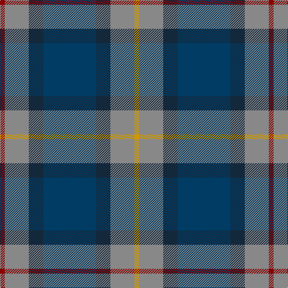

**Bands:** [RRBBBRY](/stripes/rrbbbry/) · **Stripes:** [R O DT DT DT O LO](/stripes/stripes7/) R O DT DT DT O LO

This was sourced from register-of-tartans.  It is a [7 band tartan](/bands/bands7/).

Original link https://www.tartanregister.gov.uk/tartanDetails.aspx?ref=3130

## Attestations

This cloth appears in 2 source records; the oldest owns this page.

- 01/01/1997 — Newmill (register-of-tartans, [record](https://www.tartanregister.gov.uk/tartanDetails.aspx?ref=3130))
- pre 1997 — Newmill (Corporate) (tartans-authority, [record](http://www.tartansauthority.com/tartan-ferret/display/2053/))

## Register references

External register numbers recorded for this tartan.

- Scottish Register of Tartans: [3130](https://www.tartanregister.gov.uk/tartanDetails.aspx?ref=3130)
- Scottish Tartans Authority (ITI): 2053
- Scottish Tartans World Register: 2053

## Thread count
DR/8 N40 DN24 DB88 DN24 N40 DY/8

## Palette
Each colour and its ΔE from the base-6 reference it is a variant of.

| Colour | Shade | Base | ΔE (OKLab) |
|---|---|---|---|
| DB | <code style="background-color:#003C64;">#003C64</code> `#003C64` | B <code style="background-color:#2A418A;">#2A418A</code> | 0.08 |
| DN | <code style="background-color:#14283C;">#14283C</code> `#14283C` | B <code style="background-color:#2A418A;">#2A418A</code> | 0.15 |
| DR | <code style="background-color:#880000;">#880000</code> `#880000` | R <code style="background-color:#CC0000;">#CC0000</code> | 0.15 |
| DY | <code style="background-color:#D09800;">#D09800</code> `#D09800` | Y <code style="background-color:#F2BF00;">#F2BF00</code> | 0.12 |
| N | <code style="background-color:#888888;">#888888</code> `#888888` | R <code style="background-color:#CC0000;">#CC0000</code> | 0.24 |

# Sample pattern

## Nearest tartans

The nearest existing variants by ΔTartan distance.

1. [Newmill Corporate Tartan Tartan Number: 2053. Earliest known date: March 1992 Designed to be used in the refurbishing of Johnstons of Elgin new mill shop and based on the colours of the mill shop house style. The lighter square is represented here as green from the 'Antique' colour range, a speciality of Johnstons of Elgin. See products available Copyright © Blair Urquhart, Comrie, 2015](/setts/s7/r5o20dt13db42dt13o20lo5/) — ΔT 0.85
1. [Newmill](/setts/s7/m5g20k13db42k13g20ly5~x2/) — ΔT 0.89
1. [Bailies of Bennachie (Corporate)](/setts/s7/g27r2g4r15db26k2db6~x2/) — ΔT 0.89
1. [MacPhail Hunting](/setts/s6/r2db23k14dg16k2w2~x2/) — ΔT 0.91
1. [Lyle and Scott](/setts/s6/dg5b2dg9dt19r9ly2~x2/) — ΔT 0.91
1. [MacThomas (Clan)](/setts/s7/dg5lp3dg32k16b32m3b5~x2/) — ΔT 0.96
1. [Antique 2000](/setts/s8/dt10r1dt1r1dt1k6y9b2~x2/) — ΔT 0.97
1. [Balfour](/setts/s6/db30ly3dy11ly3y33r6~x2/) — ΔT 1.01
1. [Dunbartonshire](/setts/s9/g11k2g1r4db1r4db13t2db1~x4/) — ΔT 1.05
1. [MacThomas](/setts/s7/g5m3g32k16b32m3b5~x2/) — ΔT 1.06

## Neighbour map

Every grey dot is one of 14299 variants placed by the first two principal components of the ΔTartan feature space (44% of its variance). Red is this tartan; blue dots are its nearest — click one to open its page.

<svg viewBox="0 0 640 380" role="img" style="max-width:100%;height:auto;border:1px solid #e0e0e0;border-radius:4px;display:block" xmlns="http://www.w3.org/2000/svg"><image href="/nn/cloud.v1.png" width="640" height="380"/><a href="/setts/s7/r5o20dt13db42dt13o20lo5/"><circle cx="177.2" cy="218.3" r="4" fill="#3465a4"><title>Newmill Corporate Tartan Tartan Number: 2053. Earliest known date: March 1992 Designed to be used in the refurbishing of Johnstons of Elgin new mill shop and based on the colours of the mill shop house style. The lighter square is represented here as green from the 'Antique' colour range, a speciality of Johnstons of Elgin. See products available Copyright © Blair Urquhart, Comrie, 2015</title></circle></a><a href="/setts/s7/m5g20k13db42k13g20ly5~x2/"><circle cx="163.1" cy="220.7" r="4" fill="#3465a4"><title>Newmill</title></circle></a><a href="/setts/s7/g27r2g4r15db26k2db6~x2/"><circle cx="240.9" cy="194.9" r="4" fill="#3465a4"><title>Bailies of Bennachie (Corporate)</title></circle></a><a href="/setts/s6/r2db23k14dg16k2w2~x2/"><circle cx="214.9" cy="209.8" r="4" fill="#3465a4"><title>MacPhail Hunting</title></circle></a><a href="/setts/s6/dg5b2dg9dt19r9ly2~x2/"><circle cx="220.4" cy="225.5" r="4" fill="#3465a4"><title>Lyle and Scott</title></circle></a><a href="/setts/s7/dg5lp3dg32k16b32m3b5~x2/"><circle cx="213.8" cy="200.8" r="4" fill="#3465a4"><title>MacThomas (Clan)</title></circle></a><a href="/setts/s8/dt10r1dt1r1dt1k6y9b2~x2/"><circle cx="204.1" cy="189.4" r="4" fill="#3465a4"><title>Antique 2000</title></circle></a><a href="/setts/s6/db30ly3dy11ly3y33r6~x2/"><circle cx="214.3" cy="196.8" r="4" fill="#3465a4"><title>Balfour</title></circle></a><a href="/setts/s9/g11k2g1r4db1r4db13t2db1~x4/"><circle cx="228.4" cy="177.6" r="4" fill="#3465a4"><title>Dunbartonshire</title></circle></a><a href="/setts/s7/g5m3g32k16b32m3b5~x2/"><circle cx="212.2" cy="198.7" r="4" fill="#3465a4"><title>MacThomas</title></circle></a><circle cx="206.0" cy="208.4" r="5" fill="#c00000"/></svg>

ID: /setts/s7/r1o5dt3dt11dt3o5lo1~x8/
