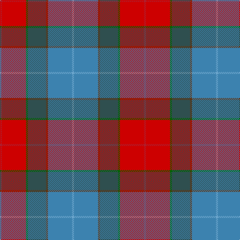

In pattern [RRGBGBY](/stripes/rrgbgby/).

This was sourced from register-of-tartans.  It is a [7 stripe tartan](/stripes/stripes7/).

Original link https://www.tartanregister.gov.uk/tartanDetails.aspx?ref=10680

## Register references

External register numbers recorded for this tartan.

- Scottish Register of Tartans: [10680](https://www.tartanregister.gov.uk/tartanDetails.aspx?ref=10680)

## Thread count
R/4 Ra48 G4 N36 T4 B48 Ba/4

## Palette
Each colour and the base-6 reference it is a variant of.

| Colour | Shade | Base |
|---|---|---|
| B | <code style="background-color:#3C82AF;">#3C82AF</code> `oklch(58.1% 0.099 239.8)` <small>#3C82AF</small> | B <code style="background-color:#2A418A;">#2A418A</code> |
| Ba | <code style="background-color:#6CA6CD;">#6CA6CD</code> `oklch(70.0% 0.083 239.0)` <small>#6CA6CD</small> | Y <code style="background-color:#F2BF00;">#F2BF00</code> |
| G | <code style="background-color:#006400;">#006400</code> `oklch(43.6% 0.148 142.5)` <small>#006400</small> | G <code style="background-color:#006100;">#006100</code> |
| N | <code style="background-color:#2F4F4F;">#2F4F4F</code> `oklch(40.3% 0.038 195.8)` <small>#2F4F4F</small> | B <code style="background-color:#2A418A;">#2A418A</code> |
| R | <code style="background-color:#AF1E2D;">#AF1E2D</code> `oklch(49.0% 0.178 22.4)` <small>#AF1E2D</small> | R <code style="background-color:#CC0000;">#CC0000</code> |
| Ra | <code style="background-color:#CD0000;">#CD0000</code> `oklch(53.3% 0.219 29.2)` <small>#CD0000</small> | R <code style="background-color:#CC0000;">#CC0000</code> |
| T | <code style="background-color:#603311;">#603311</code> `oklch(37.2% 0.079 53.9)` <small>#603311</small> | G <code style="background-color:#006100;">#006100</code> |

# Sample pattern

## Nearest tartans

The nearest existing variants by ΔTartan distance.

1. [Barbour Dress](/setts/s7/o4do2o21db11w2o20r3~x2/) — ΔT 1.34
1. [Allman-Jones (Personal)](/setts/s7/r3w2o7n25k8o15dg2~x2/) — ΔT 1.38
1. [Allman-Jones (Personal)](/setts/s7/r3w2y7n25k8y15dg2~x2/) — ΔT 1.39
1. [Ontex](/setts/s7/db4w1n12lr12m4t1w2~x4/) — ΔT 1.43
1. [Leitrim, County](/setts/s10/lo3do2n18lb3o13lb4k3lb4do18lb3~x2/) — ΔT 1.46
1. [Australian Heavy Horse](/setts/s10/n4n2n18k2n5do16w2n2lr2n4~x2/) — ΔT 1.46
1. [Meath](/setts/s12/o5db2r14dr9g8t3r3t3r3t3g19w3~x2/) — ΔT 1.46
1. [Derry Family (Olney, Buckinghamshire) (Personal)](/setts/s9/w6b36ly12dy19dy6r6dy6r28dy4/) — ΔT 1.49
1. [Crossbill](/setts/s7/k2m15dy15g15r2g3ly2~x2/) — ΔT 1.51
1. [Murray of Abercairney (Personal)](/setts/s9/t3y1k1r12r1dg9r1y1t3~x2/) — ΔT 1.57

## Neighbour map

Every grey dot is one of 14299 variants placed by the first two principal components of the ΔTartan feature space (44% of its variance). Red is this tartan; blue dots are its nearest — click one to open its page.

<svg viewBox="0 0 640 380" role="img" style="max-width:100%;height:auto;border:1px solid #e0e0e0;border-radius:4px;display:block" xmlns="http://www.w3.org/2000/svg"><image href="/nn/cloud.v1.png" width="640" height="380"/><a href="/setts/s7/o4do2o21db11w2o20r3~x2/"><circle cx="189.8" cy="167.4" r="4" fill="#3465a4"><title>Barbour Dress</title></circle></a><a href="/setts/s7/r3w2o7n25k8o15dg2~x2/"><circle cx="206.2" cy="168.1" r="4" fill="#3465a4"><title>Allman-Jones (Personal)</title></circle></a><a href="/setts/s7/r3w2y7n25k8y15dg2~x2/"><circle cx="214.2" cy="174.1" r="4" fill="#3465a4"><title>Allman-Jones (Personal)</title></circle></a><a href="/setts/s7/db4w1n12lr12m4t1w2~x4/"><circle cx="164.2" cy="166.7" r="4" fill="#3465a4"><title>Ontex</title></circle></a><a href="/setts/s10/lo3do2n18lb3o13lb4k3lb4do18lb3~x2/"><circle cx="114.6" cy="157.0" r="4" fill="#3465a4"><title>Leitrim, County</title></circle></a><a href="/setts/s10/n4n2n18k2n5do16w2n2lr2n4~x2/"><circle cx="204.9" cy="143.3" r="4" fill="#3465a4"><title>Australian Heavy Horse</title></circle></a><a href="/setts/s12/o5db2r14dr9g8t3r3t3r3t3g19w3~x2/"><circle cx="130.9" cy="141.4" r="4" fill="#3465a4"><title>Meath</title></circle></a><a href="/setts/s9/w6b36ly12dy19dy6r6dy6r28dy4/"><circle cx="108.0" cy="163.0" r="4" fill="#3465a4"><title>Derry Family (Olney, Buckinghamshire) (Personal)</title></circle></a><a href="/setts/s7/k2m15dy15g15r2g3ly2~x2/"><circle cx="163.6" cy="200.6" r="4" fill="#3465a4"><title>Crossbill</title></circle></a><a href="/setts/s9/t3y1k1r12r1dg9r1y1t3~x2/"><circle cx="187.3" cy="131.7" r="4" fill="#3465a4"><title>Murray of Abercairney (Personal)</title></circle></a><circle cx="169.9" cy="149.3" r="5" fill="#c00000"/></svg>

ID: /setts/s7/r1r12g1n9dy1t12lg1~x4/
