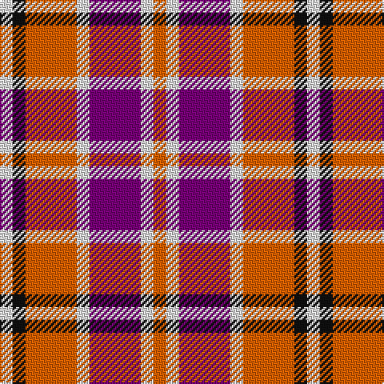

In pattern [RWBWRKW](/patterns/rwbwrkw/).

This was sourced from register-of-tartans.  It is a [7 stripes tartan](/stripes/stripes7/).

Original link https://www.tartanregister.gov.uk/tartanDetails.aspx?ref=4075

## Attestations

This cloth appears in 2 source records; the oldest owns this page.

- 01/09/2000 — Tartan Tangerine (register-of-tartans, [record](https://www.tartanregister.gov.uk/tartanDetails.aspx?ref=4075))
- 2000 — Tartan Tangerine (Corporate) (tartans-authority, [record](http://www.tartansauthority.com/tartan-ferret/display/4014/))

## Thread count
LN/8 K8 O32 LN8 P32 LN8 O/8

## Palette
Each colour and its ΔE from the base-6 reference it is a variant of.

| Colour | Shade | Base | ΔE (OKLab) |
|---|---|---|---|
| K | <code style="background-color:#101010;">#101010</code> `#101010` | K <code style="background-color:#000000;">#000000</code> | 0.17 |
| LN | <code style="background-color:#E0E0E0;">#E0E0E0</code> `#E0E0E0` | W <code style="background-color:#F7F7F7;">#F7F7F7</code> | 0.07 |
| O | <code style="background-color:#E86000;">#E86000</code> `#E86000` | R <code style="background-color:#CC0000;">#CC0000</code> | 0.14 |
| P | <code style="background-color:#780078;">#780078</code> `#780078` | B <code style="background-color:#2A418A;">#2A418A</code> | 0.17 |

# Sample pattern

## Nearest tartans

The nearest existing variants by ΔTartan distance.

1. [Culloden, Red (dress)](/setts/s8/g16b8r45w6b45w44b6w12~b800080-g008000-rc00000-we0e0e0/) — ΔT 1.17
1. [Brodie Dress](/setts/s5/b6w20k18r33k6x2~b2c2c80-k101010-rc80000-wfcfcfc/) — ΔT 1.42
1. [Westgaard of Kileughterco (Personal)](/setts/s12/r15w7r10b7w3k3w3r8b5w3k3w3x2~b1c0070-k101010-rc80000-wf8f8f8/) — ΔT 1.54
1. [MacKintosh-Geddes (Personal?)](/setts/s7/b2r4g12r3b6r10w2x2~b780078-g006818-rc80000-wfcfcfc/) — ΔT 1.60
1. [Unidentified 34](/setts/s9/w6r1ra4w1b4r1ra8w1ra2x2~b000050-r906030-rac00000-we0e0e0/) — ΔT 1.63
1. [Think Pink (ICF)](/setts/s5/k4b2y13r13w2x4~b00008c-k000034-rdc5078-wc8c8c8-yc09898/) — ΔT 1.64
1. [Winnipeg Embroiders' Guild (Corp.)](/setts/s6/r12b2y2w2b4w3x2~b003c64-re87878-we8ccb8-ye8c000/) — ΔT 1.67
1. [Unidentified #41](/setts/s9/w6r1ra4w1b4r1ra8w1ra2x2~b080848-rbe7832-radc0000-we0e0e0/) — ΔT 1.68
1. [Aberdeen University (1992)](/setts/s5/y4r27k12b15y4x2~b2c2c80-k101010-rc8002c-ye8c000/) — ΔT 1.68
1. [Wallace Dress, Red (Dance)](/setts/s5/b3w28k10r28k3x2~b2888c4-k101010-rc80000-we0e0e0/) — ΔT 1.71

## Neighbour map

Every grey dot is one of 15726 variants placed by the first two principal components of the ΔTartan feature space (44% of its variance). Red is this tartan; blue dots are its nearest — click one to open its page.

<svg viewBox="0 0 640 380" role="img" style="max-width:100%;height:auto;border:1px solid #e0e0e0;border-radius:4px;display:block" xmlns="http://www.w3.org/2000/svg"><image href="/nn/cloud.v1.png" width="640" height="380"/><a href="/setts/s8/g16b8r45w6b45w44b6w12~b800080-g008000-rc00000-we0e0e0/"><circle cx="140.7" cy="183.5" r="4" fill="#3465a4"><title>Culloden, Red (dress)</title></circle></a><a href="/setts/s5/b6w20k18r33k6x2~b2c2c80-k101010-rc80000-wfcfcfc/"><circle cx="134.6" cy="230.1" r="4" fill="#3465a4"><title>Brodie Dress</title></circle></a><a href="/setts/s12/r15w7r10b7w3k3w3r8b5w3k3w3x2~b1c0070-k101010-rc80000-wf8f8f8/"><circle cx="151.3" cy="192.4" r="4" fill="#3465a4"><title>Westgaard of Kileughterco (Personal)</title></circle></a><a href="/setts/s7/b2r4g12r3b6r10w2x2~b780078-g006818-rc80000-wfcfcfc/"><circle cx="200.7" cy="224.3" r="4" fill="#3465a4"><title>MacKintosh-Geddes (Personal?)</title></circle></a><a href="/setts/s9/w6r1ra4w1b4r1ra8w1ra2x2~b000050-r906030-rac00000-we0e0e0/"><circle cx="218.1" cy="177.2" r="4" fill="#3465a4"><title>Unidentified 34</title></circle></a><a href="/setts/s5/k4b2y13r13w2x4~b00008c-k000034-rdc5078-wc8c8c8-yc09898/"><circle cx="166.1" cy="203.8" r="4" fill="#3465a4"><title>Think Pink (ICF)</title></circle></a><a href="/setts/s6/r12b2y2w2b4w3x2~b003c64-re87878-we8ccb8-ye8c000/"><circle cx="220.8" cy="204.8" r="4" fill="#3465a4"><title>Winnipeg Embroiders' Guild (Corp.)</title></circle></a><a href="/setts/s9/w6r1ra4w1b4r1ra8w1ra2x2~b080848-rbe7832-radc0000-we0e0e0/"><circle cx="220.9" cy="174.2" r="4" fill="#3465a4"><title>Unidentified #41</title></circle></a><a href="/setts/s5/y4r27k12b15y4x2~b2c2c80-k101010-rc8002c-ye8c000/"><circle cx="186.9" cy="226.1" r="4" fill="#3465a4"><title>Aberdeen University (1992)</title></circle></a><a href="/setts/s5/b3w28k10r28k3x2~b2888c4-k101010-rc80000-we0e0e0/"><circle cx="182.4" cy="192.2" r="4" fill="#3465a4"><title>Wallace Dress, Red (Dance)</title></circle></a><circle cx="139.9" cy="214.0" r="5" fill="#c00000"/></svg>

ID: /setts/s7/r1w1b4w1r4k1w1x8~b780078-k101010-re86000-we0e0e0/
