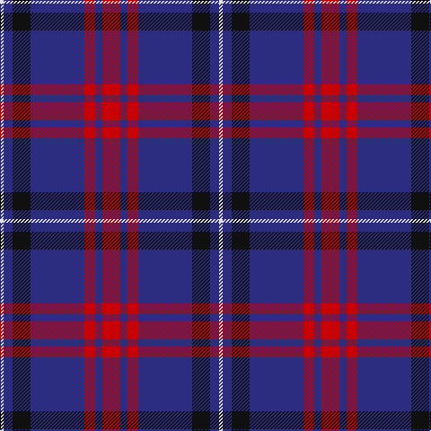

In pattern [RBRBKBW](/patterns/rbrbkbw/).

This was sourced from tartans-authority.  It is a [7 stripes tartan](/stripes/stripes7/).

Original link http://www.tartansauthority.com/tartan-ferret/display/8281/

## Thread count
LN/4 DB10 K20 DB60 R12 DB8 R/20

## Palette
Each colour and its ΔE from the base-6 reference it is a variant of.

| Colour | Shade | Base | ΔE (OKLab) |
|---|---|---|---|
| DB | <code style="background-color:#2C2C80;">#2C2C80</code> `#2C2C80` | B <code style="background-color:#2A418A;">#2A418A</code> | 0.06 |
| K | <code style="background-color:#101010;">#101010</code> `#101010` | K <code style="background-color:#000000;">#000000</code> | 0.17 |
| LN | <code style="background-color:#E0E0E0;">#E0E0E0</code> `#E0E0E0` | W <code style="background-color:#F7F7F7;">#F7F7F7</code> | 0.07 |
| R | <code style="background-color:#C80000;">#C80000</code> `#C80000` | R <code style="background-color:#CC0000;">#CC0000</code> | 0.01 |

# Sample pattern

## Nearest tartans

The nearest existing variants by ΔTartan distance.

1. [Ikelman #4 (Personal)](/setts/s7/r40b60g8b8w4b4w4-b1c0070-g006818-r880000-we0e0e0/) — ΔT 0.77
1. [Lothian Buses (Corporate?)](/setts/s6/w16b120r24g24r24b8-b2c2c80-g006818-rc80000-we0e0e0/) — ΔT 0.87
1. [Unnamed C20th - USA](/setts/s7/b4y2b36g14r14b2g2-b2c2c80-g006818-rc80000-ye8c000/) — ΔT 1.10
1. [Dege, of Saville Row](/setts/s6/r44b4r12ba4b36ra4-b000050-ba304080-r806050-rac00000/) — ΔT 1.13
1. [Discover Islay (District)](/setts/s6/b24y4b80ba24g76b8-b780078-ba2c2c80-g006818-ye8c000/) — ΔT 1.13
1. [MacGregor, Modern](/setts/s6/b72r36b8r12k4ra4-b1c1c50-k101010-rc80000-ra888888/) — ΔT 1.22
1. [Katsushika Corporate Tartan Tartan Number: 2343. Earliest known date: 1997 Designed for Katsushika Scottish country dancers from Hiroshima. See products available Copyright © Blair Urquhart, Comrie, 2015](/setts/s8/b44y4b2y4b20r4g22r12-b2c2c80-g006818-rc80000-ye8c000/) — ΔT 1.23
1. [Murdoch Celebration (Personal)](/setts/s8/b60r4b4r8b18k52w4k8-b2c4084-k101010-rdc0000-we0e0e0/) — ΔT 1.24
1. [Murdoch Clebration (Personal)](/setts/s8/k42b16r8b4r4b46k8w4-b2c2c80-k101010-rc80000-we0e0e0/) — ΔT 1.25
1. [Widows Sons Scotland (MRA)](/setts/s6/w9k16g10k22b67y4-b5a008c-g003c14-k101010-wc8c8c8-ye0a126/) — ΔT 1.25

## Neighbour map

Every grey dot is one of 15726 variants placed by the first two principal components of the ΔTartan feature space (44% of its variance). Red is this tartan; blue dots are its nearest — click one to open its page.

<svg viewBox="0 0 640 380" role="img" style="max-width:100%;height:auto;border:1px solid #e0e0e0;border-radius:4px;display:block" xmlns="http://www.w3.org/2000/svg"><image href="/nn/cloud.v1.png" width="640" height="380"/><a href="/setts/s7/r40b60g8b8w4b4w4-b1c0070-g006818-r880000-we0e0e0/"><circle cx="337.5" cy="168.4" r="4" fill="#3465a4"><title>Ikelman #4 (Personal)</title></circle></a><a href="/setts/s6/w16b120r24g24r24b8-b2c2c80-g006818-rc80000-we0e0e0/"><circle cx="339.9" cy="175.9" r="4" fill="#3465a4"><title>Lothian Buses (Corporate?)</title></circle></a><a href="/setts/s7/b4y2b36g14r14b2g2-b2c2c80-g006818-rc80000-ye8c000/"><circle cx="347.6" cy="170.3" r="4" fill="#3465a4"><title>Unnamed C20th - USA</title></circle></a><a href="/setts/s6/r44b4r12ba4b36ra4-b000050-ba304080-r806050-rac00000/"><circle cx="327.1" cy="206.2" r="4" fill="#3465a4"><title>Dege, of Saville Row</title></circle></a><a href="/setts/s6/b24y4b80ba24g76b8-b780078-ba2c2c80-g006818-ye8c000/"><circle cx="335.2" cy="192.5" r="4" fill="#3465a4"><title>Discover Islay (District)</title></circle></a><a href="/setts/s6/b72r36b8r12k4ra4-b1c1c50-k101010-rc80000-ra888888/"><circle cx="389.2" cy="174.4" r="4" fill="#3465a4"><title>MacGregor, Modern</title></circle></a><a href="/setts/s8/b44y4b2y4b20r4g22r12-b2c2c80-g006818-rc80000-ye8c000/"><circle cx="341.1" cy="162.7" r="4" fill="#3465a4"><title>Katsushika Corporate Tartan Tartan Number: 2343. Earliest known date: 1997 Designed for Katsushika Scottish country dancers from Hiroshima. See products available Copyright © Blair Urquhart, Comrie, 2015</title></circle></a><a href="/setts/s8/b60r4b4r8b18k52w4k8-b2c4084-k101010-rdc0000-we0e0e0/"><circle cx="330.8" cy="178.7" r="4" fill="#3465a4"><title>Murdoch Celebration (Personal)</title></circle></a><a href="/setts/s8/k42b16r8b4r4b46k8w4-b2c2c80-k101010-rc80000-we0e0e0/"><circle cx="305.5" cy="194.8" r="4" fill="#3465a4"><title>Murdoch Clebration (Personal)</title></circle></a><a href="/setts/s6/w9k16g10k22b67y4-b5a008c-g003c14-k101010-wc8c8c8-ye0a126/"><circle cx="289.3" cy="164.2" r="4" fill="#3465a4"><title>Widows Sons Scotland (MRA)</title></circle></a><circle cx="338.1" cy="185.5" r="5" fill="#c00000"/></svg>

ID: /setts/s7/r20b8r12b60k20b10w4-b2c2c80-k101010-rc80000-we0e0e0/
