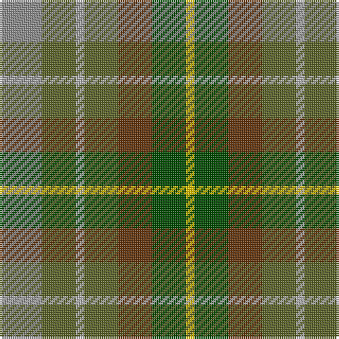

In pattern [RGYGGGY](/patterns/rgygggy/).

This was sourced from tartans-authority.  It is a [7 stripes tartan](/stripes/stripes7/).

Original link http://www.tartansauthority.com/tartan-ferret/display/1284/

## Attestations

This cloth appears in 2 source records; the oldest owns this page.

- 1984 — Devon, Green (District) (tartans-authority, [record](http://www.tartansauthority.com/tartan-ferret/display/1284/))
- 01/01/1990 — Devon (register-of-tartans, [record](https://www.tartanregister.gov.uk/tartanDetails.aspx?ref=920))

## Thread count
Na/20 Ga16 N4 Ga16 T16 G16 Y/4

## Palette
Each colour and its ΔE from the base-6 reference it is a variant of.

| Colour | Shade | Base | ΔE (OKLab) |
|---|---|---|---|
| G | <code style="background-color:#004C00;">#004C00</code> `#004C00` | G <code style="background-color:#006100;">#006100</code> | 0.07 |
| Ga | <code style="background-color:#5C6428;">#5C6428</code> `#5C6428` | G <code style="background-color:#006100;">#006100</code> | 0.10 |
| N | <code style="background-color:#B0B0B0;">#B0B0B0</code> `#B0B0B0` | Y <code style="background-color:#F2BF00;">#F2BF00</code> | 0.18 |
| Na | <code style="background-color:#8C8C8C;">#8C8C8C</code> `#8C8C8C` | R <code style="background-color:#CC0000;">#CC0000</code> | 0.24 |
| T | <code style="background-color:#64340C;">#64340C</code> `#64340C` | G <code style="background-color:#006100;">#006100</code> | 0.17 |
| Y | <code style="background-color:#E8C000;">#E8C000</code> `#E8C000` | Y <code style="background-color:#F2BF00;">#F2BF00</code> | 0.02 |

# Sample pattern

## Nearest tartans

The nearest existing variants by ΔTartan distance.

1. [Brocliande (Fashion))](/setts/s8/k6b22g30ga10g20gb28ga28y4-b2888c4-g5c6428-ga285800-gb003820-k101010-yd09800/) — ΔT 1.34
1. [Christmas Hill Game Farm (Corporate)](/setts/s7/g10y40r6ga26g26b6gb6-b141440-g4c3400-ga004828-gb006464-ra00000-ya08858/) — ΔT 1.60
1. [Devon Original District Tartan Tartan Number: 1284. Earliest known date: 1984 The Devon Original and Devon Companion owe their origin to the success of the Cornish St Piran sett, which was woven by Coldharbour Mill in the early 1980's. The accreditation certificate was presented to the Mayor of Barnstaple in 1991. In a poem describing the tartan, Miss M. Miles says, "So, in the mind, Devon's beauty is retrieved By contemplating Devon's tartan's weave." See products available Copyright © Blair Urquhart, Comrie, 2015](/setts/s7/y20g16w4g16r16ga16ya4-g6c8820-ga003820-ra8441c-we0e0e0-ya8a8a8-yae8c000/) — ΔT 1.62
1. [Aberdeenshire Home Colours](/setts/s7/b38y24r8ya16ra8g12ga32-b5c8ca8-g006818-ga408060-rc80000-ra888888-yd87c00-yafccc00/) — ΔT 1.62
1. [Parliament Trade Tartan Tartan Number: 2477. Earliest known date: 1998 Created to celebrate the referendum result for the re-establishment of a Scottish Parliament as well as to provide a Parliamentary livery tartan. See products available Copyright © Blair Urquhart, Comrie, 2015](/setts/s7/b16g22k6g22r24ba20y4-b2c2c80-ba003c64-g006818-k101010-r880000-ye8c000/) — ΔT 1.63
1. [Devon, Original](/setts/s7/g20ga16w4ga16r16gb16y4-g808080-ga008000-gb003000-r703000-we0e0e0-yf0c000/) — ΔT 1.65
1. [Lawrence's Seven Pillars of Khaki](/setts/s9/g6b24g20b12g16ga12g16r46ra6-b5c8ca8-g006818-ga289c18-r98481c-rab03000/) — ΔT 1.67
1. [Styrian](/setts/s8/r32g58b38ga16b38g58r32ra8-b5c5c5c-g003820-ga006818-r888888-ra880000/) — ΔT 1.72
1. [Styrian (Fashion)](/setts/s5/g16b38ga58r32ra8-b5c5c5c-g006818-ga003820-r888888-ra880000/) — ΔT 1.74
1. [Tennant (Clan)](/setts/s7/r4g28b28k28ga28g28r4-b1474b4-g604000-ga006818-k101010-rc80000/) — ΔT 1.76

## Neighbour map

Every grey dot is one of 15726 variants placed by the first two principal components of the ΔTartan feature space (44% of its variance). Red is this tartan; blue dots are its nearest — click one to open its page.

<svg viewBox="0 0 640 380" role="img" style="max-width:100%;height:auto;border:1px solid #e0e0e0;border-radius:4px;display:block" xmlns="http://www.w3.org/2000/svg"><image href="/nn/cloud.v1.png" width="640" height="380"/><a href="/setts/s8/k6b22g30ga10g20gb28ga28y4-b2888c4-g5c6428-ga285800-gb003820-k101010-yd09800/"><circle cx="140.3" cy="240.7" r="4" fill="#3465a4"><title>Brocliande (Fashion))</title></circle></a><a href="/setts/s7/g10y40r6ga26g26b6gb6-b141440-g4c3400-ga004828-gb006464-ra00000-ya08858/"><circle cx="145.6" cy="210.4" r="4" fill="#3465a4"><title>Christmas Hill Game Farm (Corporate)</title></circle></a><a href="/setts/s7/y20g16w4g16r16ga16ya4-g6c8820-ga003820-ra8441c-we0e0e0-ya8a8a8-yae8c000/"><circle cx="69.3" cy="232.7" r="4" fill="#3465a4"><title>Devon Original District Tartan Tartan Number: 1284. Earliest known date: 1984 The Devon Original and Devon Companion owe their origin to the success of the Cornish St Piran sett, which was woven by Coldharbour Mill in the early 1980's. The accreditation certificate was presented to the Mayor of Barnstaple in 1991. In a poem describing the tartan, Miss M. Miles says, &quot;So, in the mind, Devon's beauty is retrieved By contemplating Devon's tartan's weave.&quot; See products available Copyright © Blair Urquhart, Comrie, 2015</title></circle></a><a href="/setts/s7/b38y24r8ya16ra8g12ga32-b5c8ca8-g006818-ga408060-rc80000-ra888888-yd87c00-yafccc00/"><circle cx="49.5" cy="216.0" r="4" fill="#3465a4"><title>Aberdeenshire Home Colours</title></circle></a><a href="/setts/s7/b16g22k6g22r24ba20y4-b2c2c80-ba003c64-g006818-k101010-r880000-ye8c000/"><circle cx="112.3" cy="242.7" r="4" fill="#3465a4"><title>Parliament Trade Tartan Tartan Number: 2477. Earliest known date: 1998 Created to celebrate the referendum result for the re-establishment of a Scottish Parliament as well as to provide a Parliamentary livery tartan. See products available Copyright © Blair Urquhart, Comrie, 2015</title></circle></a><a href="/setts/s7/g20ga16w4ga16r16gb16y4-g808080-ga008000-gb003000-r703000-we0e0e0-yf0c000/"><circle cx="66.6" cy="240.0" r="4" fill="#3465a4"><title>Devon, Original</title></circle></a><a href="/setts/s9/g6b24g20b12g16ga12g16r46ra6-b5c8ca8-g006818-ga289c18-r98481c-rab03000/"><circle cx="195.2" cy="229.6" r="4" fill="#3465a4"><title>Lawrence's Seven Pillars of Khaki</title></circle></a><a href="/setts/s8/r32g58b38ga16b38g58r32ra8-b5c5c5c-g003820-ga006818-r888888-ra880000/"><circle cx="192.3" cy="259.8" r="4" fill="#3465a4"><title>Styrian</title></circle></a><a href="/setts/s5/g16b38ga58r32ra8-b5c5c5c-g006818-ga003820-r888888-ra880000/"><circle cx="191.9" cy="266.3" r="4" fill="#3465a4"><title>Styrian (Fashion)</title></circle></a><a href="/setts/s7/r4g28b28k28ga28g28r4-b1474b4-g604000-ga006818-k101010-rc80000/"><circle cx="148.8" cy="248.6" r="4" fill="#3465a4"><title>Tennant (Clan)</title></circle></a><circle cx="110.7" cy="256.5" r="5" fill="#c00000"/></svg>

ID: /setts/s7/r20g16y4g16ga16gb16ya4-g5c6428-ga64340c-gb004c00-r8c8c8c-yb0b0b0-yae8c000/
