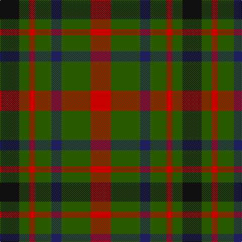

In pattern [KGRGBGR](/patterns/kgrgbgr/).

This was sourced from tartans-authority.  It is a [7 stripes tartan](/stripes/stripes7/).

Original link http://www.tartansauthority.com/tartan-ferret/display/1104/

## Thread count
K/38 G20 R12 G32 DB20 G58 R/40

## Palette
Each colour and its ΔE from the base-6 reference it is a variant of.

| Colour | Shade | Base | ΔE (OKLab) |
|---|---|---|---|
| DB | <code style="background-color:#202060;">#202060</code> `#202060` | B <code style="background-color:#2A418A;">#2A418A</code> | 0.11 |
| G | <code style="background-color:#285800;">#285800</code> `#285800` | G <code style="background-color:#006100;">#006100</code> | 0.03 |
| K | <code style="background-color:#101010;">#101010</code> `#101010` | K <code style="background-color:#000000;">#000000</code> | 0.17 |
| R | <code style="background-color:#C80000;">#C80000</code> `#C80000` | R <code style="background-color:#CC0000;">#CC0000</code> | 0.01 |

# Sample pattern

## Nearest tartans

The nearest existing variants by ΔTartan distance.

1. [MacDonagh](/setts/s7/r20g29b10g16r6g10k19~b2c2c80-g006818-k101010-rc80000~x2/) — ΔT 0.51
1. [MacDona Family Tartan Tartan Number: 1104. Earliest known date: 1892 This sett appears in Paton's collection which is housed at the Scottish Tartans Museum, Comrie in Perthshire, Scotland. The samples are undated but the collection is known to have been put together around the 1830's, with some additions during the Victorian period. See products available Copyright © Blair Urquhart, Comrie, 2015](/setts/s7/r35g52b18g17r12g17k18~b202060-g006818-k101010-rc80000/) — ΔT 0.68
1. [Unidentified Pinafore](/setts/s7/g24k4g24k24b7r24b7~b3c82af-g005020-k101010-r960028~x2/) — ΔT 1.27
1. [Tulsa District Tartan Tartan Number: 712. Earliest known date: 1978 The tartan was designed by Richard Crawford, Chinnubbie McIntosh, and Bea Notley, and supported by the Mayor of Tulsa, Robert J. La Fortune who issued a proclamation to 'endorse and ordain the establishment of the Tulsa tartan'. Tulsa is situated on the Arkansas River in Oklahoma, a State much settled by Scots. See products available Copyright © Blair Urquhart, Comrie, 2015](/setts/s6/r14k3r14g13b8g13~b2c2c80-g006818-k101010-rc80000~x2/) — ΔT 1.29
1. [Ikelman #3 (Personal)](/setts/s8/b11k4r4y4b11y4r4k4~b5c5c5c-k101010-r880000-yd09800~x4/) — ΔT 1.33
1. [Cub Scouts of America](/setts/s5/g10b2r8y2g5~b00008c-g146400-r8c0000-yc88c00~x4/) — ΔT 1.41
1. [Tulsa](/setts/s6/r14k3r14g13b8g13~b304080-g008000-k000000-rc00000~x2/) — ΔT 1.42
1. [Cates Armigers (Personal)](/setts/s6/g20r8g20y8ga20k5~g003820-ga006818-k101010-rc80000-ye8c000~x2/) — ΔT 1.43
1. [Londonderry, County](/setts/s7/r6k2g12y8r5k2g3~g003820-k101010-rb84c00-ybc8c00~x4/) — ΔT 1.45
1. [MacLaggan](/setts/s7/k13g12w2g12k13b12k2~b440044-g006818-k101010-wffffff~x2/) — ΔT 1.47

## Neighbour map

Every grey dot is one of 15726 variants placed by the first two principal components of the ΔTartan feature space (44% of its variance). Red is this tartan; blue dots are its nearest — click one to open its page.

<svg viewBox="0 0 640 380" role="img" style="max-width:100%;height:auto;border:1px solid #e0e0e0;border-radius:4px;display:block" xmlns="http://www.w3.org/2000/svg"><image href="/nn/cloud.v1.png" width="640" height="380"/><a href="/setts/s7/r20g29b10g16r6g10k19~b2c2c80-g006818-k101010-rc80000~x2/"><circle cx="195.3" cy="274.5" r="4" fill="#3465a4"><title>MacDonagh</title></circle></a><a href="/setts/s7/r35g52b18g17r12g17k18~b202060-g006818-k101010-rc80000/"><circle cx="212.7" cy="267.2" r="4" fill="#3465a4"><title>MacDona Family Tartan Tartan Number: 1104. Earliest known date: 1892 This sett appears in Paton's collection which is housed at the Scottish Tartans Museum, Comrie in Perthshire, Scotland. The samples are undated but the collection is known to have been put together around the 1830's, with some additions during the Victorian period. See products available Copyright © Blair Urquhart, Comrie, 2015</title></circle></a><a href="/setts/s7/g24k4g24k24b7r24b7~b3c82af-g005020-k101010-r960028~x2/"><circle cx="190.1" cy="264.1" r="4" fill="#3465a4"><title>Unidentified Pinafore</title></circle></a><a href="/setts/s6/r14k3r14g13b8g13~b2c2c80-g006818-k101010-rc80000~x2/"><circle cx="178.5" cy="287.8" r="4" fill="#3465a4"><title>Tulsa District Tartan Tartan Number: 712. Earliest known date: 1978 The tartan was designed by Richard Crawford, Chinnubbie McIntosh, and Bea Notley, and supported by the Mayor of Tulsa, Robert J. La Fortune who issued a proclamation to 'endorse and ordain the establishment of the Tulsa tartan'. Tulsa is situated on the Arkansas River in Oklahoma, a State much settled by Scots. See products available Copyright © Blair Urquhart, Comrie, 2015</title></circle></a><a href="/setts/s8/b11k4r4y4b11y4r4k4~b5c5c5c-k101010-r880000-yd09800~x4/"><circle cx="173.0" cy="275.2" r="4" fill="#3465a4"><title>Ikelman #3 (Personal)</title></circle></a><a href="/setts/s5/g10b2r8y2g5~b00008c-g146400-r8c0000-yc88c00~x4/"><circle cx="278.3" cy="281.0" r="4" fill="#3465a4"><title>Cub Scouts of America</title></circle></a><a href="/setts/s6/r14k3r14g13b8g13~b304080-g008000-k000000-rc00000~x2/"><circle cx="164.0" cy="283.0" r="4" fill="#3465a4"><title>Tulsa</title></circle></a><a href="/setts/s6/g20r8g20y8ga20k5~g003820-ga006818-k101010-rc80000-ye8c000~x2/"><circle cx="164.2" cy="271.0" r="4" fill="#3465a4"><title>Cates Armigers (Personal)</title></circle></a><a href="/setts/s7/r6k2g12y8r5k2g3~g003820-k101010-rb84c00-ybc8c00~x4/"><circle cx="168.6" cy="239.5" r="4" fill="#3465a4"><title>Londonderry, County</title></circle></a><a href="/setts/s7/k13g12w2g12k13b12k2~b440044-g006818-k101010-wffffff~x2/"><circle cx="182.6" cy="264.2" r="4" fill="#3465a4"><title>MacLaggan</title></circle></a><circle cx="207.9" cy="278.3" r="5" fill="#c00000"/></svg>

ID: /setts/s7/r20g29b10g16r6g10k19~b202060-g285800-k101010-rc80000~x2/
