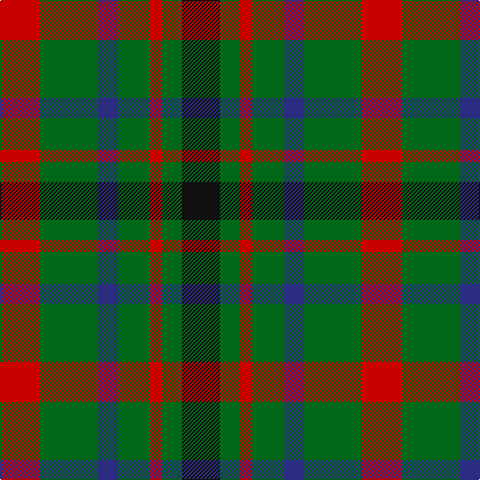

In pattern [KGRGBGR](/stripes/kgrgbgr/).

This was sourced from register-of-tartans.  It is a [7 stripe tartan](/stripes/stripes7/).

Original link https://www.tartanregister.gov.uk/tartanDetails.aspx?ref=2333

## Register references

External register numbers recorded for this tartan.

- Scottish Register of Tartans: [2333](https://www.tartanregister.gov.uk/tartanDetails.aspx?ref=2333)
- Scottish Tartans Authority (ITI): 1104
- Scottish Tartans World Register: 1104

## Thread count
R/40 G58 DB20 G32 R12 G20 K/38

## Palette
Each colour and the base-6 reference it is a variant of.

| Colour | Shade | Base |
|---|---|---|
| DB | <code style="background-color:#2C2C80;">#2C2C80</code> `oklch(35.0% 0.138 276.6)` <small>#2C2C80</small> | B <code style="background-color:#2A418A;">#2A418A</code> |
| G | <code style="background-color:#006818;">#006818</code> `oklch(45.0% 0.142 145.0)` <small>#006818</small> | G <code style="background-color:#006100;">#006100</code> |
| K | <code style="background-color:#101010;">#101010</code> `oklch(17.3% 0.000 89.9)` <small>#101010</small> | K <code style="background-color:#000000;">#000000</code> |
| R | <code style="background-color:#C80000;">#C80000</code> `oklch(52.3% 0.215 29.2)` <small>#C80000</small> | R <code style="background-color:#CC0000;">#CC0000</code> |

# Sample pattern

## Nearest tartans

The nearest existing variants by ΔTartan distance.

1. [MacDonagh (Name)](/setts/s7/r20dg29db10dg16r6dg10k19~x2/) — ΔT 0.51
1. [MacDona](/setts/s7/r35g52db18g17r12g17k18/) — ΔT 1.19
1. [Cates Armigers (Personal)](/setts/s6/dg20r8dg20ly8g20k5~x2/) — ΔT 1.22
1. [Tulsa](/setts/s6/r14k3r14g13db8g13~x2/) — ΔT 1.35
1. [MacLaggan](/setts/s7/k13g12w2g12k13dp12k2~x2/) — ΔT 1.37
1. [Unidentified Pinafore](/setts/s7/dg24k4dg24k24t7r24t7~x2/) — ΔT 1.37
1. [Hall (1994)](/setts/s11/g6r3db6r3g12r3db6r3g12r3ly2~x2/) — ΔT 1.39
1. [Walker James](/setts/s10/r4k6t1g7k2g7t1k6r4g2~x4/) — ΔT 1.39
1. [Cub Scouts of America](/setts/s5/g10db2r8lo2g5~x4/) — ΔT 1.42
1. [Ikelman #3 (Personal)](/setts/s8/n11k4r4lo4n11~x4/) — ΔT 1.42

## Neighbour map

Every grey dot is one of 14299 variants placed by the first two principal components of the ΔTartan feature space (44% of its variance). Red is this tartan; blue dots are its nearest — click one to open its page.

<svg viewBox="0 0 640 380" role="img" style="max-width:100%;height:auto;border:1px solid #e0e0e0;border-radius:4px;display:block" xmlns="http://www.w3.org/2000/svg"><image href="/nn/cloud.v1.png" width="640" height="380"/><a href="/setts/s7/r20dg29db10dg16r6dg10k19~x2/"><circle cx="209.5" cy="280.1" r="4" fill="#3465a4"><title>MacDonagh (Name)</title></circle></a><a href="/setts/s7/r35g52db18g17r12g17k18/"><circle cx="182.0" cy="253.9" r="4" fill="#3465a4"><title>MacDona</title></circle></a><a href="/setts/s6/dg20r8dg20ly8g20k5~x2/"><circle cx="166.6" cy="273.3" r="4" fill="#3465a4"><title>Cates Armigers (Personal)</title></circle></a><a href="/setts/s6/r14k3r14g13db8g13~x2/"><circle cx="165.2" cy="281.6" r="4" fill="#3465a4"><title>Tulsa</title></circle></a><a href="/setts/s7/k13g12w2g12k13dp12k2~x2/"><circle cx="185.5" cy="266.3" r="4" fill="#3465a4"><title>MacLaggan</title></circle></a><a href="/setts/s7/dg24k4dg24k24t7r24t7~x2/"><circle cx="192.5" cy="268.7" r="4" fill="#3465a4"><title>Unidentified Pinafore</title></circle></a><a href="/setts/s11/g6r3db6r3g12r3db6r3g12r3ly2~x2/"><circle cx="227.4" cy="226.3" r="4" fill="#3465a4"><title>Hall (1994)</title></circle></a><a href="/setts/s10/r4k6t1g7k2g7t1k6r4g2~x4/"><circle cx="171.3" cy="231.4" r="4" fill="#3465a4"><title>Walker James</title></circle></a><a href="/setts/s5/g10db2r8lo2g5~x4/"><circle cx="279.6" cy="282.4" r="4" fill="#3465a4"><title>Cub Scouts of America</title></circle></a><a href="/setts/s8/n11k4r4lo4n11~x4/"><circle cx="174.4" cy="276.4" r="4" fill="#3465a4"><title>Ikelman #3 (Personal)</title></circle></a><circle cx="197.2" cy="275.4" r="5" fill="#c00000"/></svg>

ID: /setts/s7/r20g29db10g16r6g10k19~x2/
