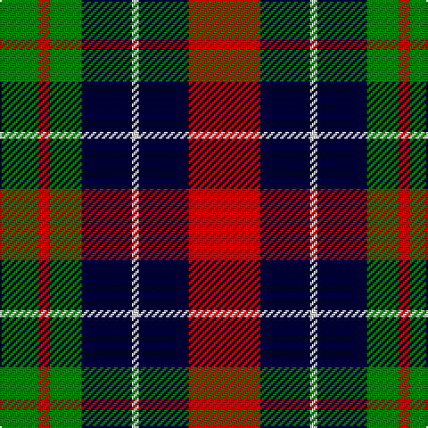

In pattern [GRGKWKR](/patterns/grgkwkr/).

This was sourced from weddslist.  It is a [7 stripes tartan](/stripes/stripes7/).

Original link http://www.weddslist.com/cgi-bin/tartans/pg.pl?source=sts

## Thread count
G/22 R6 G18 DB28 LN4 DB28 R/40

## Palette
Each colour and its ΔE from the base-6 reference it is a variant of.

| Colour | Shade | Base | ΔE (OKLab) |
|---|---|---|---|
| DB | <code style="background-color:#000030;">#000030</code> `#000030` | K <code style="background-color:#000000;">#000000</code> | 0.17 |
| G | <code style="background-color:#008000;">#008000</code> `#008000` | G <code style="background-color:#006100;">#006100</code> | 0.10 |
| LN | <code style="background-color:#E0E0E0;">#E0E0E0</code> `#E0E0E0` | W <code style="background-color:#F7F7F7;">#F7F7F7</code> | 0.07 |
| R | <code style="background-color:#C00000;">#C00000</code> `#C00000` | R <code style="background-color:#CC0000;">#CC0000</code> | 0.03 |

# Sample pattern

## Nearest tartans

The nearest existing variants by ΔTartan distance.

1. [Kilgour](/setts/s6/b14g21b4r21b14y2x2~b000050-g008000-rc00000-yf0c000/) — ΔT 0.65
1. [Kilgour](/setts/s6/b14g21b4r21b14y2x2~b080848-g005020-rdc0000-ye8c000/) — ΔT 0.85
1. [Borthwick](/setts/s9/g12k2r12k3ga12k16ga12k3r6x2~g008000-ga808080-k000000-r900030/) — ΔT 1.02
1. [MacLaren](/setts/s7/b9k7g5r4g7k1y1x2~b800080-g008000-k000000-rc00020-yf0c000/) — ΔT 1.05
1. [Baillie](/setts/s7/b3k1b8k6g8k1w2x2~b800080-g008000-k000000-we0e0e0/) — ΔT 1.06
1. [Scottish Ballet](/setts/s6/y5g22b15ba11b5g2x2~b440044-ba780078-g288028-ye8c000/) — ΔT 1.06
1. [Utah (US State)](/setts/s8/w2r3g9r3b2r3b3w1x6~b1c0070-g003820-r880000-we0e0e0/) — ΔT 1.08
1. [Wilson's, No 100](/setts/s6/g3b17k18y2g17k3x2~b800080-g008000-k000000-yf0c000/) — ΔT 1.09
1. [Wilson's, No 76](/setts/s6/g3b17k18w2g17k3x2~b800080-g008000-k000000-we0e0e0/) — ΔT 1.12
1. [Wilson's, No 150 "Coburg"](/setts/s6/g18b2g4k14ba12k3x2~b5480b0-ba800080-g008000-k000000/) — ΔT 1.15

## Neighbour map

Every grey dot is one of 15726 variants placed by the first two principal components of the ΔTartan feature space (44% of its variance). Red is this tartan; blue dots are its nearest — click one to open its page.

<svg viewBox="0 0 640 380" role="img" style="max-width:100%;height:auto;border:1px solid #e0e0e0;border-radius:4px;display:block" xmlns="http://www.w3.org/2000/svg"><image href="/nn/cloud.v1.png" width="640" height="380"/><a href="/setts/s6/b14g21b4r21b14y2x2~b000050-g008000-rc00000-yf0c000/"><circle cx="182.9" cy="226.1" r="4" fill="#3465a4"><title>Kilgour</title></circle></a><a href="/setts/s6/b14g21b4r21b14y2x2~b080848-g005020-rdc0000-ye8c000/"><circle cx="195.5" cy="228.2" r="4" fill="#3465a4"><title>Kilgour</title></circle></a><a href="/setts/s9/g12k2r12k3ga12k16ga12k3r6x2~g008000-ga808080-k000000-r900030/"><circle cx="97.2" cy="214.8" r="4" fill="#3465a4"><title>Borthwick</title></circle></a><a href="/setts/s7/b9k7g5r4g7k1y1x2~b800080-g008000-k000000-rc00020-yf0c000/"><circle cx="103.8" cy="201.1" r="4" fill="#3465a4"><title>MacLaren</title></circle></a><a href="/setts/s7/b3k1b8k6g8k1w2x2~b800080-g008000-k000000-we0e0e0/"><circle cx="145.2" cy="209.9" r="4" fill="#3465a4"><title>Baillie</title></circle></a><a href="/setts/s6/y5g22b15ba11b5g2x2~b440044-ba780078-g288028-ye8c000/"><circle cx="192.6" cy="213.4" r="4" fill="#3465a4"><title>Scottish Ballet</title></circle></a><a href="/setts/s8/w2r3g9r3b2r3b3w1x6~b1c0070-g003820-r880000-we0e0e0/"><circle cx="156.2" cy="206.2" r="4" fill="#3465a4"><title>Utah (US State)</title></circle></a><a href="/setts/s6/g3b17k18y2g17k3x2~b800080-g008000-k000000-yf0c000/"><circle cx="152.5" cy="214.8" r="4" fill="#3465a4"><title>Wilson's, No 100</title></circle></a><a href="/setts/s6/g3b17k18w2g17k3x2~b800080-g008000-k000000-we0e0e0/"><circle cx="151.5" cy="214.5" r="4" fill="#3465a4"><title>Wilson's, No 76</title></circle></a><a href="/setts/s6/g18b2g4k14ba12k3x2~b5480b0-ba800080-g008000-k000000/"><circle cx="173.6" cy="222.1" r="4" fill="#3465a4"><title>Wilson's, No 150 &quot;Coburg&quot;</title></circle></a><circle cx="158.6" cy="220.0" r="5" fill="#c00000"/></svg>

ID: /setts/s7/r20k14w2k14g9r3g11x2~g008000-k000030-rc00000-we0e0e0/
