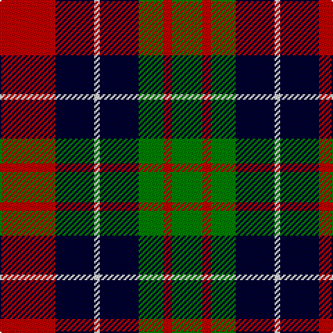

This page is one **sett** — a single exact thread-count. It belongs to the [tartan](/tartans/r20db14ln2db14g9r3g11/)
(the same proportion at any scale), whose colour order is pattern [GRGKWKR](/stripes/grgkwkr/).

Sourced from weddslist.  It is a [7 stripe tartan](/stripes/stripes7/).

Original link http://www.weddslist.com/cgi-bin/tartans/pg.pl?source=sts

## Thread count
R/40 DB28 LN4 DB28 G18 R6 G/22

## Palette
Each colour and the base-6 reference it is a variant of.

| Colour | Shade | Base |
|---|---|---|
| DB | <code style="background-color:#000030;">#000030</code> `oklch(14.0% 0.097 264.1)` <small>#000030</small> | K <code style="background-color:#000000;">#000000</code> |
| G | <code style="background-color:#008000;">#008000</code> `oklch(52.0% 0.177 142.5)` <small>#008000</small> | G <code style="background-color:#006100;">#006100</code> |
| LN | <code style="background-color:#E0E0E0;">#E0E0E0</code> `oklch(90.7% 0.000 89.9)` <small>#E0E0E0</small> | W <code style="background-color:#F7F7F7;">#F7F7F7</code> |
| R | <code style="background-color:#C00000;">#C00000</code> `oklch(50.7% 0.208 29.2)` <small>#C00000</small> | R <code style="background-color:#CC0000;">#CC0000</code> |

# Sample pattern

## Nearest tartans

The nearest existing variants by ΔTartan distance, with this tartan at the top so the swatches line up against it.

ΔTartan

Tartan

Sett

—

<a href="/ttd/edit/#slug=r20k14w2k14g9r3g11~x2">Brough</a> <a class="nn-out" href="/setts/s7/r20k14w2k14g9r3g11~x2/" title="open its dictionary page">↗</a>

0.65

<a href="/ttd/edit/#slug=db14g21db4r21db14ly2~x2">Kilgour</a> <a class="nn-out" href="/setts/s6/db14g21db4r21db14ly2~x2/" title="open its dictionary page">↗</a>

0.85

<a href="/ttd/edit/#slug=db14dg21db4r21db14ly2~x2">Kilgour</a> <a class="nn-out" href="/setts/s6/db14dg21db4r21db14ly2~x2/" title="open its dictionary page">↗</a>

1.02

<a href="/ttd/edit/#slug=g12k2r12k3y12k16y12k3r6~x2">Borthwick</a> <a class="nn-out" href="/setts/s9/g12k2r12k3y12k16y12k3r6~x2/" title="open its dictionary page">↗</a>

1.06

<a href="/ttd/edit/#slug=p3k1p8k6g8k1w2~x2">Baillie</a> <a class="nn-out" href="/setts/s7/p3k1p8k6g8k1w2~x2/" title="open its dictionary page">↗</a>

1.06

<a href="/ttd/edit/#slug=p9k7g5r4g7k1ly1~x2">MacLaren</a> <a class="nn-out" href="/setts/s7/p9k7g5r4g7k1ly1~x2/" title="open its dictionary page">↗</a>

1.06

<a href="/ttd/edit/#slug=ly5g22dp15dp11dp5g2~x2">Scottish Ballet</a> <a class="nn-out" href="/setts/s6/ly5g22dp15dp11dp5g2~x2/" title="open its dictionary page">↗</a>

1.08

<a href="/ttd/edit/#slug=w2r3dg9r3db2r3db3w1~x6">Utah (US State)</a> <a class="nn-out" href="/setts/s8/w2r3dg9r3db2r3db3w1~x6/" title="open its dictionary page">↗</a>

1.10

<a href="/ttd/edit/#slug=k3g17ly2k18p17g3~x2">Wilson's, No 100</a> <a class="nn-out" href="/setts/s6/k3g17ly2k18p17g3~x2/" title="open its dictionary page">↗</a>

1.12

<a href="/ttd/edit/#slug=k3g17w2k18p17g3~x2">Wilson's, No 76</a> <a class="nn-out" href="/setts/s6/k3g17w2k18p17g3~x2/" title="open its dictionary page">↗</a>

1.15

<a href="/ttd/edit/#slug=g18t2g4k14p12k3~x2">Wilson's, No 150 &quot;Coburg&quot;</a> <a class="nn-out" href="/setts/s6/g18t2g4k14p12k3~x2/" title="open its dictionary page">↗</a>

## Neighbour map

Every grey dot is one of 14299 variants placed by the first two principal components of the ΔTartan feature space (44% of its variance). Red is this tartan; blue dots are its nearest — click one to open its page.

<svg viewBox="0 0 640 380" role="img" style="max-width:100%;height:auto;border:1px solid #e0e0e0;border-radius:4px;display:block" xmlns="http://www.w3.org/2000/svg"><image href="/nn/cloud.v1.png" width="640" height="380"/><a href="/setts/s6/db14g21db4r21db14ly2~x2/"><circle cx="185.6" cy="224.4" r="4" fill="#3465a4"><title>Kilgour</title></circle></a><a href="/setts/s6/db14dg21db4r21db14ly2~x2/"><circle cx="197.8" cy="227.0" r="4" fill="#3465a4"><title>Kilgour</title></circle></a><a href="/setts/s9/g12k2r12k3y12k16y12k3r6~x2/"><circle cx="100.2" cy="213.9" r="4" fill="#3465a4"><title>Borthwick</title></circle></a><a href="/setts/s7/p3k1p8k6g8k1w2~x2/"><circle cx="148.2" cy="207.3" r="4" fill="#3465a4"><title>Baillie</title></circle></a><a href="/setts/s7/p9k7g5r4g7k1ly1~x2/"><circle cx="106.6" cy="199.9" r="4" fill="#3465a4"><title>MacLaren</title></circle></a><a href="/setts/s6/ly5g22dp15dp11dp5g2~x2/"><circle cx="194.9" cy="212.8" r="4" fill="#3465a4"><title>Scottish Ballet</title></circle></a><a href="/setts/s8/w2r3dg9r3db2r3db3w1~x6/"><circle cx="158.7" cy="206.3" r="4" fill="#3465a4"><title>Utah (US State)</title></circle></a><a href="/setts/s6/k3g17ly2k18p17g3~x2/"><circle cx="155.9" cy="212.6" r="4" fill="#3465a4"><title>Wilson's, No 100</title></circle></a><a href="/setts/s6/k3g17w2k18p17g3~x2/"><circle cx="154.9" cy="212.3" r="4" fill="#3465a4"><title>Wilson's, No 76</title></circle></a><a href="/setts/s6/g18t2g4k14p12k3~x2/"><circle cx="177.0" cy="220.1" r="4" fill="#3465a4"><title>Wilson's, No 150 &quot;Coburg&quot;</title></circle></a><circle cx="161.2" cy="217.9" r="5" fill="#c00000"/></svg>

ID: /setts/s7/r20k14w2k14g9r3g11~x2/
