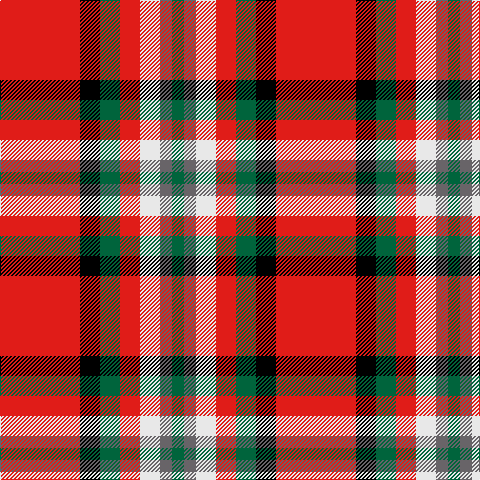

In pattern [GBWRGKR](/stripes/gbwrgkr/).

This was sourced from register-of-tartans.  It is a [7 stripe tartan](/stripes/stripes7/).

Original link https://www.tartanregister.gov.uk/tartanDetails.aspx?ref=10844

## Register references

External register numbers recorded for this tartan.

- Scottish Register of Tartans: [10844](https://www.tartanregister.gov.uk/tartanDetails.aspx?ref=10844)

## Thread count
R/80 K20 G20 R20 LN20 N12 G/12

## Palette
Each colour and the base-6 reference it is a variant of.

| Colour | Shade | Base |
|---|---|---|
| G | <code style="background-color:#00643C;">#00643C</code> `oklch(44.3% 0.104 157.7)` <small>#00643C</small> | G <code style="background-color:#006100;">#006100</code> |
| K | <code style="background-color:#000000;">#000000</code> `oklch(0.0% 0.000 0.0)` <small>#000000</small> | K <code style="background-color:#000000;">#000000</code> |
| LN | <code style="background-color:#E8E8E8;">#E8E8E8</code> `oklch(93.1% 0.000 89.9)` <small>#E8E8E8</small> | W <code style="background-color:#F7F7F7;">#F7F7F7</code> |
| N | <code style="background-color:#686468;">#686468</code> `oklch(50.8% 0.008 325.7)` <small>#686468</small> | B <code style="background-color:#2A418A;">#2A418A</code> |
| R | <code style="background-color:#E01C18;">#E01C18</code> `oklch(57.8% 0.225 28.6)` <small>#E01C18</small> | R <code style="background-color:#CC0000;">#CC0000</code> |

# Sample pattern

## Nearest tartans

The nearest existing variants by ΔTartan distance.

1. [Mangles, Peter and Annette (Personal](/setts/s7/r20k5dg5r5w5o3dg3~x4/) — ΔT 0.34
1. [Mangles, Peter and Annette Family/Personal Tartan Tartan Number: 10844. Earliest known date: 02/05/2013 The colours were chosen to represent the organisation and the location where Peter and Annette first met in Liverpool. In addition the red is representative of the city of Aberdeen (Scotland) and the black and grey is representative of the granite used extensively throughout Aberdeen See products available Copyright © Blair Urquhart, Comrie, 2015](/setts/s7/r20k5g5r5w5lr3g3~x4/) — ΔT 0.42
1. [Royal Stuart/Stewart](/setts/s8/r7db2k2ly1k2r2k1w1~x2/) — ΔT 0.74
1. [Blaylock](/setts/s10/k4w2db8w3r16k2r5ly2r5w2~x2/) — ΔT 0.97
1. [Benedict (Personal)](/setts/s5/dg4lb4k2r15ly4~x4/) — ΔT 0.99
1. [McCartney (2015)](/setts/s6/r5g3lb3db5r16ly3~x2/) — ΔT 1.15
1. [Benedict (Personal)](/setts/s5/g4lb4k2r15ly4~x4/) — ΔT 1.19
1. [McGill University](/setts/s5/w3r24db12dg8ly3~x2/) — ΔT 1.27
1. [Carlow County Crest (Fashion)](/setts/s10/w15g8k12g14r64k12r16k10ly8k14/) — ΔT 1.27
1. [Thermos Un-named (aretefact)](/setts/s6/k6r20w2r9w3lb2~x2/) — ΔT 1.29

## Neighbour map

Every grey dot is one of 14299 variants placed by the first two principal components of the ΔTartan feature space (44% of its variance). Red is this tartan; blue dots are its nearest — click one to open its page.

<svg viewBox="0 0 640 380" role="img" style="max-width:100%;height:auto;border:1px solid #e0e0e0;border-radius:4px;display:block" xmlns="http://www.w3.org/2000/svg"><image href="/nn/cloud.v1.png" width="640" height="380"/><a href="/setts/s7/r20k5dg5r5w5o3dg3~x4/"><circle cx="230.9" cy="175.2" r="4" fill="#3465a4"><title>Mangles, Peter and Annette (Personal</title></circle></a><a href="/setts/s7/r20k5g5r5w5lr3g3~x4/"><circle cx="227.8" cy="171.4" r="4" fill="#3465a4"><title>Mangles, Peter and Annette Family/Personal Tartan Tartan Number: 10844. Earliest known date: 02/05/2013 The colours were chosen to represent the organisation and the location where Peter and Annette first met in Liverpool. In addition the red is representative of the city of Aberdeen (Scotland) and the black and grey is representative of the granite used extensively throughout Aberdeen See products available Copyright © Blair Urquhart, Comrie, 2015</title></circle></a><a href="/setts/s8/r7db2k2ly1k2r2k1w1~x2/"><circle cx="208.3" cy="168.5" r="4" fill="#3465a4"><title>Royal Stuart/Stewart</title></circle></a><a href="/setts/s10/k4w2db8w3r16k2r5ly2r5w2~x2/"><circle cx="212.1" cy="146.6" r="4" fill="#3465a4"><title>Blaylock</title></circle></a><a href="/setts/s5/dg4lb4k2r15ly4~x4/"><circle cx="226.7" cy="189.1" r="4" fill="#3465a4"><title>Benedict (Personal)</title></circle></a><a href="/setts/s6/r5g3lb3db5r16ly3~x2/"><circle cx="271.9" cy="199.0" r="4" fill="#3465a4"><title>McCartney (2015)</title></circle></a><a href="/setts/s5/g4lb4k2r15ly4~x4/"><circle cx="232.1" cy="191.8" r="4" fill="#3465a4"><title>Benedict (Personal)</title></circle></a><a href="/setts/s5/w3r24db12dg8ly3~x2/"><circle cx="197.2" cy="181.7" r="4" fill="#3465a4"><title>McGill University</title></circle></a><a href="/setts/s10/w15g8k12g14r64k12r16k10ly8k14/"><circle cx="189.9" cy="150.0" r="4" fill="#3465a4"><title>Carlow County Crest (Fashion)</title></circle></a><a href="/setts/s6/k6r20w2r9w3lb2~x2/"><circle cx="226.7" cy="162.2" r="4" fill="#3465a4"><title>Thermos Un-named (aretefact)</title></circle></a><circle cx="222.4" cy="170.4" r="5" fill="#c00000"/></svg>

ID: /setts/s7/r20k5g5r5w5n3g3~x4/
