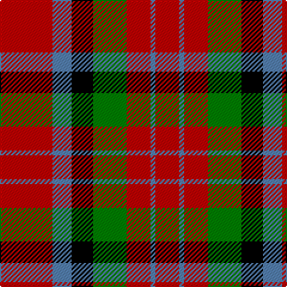

This page is one **sett** — a single exact thread-count. It belongs to the [tartan](/tartans/r22b8k9g14r10b2r10/)
(the same proportion at any scale), whose colour order is pattern [RBKGRBR](/stripes/rbkgrbr/).

Sourced from weddslist.  It is a [7 stripe tartan](/stripes/stripes7/).

Original link http://www.weddslist.com/cgi-bin/tartans/pg.pl?source=sts

## Also known as

This cloth is also recorded under:

- MacDuff #2

## Thread count
R/44 B16 K18 G28 R20 B4 R/20

## Palette
Each colour and the base-6 reference it is a variant of.

| Colour | Shade | Base |
|---|---|---|
| B | <code style="background-color:#5480B0;">#5480B0</code> `oklch(58.8% 0.089 251.5)` <small>#5480B0</small> | B <code style="background-color:#2A418A;">#2A418A</code> |
| G | <code style="background-color:#008000;">#008000</code> `oklch(52.0% 0.177 142.5)` <small>#008000</small> | G <code style="background-color:#006100;">#006100</code> |
| K | <code style="background-color:#000000;">#000000</code> `oklch(0.0% 0.000 0.0)` <small>#000000</small> | K <code style="background-color:#000000;">#000000</code> |
| R | <code style="background-color:#C00000;">#C00000</code> `oklch(50.7% 0.208 29.2)` <small>#C00000</small> | R <code style="background-color:#CC0000;">#CC0000</code> |

# Sample pattern

## Nearest tartans

The nearest existing variants by ΔTartan distance, with this tartan at the top so the swatches line up against it.

ΔTartan

Tartan

Sett

—

<a href="/ttd/edit/#slug=r22t8k9g14r10t2r10~x2">MacDuff</a> <a class="nn-out" href="/setts/s7/r22t8k9g14r10t2r10~x2/" title="open its dictionary page">↗</a>

0.62

<a href="/ttd/edit/#slug=r22t8k9dg14r10t2r10~x2">MacDuff #2</a> <a class="nn-out" href="/setts/s7/r22t8k9dg14r10t2r10~x2/" title="open its dictionary page">↗</a>

0.70

<a href="/ttd/edit/#slug=r8t3k4g6r4k1r4~x2">MacDuff</a> <a class="nn-out" href="/setts/s7/r8t3k4g6r4k1r4~x2/" title="open its dictionary page">↗</a>

0.74

<a href="/ttd/edit/#slug=r8t3k4dg6r4k1r4~x2">MacDuff #5</a> <a class="nn-out" href="/setts/s7/r8t3k4dg6r4k1r4~x2/" title="open its dictionary page">↗</a>

0.89

<a href="/ttd/edit/#slug=r36lt9k12g17r10k3r10~x2">MacDuff #6</a> <a class="nn-out" href="/setts/s7/r36lt9k12g17r10k3r10~x2/" title="open its dictionary page">↗</a>

0.90

<a href="/ttd/edit/#slug=r8db3k4g6r4k1r4~x4">MacDuff Clan Tartan Tartan Number: 2141. Earliest known date: 1831 According to D.C.Stewart, &quot;It will be observed that the MacDuff tartan is substantially the Royal Stuart with the white and yellow lines removed. Whether this indicates it as a source of the Stuart, or the association of the Earls of Fife with the Crown, remains to be determined.&quot; James Logan published this sett in his book, 'The Scottish Gael' in 1831. See products available Copyright © Blair Urquhart, Comrie, 2015</a> <a class="nn-out" href="/setts/s7/r8db3k4g6r4k1r4~x4/" title="open its dictionary page">↗</a>

1.02

<a href="/ttd/edit/#slug=r8db3k4dg6r4k1r4~x2">MacDuff</a> <a class="nn-out" href="/setts/s7/r8db3k4dg6r4k1r4~x2/" title="open its dictionary page">↗</a>

1.07

<a href="/ttd/edit/#slug=r10g24k10r28lb3r6~x2">Nisbet</a> <a class="nn-out" href="/setts/s6/r10g24k10r28lb3r6~x2/" title="open its dictionary page">↗</a>

1.12

<a href="/ttd/edit/#slug=r36db9k12g17r10k3r10~x2">MacDuff - 1819 (Clan)</a> <a class="nn-out" href="/setts/s7/r36db9k12g17r10k3r10~x2/" title="open its dictionary page">↗</a>

1.12

<a href="/ttd/edit/#slug=dg9w1r9k9r9~x8">Unidentified item</a> <a class="nn-out" href="/setts/s5/dg9w1r9k9r9~x8/" title="open its dictionary page">↗</a>

1.23

<a href="/ttd/edit/#slug=r12g2r4g4k15t4r4t2r12~x2">Alexander - 1985 (Name)</a> <a class="nn-out" href="/setts/s9/r12g2r4g4k15t4r4t2r12~x2/" title="open its dictionary page">↗</a>

## Neighbour map

Every grey dot is one of 14299 variants placed by the first two principal components of the ΔTartan feature space (44% of its variance). Red is this tartan; blue dots are its nearest — click one to open its page.

<svg viewBox="0 0 640 380" role="img" style="max-width:100%;height:auto;border:1px solid #e0e0e0;border-radius:4px;display:block" xmlns="http://www.w3.org/2000/svg"><image href="/nn/cloud.v1.png" width="640" height="380"/><a href="/setts/s7/r22t8k9dg14r10t2r10~x2/"><circle cx="268.5" cy="215.7" r="4" fill="#3465a4"><title>MacDuff #2</title></circle></a><a href="/setts/s7/r8t3k4g6r4k1r4~x2/"><circle cx="214.6" cy="228.7" r="4" fill="#3465a4"><title>MacDuff</title></circle></a><a href="/setts/s7/r8t3k4dg6r4k1r4~x2/"><circle cx="231.8" cy="232.8" r="4" fill="#3465a4"><title>MacDuff #5</title></circle></a><a href="/setts/s7/r36lt9k12g17r10k3r10~x2/"><circle cx="292.6" cy="190.1" r="4" fill="#3465a4"><title>MacDuff #6</title></circle></a><a href="/setts/s7/r8db3k4g6r4k1r4~x4/"><circle cx="239.9" cy="239.5" r="4" fill="#3465a4"><title>MacDuff Clan Tartan Tartan Number: 2141. Earliest known date: 1831 According to D.C.Stewart, &quot;It will be observed that the MacDuff tartan is substantially the Royal Stuart with the white and yellow lines removed. Whether this indicates it as a source of the Stuart, or the association of the Earls of Fife with the Crown, remains to be determined.&quot; James Logan published this sett in his book, 'The Scottish Gael' in 1831. See products available Copyright © Blair Urquhart, Comrie, 2015</title></circle></a><a href="/setts/s7/r8db3k4dg6r4k1r4~x2/"><circle cx="219.4" cy="231.8" r="4" fill="#3465a4"><title>MacDuff</title></circle></a><a href="/setts/s6/r10g24k10r28lb3r6~x2/"><circle cx="286.6" cy="216.8" r="4" fill="#3465a4"><title>Nisbet</title></circle></a><a href="/setts/s7/r36db9k12g17r10k3r10~x2/"><circle cx="309.8" cy="199.6" r="4" fill="#3465a4"><title>MacDuff - 1819 (Clan)</title></circle></a><a href="/setts/s5/dg9w1r9k9r9~x8/"><circle cx="212.4" cy="247.6" r="4" fill="#3465a4"><title>Unidentified item</title></circle></a><a href="/setts/s9/r12g2r4g4k15t4r4t2r12~x2/"><circle cx="259.1" cy="200.2" r="4" fill="#3465a4"><title>Alexander - 1985 (Name)</title></circle></a><circle cx="254.4" cy="212.9" r="5" fill="#c00000"/></svg>

ID: /setts/s7/r22t8k9g14r10t2r10~x2/
