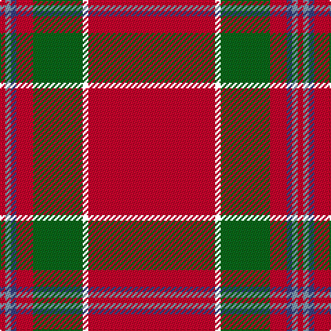

**Bands:** [RKGRBYR](/stripes/rkgrbyr/) · **Stripes:** [R K G R DB LR R](/stripes/stripes7/) R K G R DB LR R

This was sourced from house-of-tartan.  It is a [7 band tartan](/bands/bands7/).

Original link http://www.house-of-tartan.scotland.net/house/TartanViewjs.asp?colr=Def&tnam=2800

## Thread count
R/92 XB4 G36 R12 Ba4 B4 R/4

## Palette
Each colour and its ΔE from the base-6 reference it is a variant of.

| Colour | Shade | Base | ΔE (OKLab) |
|---|---|---|---|
| B | <code style="background-color:#809CB0;">#809CB0</code> `#809CB0` | Y <code style="background-color:#F2BF00;">#F2BF00</code> | 0.26 |
| Ba | <code style="background-color:#384080;">#384080</code> `#384080` | B <code style="background-color:#2A418A;">#2A418A</code> | 0.02 |
| G | <code style="background-color:#086818;">#086818</code> `#086818` | G <code style="background-color:#006100;">#006100</code> | 0.02 |
| R | <code style="background-color:#C8002C;">#C8002C</code> `#C8002C` | R <code style="background-color:#CC0000;">#CC0000</code> | 0.03 |

# Sample pattern

## Nearest tartans

The nearest existing variants by ΔTartan distance.

1. [De Nardi #2 (Personal)](/setts/s8/r68db27r5ly3r5g3r13t3~x2/) — ΔT 0.74
1. [Princess Elizabeth #2](/setts/s8/r60db8w3db10ly3t4ly3r19~x2/) — ΔT 0.80
1. [De Nardi (Personal)](/setts/s8/r68db26r5ly3r5g3r13o3~x2/) — ΔT 0.83
1. [Oliver, dress](/setts/s9/r40k3r2db12r2g2r2g2ly3~x2/) — ΔT 0.93
1. [Earl of Inverness (Royal)](/setts/s8/r100db10w5db14ly4db8ly4r24/) — ΔT 0.95
1. [Drummond of Fingask](/setts/s8/r48db3lo2g14r8db3t4w3~x2/) — ΔT 1.17
1. [Sildesalaten](/setts/s5/r32lb4dt7ly2t2~x5/) — ΔT 1.22
1. [Stuart/Stewart of Fingask](/setts/s8/r72dg3ly2dg26r14db6t6w2/) — ΔT 1.29
1. [Hackston (Green stripe) (Portrait)](/setts/s8/r51lr2k11lo3r11lo3r11g3~x2/) — ΔT 1.29
1. [Stewart of Fingask - 1745 (Clan?)](/setts/s8/r72g3ly2g26r14db6t6w2/) — ΔT 1.31

## Neighbour map

Every grey dot is one of 14299 variants placed by the first two principal components of the ΔTartan feature space (44% of its variance). Red is this tartan; blue dots are its nearest — click one to open its page.

<svg viewBox="0 0 640 380" role="img" style="max-width:100%;height:auto;border:1px solid #e0e0e0;border-radius:4px;display:block" xmlns="http://www.w3.org/2000/svg"><image href="/nn/cloud.v1.png" width="640" height="380"/><a href="/setts/s8/r68db27r5ly3r5g3r13t3~x2/"><circle cx="475.7" cy="114.2" r="4" fill="#3465a4"><title>De Nardi #2 (Personal)</title></circle></a><a href="/setts/s8/r60db8w3db10ly3t4ly3r19~x2/"><circle cx="463.6" cy="114.7" r="4" fill="#3465a4"><title>Princess Elizabeth #2</title></circle></a><a href="/setts/s8/r68db26r5ly3r5g3r13o3~x2/"><circle cx="489.9" cy="118.0" r="4" fill="#3465a4"><title>De Nardi (Personal)</title></circle></a><a href="/setts/s9/r40k3r2db12r2g2r2g2ly3~x2/"><circle cx="431.9" cy="98.5" r="4" fill="#3465a4"><title>Oliver, dress</title></circle></a><a href="/setts/s8/r100db10w5db14ly4db8ly4r24/"><circle cx="484.7" cy="99.6" r="4" fill="#3465a4"><title>Earl of Inverness (Royal)</title></circle></a><a href="/setts/s8/r48db3lo2g14r8db3t4w3~x2/"><circle cx="402.4" cy="91.5" r="4" fill="#3465a4"><title>Drummond of Fingask</title></circle></a><a href="/setts/s5/r32lb4dt7ly2t2~x5/"><circle cx="417.2" cy="142.4" r="4" fill="#3465a4"><title>Sildesalaten</title></circle></a><a href="/setts/s8/r72dg3ly2dg26r14db6t6w2/"><circle cx="424.0" cy="77.6" r="4" fill="#3465a4"><title>Stuart/Stewart of Fingask</title></circle></a><a href="/setts/s8/r51lr2k11lo3r11lo3r11g3~x2/"><circle cx="522.8" cy="115.3" r="4" fill="#3465a4"><title>Hackston (Green stripe) (Portrait)</title></circle></a><a href="/setts/s8/r72g3ly2g26r14db6t6w2/"><circle cx="431.8" cy="84.5" r="4" fill="#3465a4"><title>Stewart of Fingask - 1745 (Clan?)</title></circle></a><circle cx="464.7" cy="120.9" r="5" fill="#c00000"/></svg>

ID: /setts/s7/r23k1g9r3db1lr1r1~x4/
