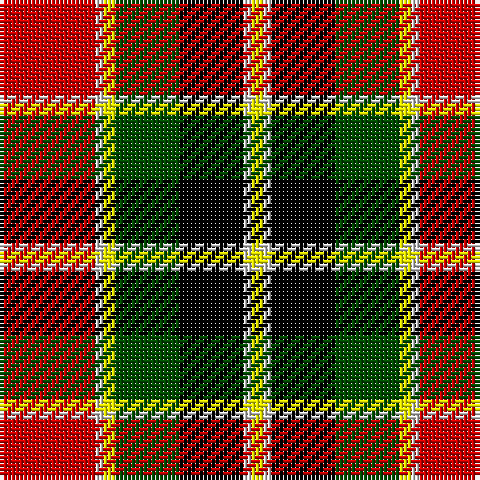

In pattern [RWYGKWY](/stripes/rwygkwy/).

This was sourced from weddslist.  It is a [7 stripe tartan](/stripes/stripes7/).

Original link http://www.weddslist.com/cgi-bin/tartans/pg.pl?source=rb

## Register references

External register numbers recorded for this tartan.

- Scottish Register of Tartans: [1166](https://www.tartanregister.gov.uk/tartanDetails.aspx?ref=1166)
- Scottish Register of Tartans: [1758](https://www.tartanregister.gov.uk/tartanDetails.aspx?ref=1758)
- Scottish Register of Tartans: [2307](https://www.tartanregister.gov.uk/tartanDetails.aspx?ref=2307)
- Scottish Register of Tartans: [2540](https://www.tartanregister.gov.uk/tartanDetails.aspx?ref=2540)
- Scottish Register of Tartans: [2666](https://www.tartanregister.gov.uk/tartanDetails.aspx?ref=2666)
- Scottish Register of Tartans: [2862](https://www.tartanregister.gov.uk/tartanDetails.aspx?ref=2862)
- Scottish Register of Tartans: [3808](https://www.tartanregister.gov.uk/tartanDetails.aspx?ref=3808)
- Scottish Register of Tartans: [982](https://www.tartanregister.gov.uk/tartanDetails.aspx?ref=982)
- Scottish Tartans Authority (ITI): 218
- Scottish Tartans World Register: 1010
- Scottish Tartans World Register: 1042
- Scottish Tartans World Register: 127
- Scottish Tartans World Register: 1585
- Scottish Tartans World Register: 218
- Scottish Tartans World Register: 2218
- Scottish Tartans World Register: 737
- Scottish Tartans World Register: 897

## Thread count
R/24 N2 Y3 G16 K16 N2 Y/3

## Palette
Each colour and its ΔE from the base-6 reference it is a variant of.

| Colour | Shade | Base | ΔE (OKLab) |
|---|---|---|---|
| G | <code style="background-color:#004C00;">#004C00</code> `#004C00` | G <code style="background-color:#006100;">#006100</code> | 0.07 |
| K | <code style="background-color:#000000;">#000000</code> `#000000` | K <code style="background-color:#000000;">#000000</code> | 0.00 |
| N | <code style="background-color:#D0D0D0;">#D0D0D0</code> `#D0D0D0` | W <code style="background-color:#F7F7F7;">#F7F7F7</code> | 0.12 |
| R | <code style="background-color:#C80000;">#C80000</code> `#C80000` | R <code style="background-color:#CC0000;">#CC0000</code> | 0.01 |
| Y | <code style="background-color:#FFFF00;">#FFFF00</code> `#FFFF00` | Y <code style="background-color:#F2BF00;">#F2BF00</code> | 0.16 |

# Sample pattern

## Nearest tartans

The nearest existing variants by ΔTartan distance.

1. [MacLachlan #4](/setts/s7/r24w2ly3dg16k16w2ly3~x2/) — ΔT 0.72
1. [MacLachlan W](/setts/s7/r24lr2ly3dg16k16lr2ly3~x2/) — ΔT 0.72
1. [MacLachlan W](/setts/s7/r24lr2ly3dg16k16lr2ly3/) — ΔT 0.72
1. [MacLachlan Old Clan Tartan Tartan Number: 1710. Earliest known date: 1790 It is the oldest MacLachlan tartan actually bearing the name. The sett has been refered to as Old MacLachlan, MacLachlan and Hunting MacLachlan. Although the sett did not appear in books until D.W. Stewart's Old & Rare Scottish Tartans of 1893, there are samples of it in the collections of Campbell of Craignish in 1790 and in the Highland Society of London (circa 1816). See products available Copyright © Blair Urquhart, Comrie, 2015](/setts/s7/r24w2ly3g16k16w2ly3~x2/) — ΔT 0.74
1. [Garvock (2015)](/setts/s8/g28t3g3k10r2k10r20ly4~x2/) — ΔT 0.90
1. [Blackstock, dress](/setts/s7/ly2g7k6r12k1r1ly2~x4/) — ΔT 1.08
1. [Unidentified No 5](/setts/s8/k10ly2dg11r11w1r1w1k9~x2/) — ΔT 1.11
1. [Caledonian Brewery (Corporate)](/setts/s7/w4dg20dg10r25b2r2dg2~x2/) — ΔT 1.14
1. [Blackstock Red (Dress)](/setts/s7/ly2dg7k6r11k1r1ly2~x4/) — ΔT 1.17
1. [Unnamed No 5](/setts/s8/k10ly2g11r11w1r1w1k9~x2/) — ΔT 1.17

## Neighbour map

Every grey dot is one of 14299 variants placed by the first two principal components of the ΔTartan feature space (44% of its variance). Red is this tartan; blue dots are its nearest — click one to open its page.

<svg viewBox="0 0 640 380" role="img" style="max-width:100%;height:auto;border:1px solid #e0e0e0;border-radius:4px;display:block" xmlns="http://www.w3.org/2000/svg"><image href="/nn/cloud.v1.png" width="640" height="380"/><a href="/setts/s7/r24w2ly3dg16k16w2ly3~x2/"><circle cx="154.2" cy="152.5" r="4" fill="#3465a4"><title>MacLachlan #4</title></circle></a><a href="/setts/s7/r24lr2ly3dg16k16lr2ly3~x2/"><circle cx="155.8" cy="160.9" r="4" fill="#3465a4"><title>MacLachlan W</title></circle></a><a href="/setts/s7/r24lr2ly3dg16k16lr2ly3/"><circle cx="155.8" cy="160.9" r="4" fill="#3465a4"><title>MacLachlan W</title></circle></a><a href="/setts/s7/r24w2ly3g16k16w2ly3~x2/"><circle cx="155.1" cy="154.7" r="4" fill="#3465a4"><title>MacLachlan Old Clan Tartan Tartan Number: 1710. Earliest known date: 1790 It is the oldest MacLachlan tartan actually bearing the name. The sett has been refered to as Old MacLachlan, MacLachlan and Hunting MacLachlan. Although the sett did not appear in books until D.W. Stewart's Old &amp; Rare Scottish Tartans of 1893, there are samples of it in the collections of Campbell of Craignish in 1790 and in the Highland Society of London (circa 1816). See products available Copyright © Blair Urquhart, Comrie, 2015</title></circle></a><a href="/setts/s8/g28t3g3k10r2k10r20ly4~x2/"><circle cx="164.1" cy="148.9" r="4" fill="#3465a4"><title>Garvock (2015)</title></circle></a><a href="/setts/s7/ly2g7k6r12k1r1ly2~x4/"><circle cx="190.5" cy="168.3" r="4" fill="#3465a4"><title>Blackstock, dress</title></circle></a><a href="/setts/s8/k10ly2dg11r11w1r1w1k9~x2/"><circle cx="174.2" cy="169.9" r="4" fill="#3465a4"><title>Unidentified No 5</title></circle></a><a href="/setts/s7/w4dg20dg10r25b2r2dg2~x2/"><circle cx="203.0" cy="153.8" r="4" fill="#3465a4"><title>Caledonian Brewery (Corporate)</title></circle></a><a href="/setts/s7/ly2dg7k6r11k1r1ly2~x4/"><circle cx="188.5" cy="182.8" r="4" fill="#3465a4"><title>Blackstock Red (Dress)</title></circle></a><a href="/setts/s8/k10ly2g11r11w1r1w1k9~x2/"><circle cx="156.1" cy="165.6" r="4" fill="#3465a4"><title>Unnamed No 5</title></circle></a><circle cx="140.1" cy="149.7" r="5" fill="#c00000"/></svg>

ID: /setts/s7/r24lb2ly3dg16k16lb2ly3/
