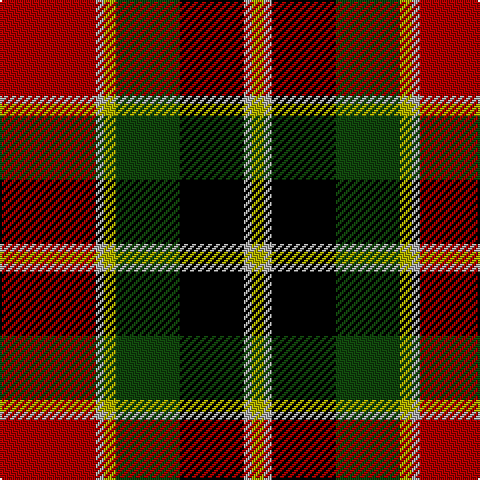

In pattern [RYYGKYY](/stripes/ryygkyy/).

This was sourced from weddslist.  It is a [7 stripe tartan](/stripes/stripes7/).

Original link http://www.weddslist.com/cgi-bin/tartans/pg.pl?source=tinsel

## Thread count
DR/48 N4 LG6 DG32 K32 N4 LG/6

## Palette
Each colour and the base-6 reference it is a variant of.

| Colour | Shade | Base |
|---|---|---|
| DG | <code style="background-color:#11450D;">#11450D</code> `oklch(34.4% 0.101 142.1)` <small>#11450D</small> | G <code style="background-color:#006100;">#006100</code> |
| DR | <code style="background-color:#AA0000;">#AA0000</code> `oklch(46.3% 0.190 29.2)` <small>#AA0000</small> | R <code style="background-color:#CC0000;">#CC0000</code> |
| K | <code style="background-color:#000000;">#000000</code> `oklch(0.0% 0.000 0.0)` <small>#000000</small> | K <code style="background-color:#000000;">#000000</code> |
| LG | <code style="background-color:#AAAA00;">#AAAA00</code> `oklch(71.4% 0.156 109.8)` <small>#AAAA00</small> | Y <code style="background-color:#F2BF00;">#F2BF00</code> |
| N | <code style="background-color:#AAAAAA;">#AAAAAA</code> `oklch(73.8% 0.000 89.9)` <small>#AAAAAA</small> | Y <code style="background-color:#F2BF00;">#F2BF00</code> |

# Sample pattern

## Nearest tartans

The nearest existing variants by ΔTartan distance, with this tartan at the top so the swatches line up against it.

ΔTartan

Tartan

Sett

—

<a href="/ttd/edit/#slug=r24lr2ly3dg16k16lr2ly3~x2">MacLachlan W</a> <a class="nn-out" href="/setts/s7/r24lr2ly3dg16k16lr2ly3~x2/" title="open its dictionary page">↗</a>

0.00

<a href="/ttd/edit/#slug=r24lr2ly3dg16k16lr2ly3">MacLachlan W</a> <a class="nn-out" href="/setts/s7/r24lr2ly3dg16k16lr2ly3/" title="open its dictionary page">↗</a>

0.72

<a href="/ttd/edit/#slug=r24lb2ly3dg16k16lb2ly3">MacLachlan W</a> <a class="nn-out" href="/setts/s7/r24lb2ly3dg16k16lb2ly3/" title="open its dictionary page">↗</a>

0.78

<a href="/ttd/edit/#slug=k10ly2dg11r11w1r1w1k9~x2">Unidentified No 5</a> <a class="nn-out" href="/setts/s8/k10ly2dg11r11w1r1w1k9~x2/" title="open its dictionary page">↗</a>

0.92

<a href="/ttd/edit/#slug=g28t3g3k10r2k10r20ly4~x2">Garvock (2015)</a> <a class="nn-out" href="/setts/s8/g28t3g3k10r2k10r20ly4~x2/" title="open its dictionary page">↗</a>

0.95

<a href="/ttd/edit/#slug=r24w2ly3dg16k16w2ly3~x2">MacLachlan #4</a> <a class="nn-out" href="/setts/s7/r24w2ly3dg16k16w2ly3~x2/" title="open its dictionary page">↗</a>

0.96

<a href="/ttd/edit/#slug=r24w2ly3g16k16w2ly3~x2">MacLachlan Old Clan Tartan Tartan Number: 1710. Earliest known date: 1790 It is the oldest MacLachlan tartan actually bearing the name. The sett has been refered to as Old MacLachlan, MacLachlan and Hunting MacLachlan. Although the sett did not appear in books until D.W. Stewart's Old &amp; Rare Scottish Tartans of 1893, there are samples of it in the collections of Campbell of Craignish in 1790 and in the Highland Society of London (circa 1816). See products available Copyright © Blair Urquhart, Comrie, 2015</a> <a class="nn-out" href="/setts/s7/r24w2ly3g16k16w2ly3~x2/" title="open its dictionary page">↗</a>

1.01

<a href="/ttd/edit/#slug=k10ly2g11r11w1r1w1k9~x2">Unnamed No 5</a> <a class="nn-out" href="/setts/s8/k10ly2g11r11w1r1w1k9~x2/" title="open its dictionary page">↗</a>

1.05

<a href="/ttd/edit/#slug=ly2dg7k6r11k1r1ly2~x4">Blackstock Red (Dress)</a> <a class="nn-out" href="/setts/s7/ly2dg7k6r11k1r1ly2~x4/" title="open its dictionary page">↗</a>

1.07

<a href="/ttd/edit/#slug=lb4k13g6r16lb2r2g2~x2">Caledonian Brewery Corporate Tartan Tartan Number: 2315. Earliest known date: pre 1997 Designed by Kinloch Anderson Ltd to commemorate the opening of the new Caledonian Brewery Malting Building. See products available Copyright © Blair Urquhart, Comrie, 2015</a> <a class="nn-out" href="/setts/s7/lb4k13g6r16lb2r2g2~x2/" title="open its dictionary page">↗</a>

1.09

<a href="/ttd/edit/#slug=w4dg20dg10r25b2r2dg2~x2">Caledonian Brewery (Corporate)</a> <a class="nn-out" href="/setts/s7/w4dg20dg10r25b2r2dg2~x2/" title="open its dictionary page">↗</a>

## Neighbour map

Every grey dot is one of 14299 variants placed by the first two principal components of the ΔTartan feature space (44% of its variance). Red is this tartan; blue dots are its nearest — click one to open its page.

<svg viewBox="0 0 640 380" role="img" style="max-width:100%;height:auto;border:1px solid #e0e0e0;border-radius:4px;display:block" xmlns="http://www.w3.org/2000/svg"><image href="/nn/cloud.v1.png" width="640" height="380"/><a href="/setts/s7/r24lr2ly3dg16k16lr2ly3/"><circle cx="155.8" cy="160.9" r="4" fill="#3465a4"><title>MacLachlan W</title></circle></a><a href="/setts/s7/r24lb2ly3dg16k16lb2ly3/"><circle cx="140.1" cy="149.7" r="4" fill="#3465a4"><title>MacLachlan W</title></circle></a><a href="/setts/s8/k10ly2dg11r11w1r1w1k9~x2/"><circle cx="174.2" cy="169.9" r="4" fill="#3465a4"><title>Unidentified No 5</title></circle></a><a href="/setts/s8/g28t3g3k10r2k10r20ly4~x2/"><circle cx="164.1" cy="148.9" r="4" fill="#3465a4"><title>Garvock (2015)</title></circle></a><a href="/setts/s7/r24w2ly3dg16k16w2ly3~x2/"><circle cx="154.2" cy="152.5" r="4" fill="#3465a4"><title>MacLachlan #4</title></circle></a><a href="/setts/s7/r24w2ly3g16k16w2ly3~x2/"><circle cx="155.1" cy="154.7" r="4" fill="#3465a4"><title>MacLachlan Old Clan Tartan Tartan Number: 1710. Earliest known date: 1790 It is the oldest MacLachlan tartan actually bearing the name. The sett has been refered to as Old MacLachlan, MacLachlan and Hunting MacLachlan. Although the sett did not appear in books until D.W. Stewart's Old &amp; Rare Scottish Tartans of 1893, there are samples of it in the collections of Campbell of Craignish in 1790 and in the Highland Society of London (circa 1816). See products available Copyright © Blair Urquhart, Comrie, 2015</title></circle></a><a href="/setts/s8/k10ly2g11r11w1r1w1k9~x2/"><circle cx="156.1" cy="165.6" r="4" fill="#3465a4"><title>Unnamed No 5</title></circle></a><a href="/setts/s7/ly2dg7k6r11k1r1ly2~x4/"><circle cx="188.5" cy="182.8" r="4" fill="#3465a4"><title>Blackstock Red (Dress)</title></circle></a><a href="/setts/s7/lb4k13g6r16lb2r2g2~x2/"><circle cx="172.2" cy="188.2" r="4" fill="#3465a4"><title>Caledonian Brewery Corporate Tartan Tartan Number: 2315. Earliest known date: pre 1997 Designed by Kinloch Anderson Ltd to commemorate the opening of the new Caledonian Brewery Malting Building. See products available Copyright © Blair Urquhart, Comrie, 2015</title></circle></a><a href="/setts/s7/w4dg20dg10r25b2r2dg2~x2/"><circle cx="203.0" cy="153.8" r="4" fill="#3465a4"><title>Caledonian Brewery (Corporate)</title></circle></a><circle cx="155.8" cy="160.9" r="5" fill="#c00000"/></svg>

ID: /setts/s7/r24lr2ly3dg16k16lr2ly3~x2/
