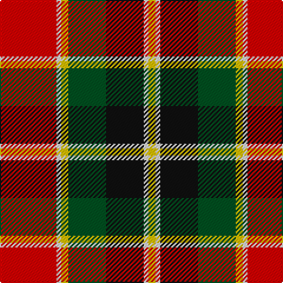

This page is one **sett** — a single exact thread-count. It belongs to the [tartan](/tartans/r24ln2y3g16k16ln2y3/)
(the same proportion at any scale), whose colour order is pattern [RWYGKWY](/stripes/rwygkwy/).

Sourced from register-of-tartans.  It is a [7 stripe tartan](/stripes/stripes7/).

Original link https://www.tartanregister.gov.uk/tartanDetails.aspx?ref=2584

## Also known as

This cloth is also recorded under:

- MacLachlan #4

## Register references

External register numbers recorded for this tartan.

- Scottish Register of Tartans: [2584](https://www.tartanregister.gov.uk/tartanDetails.aspx?ref=2584)
- Scottish Tartans World Register: 1710

## Thread count
R/48 LN4 Y6 G32 K32 LN4 Y/6

## Palette
Each colour and the base-6 reference it is a variant of.

| Colour | Shade | Base |
|---|---|---|
| G | <code style="background-color:#005020;">#005020</code> `oklch(37.7% 0.105 149.6)` <small>#005020</small> | G <code style="background-color:#006100;">#006100</code> |
| K | <code style="background-color:#101010;">#101010</code> `oklch(17.3% 0.000 89.9)` <small>#101010</small> | K <code style="background-color:#000000;">#000000</code> |
| LN | <code style="background-color:#E0E0E0;">#E0E0E0</code> `oklch(90.7% 0.000 89.9)` <small>#E0E0E0</small> | W <code style="background-color:#F7F7F7;">#F7F7F7</code> |
| R | <code style="background-color:#DC0000;">#DC0000</code> `oklch(56.2% 0.230 29.2)` <small>#DC0000</small> | R <code style="background-color:#CC0000;">#CC0000</code> |
| Y | <code style="background-color:#E8C000;">#E8C000</code> `oklch(81.9% 0.168 93.7)` <small>#E8C000</small> | Y <code style="background-color:#F2BF00;">#F2BF00</code> |

# Sample pattern

## Nearest tartans

The nearest existing variants by ΔTartan distance, with this tartan at the top so the swatches line up against it.

ΔTartan

Tartan

Sett

—

<a href="/ttd/edit/#slug=r24w2ly3dg16k16w2ly3~x2">MacLachlan #4</a> <a class="nn-out" href="/setts/s7/r24w2ly3dg16k16w2ly3~x2/" title="open its dictionary page">↗</a>

0.27

<a href="/ttd/edit/#slug=r24w2ly3g16k16w2ly3~x2">MacLachlan Old Clan Tartan Tartan Number: 1710. Earliest known date: 1790 It is the oldest MacLachlan tartan actually bearing the name. The sett has been refered to as Old MacLachlan, MacLachlan and Hunting MacLachlan. Although the sett did not appear in books until D.W. Stewart's Old &amp; Rare Scottish Tartans of 1893, there are samples of it in the collections of Campbell of Craignish in 1790 and in the Highland Society of London (circa 1816). See products available Copyright © Blair Urquhart, Comrie, 2015</a> <a class="nn-out" href="/setts/s7/r24w2ly3g16k16w2ly3~x2/" title="open its dictionary page">↗</a>

0.72

<a href="/ttd/edit/#slug=r24lb2ly3dg16k16lb2ly3">MacLachlan W</a> <a class="nn-out" href="/setts/s7/r24lb2ly3dg16k16lb2ly3/" title="open its dictionary page">↗</a>

0.73

<a href="/ttd/edit/#slug=w4dg20dg10r25b2r2dg2~x2">Caledonian Brewery (Corporate)</a> <a class="nn-out" href="/setts/s7/w4dg20dg10r25b2r2dg2~x2/" title="open its dictionary page">↗</a>

0.95

<a href="/ttd/edit/#slug=r24lr2ly3dg16k16lr2ly3~x2">MacLachlan W</a> <a class="nn-out" href="/setts/s7/r24lr2ly3dg16k16lr2ly3~x2/" title="open its dictionary page">↗</a>

0.95

<a href="/ttd/edit/#slug=r24lr2ly3dg16k16lr2ly3">MacLachlan W</a> <a class="nn-out" href="/setts/s7/r24lr2ly3dg16k16lr2ly3/" title="open its dictionary page">↗</a>

0.97

<a href="/ttd/edit/#slug=w4dg20g10r25b2r2g2~x2">Caledonian Brewery</a> <a class="nn-out" href="/setts/s7/w4dg20g10r25b2r2g2~x2/" title="open its dictionary page">↗</a>

1.10

<a href="/ttd/edit/#slug=do2r2do15r1w10dy15r2dy2~x2">Bannockbane Brown #1</a> <a class="nn-out" href="/setts/s8/do2r2do15r1w10dy15r2dy2~x2/" title="open its dictionary page">↗</a>

1.13

<a href="/ttd/edit/#slug=k14db22k5lo11k5ly24k11lo11r54lo8k10">Derry County Crest (Fashion)</a> <a class="nn-out" href="/setts/s11/k14db22k5lo11k5ly24k11lo11r54lo8k10/" title="open its dictionary page">↗</a>

1.14

<a href="/ttd/edit/#slug=r10dg3ly3w1k2w1ly3dg12w2r3w1~x4">Unnamed C18th - Pr Ch Ed Plaid?</a> <a class="nn-out" href="/setts/s11/r10dg3ly3w1k2w1ly3dg12w2r3w1~x4/" title="open its dictionary page">↗</a>

1.16

<a href="/ttd/edit/#slug=k10ly2dg11r11w1r1w1k9~x2">Unidentified No 5</a> <a class="nn-out" href="/setts/s8/k10ly2dg11r11w1r1w1k9~x2/" title="open its dictionary page">↗</a>

## Neighbour map

Every grey dot is one of 14299 variants placed by the first two principal components of the ΔTartan feature space (44% of its variance). Red is this tartan; blue dots are its nearest — click one to open its page.

<svg viewBox="0 0 640 380" role="img" style="max-width:100%;height:auto;border:1px solid #e0e0e0;border-radius:4px;display:block" xmlns="http://www.w3.org/2000/svg"><image href="/nn/cloud.v1.png" width="640" height="380"/><a href="/setts/s7/r24w2ly3g16k16w2ly3~x2/"><circle cx="155.1" cy="154.7" r="4" fill="#3465a4"><title>MacLachlan Old Clan Tartan Tartan Number: 1710. Earliest known date: 1790 It is the oldest MacLachlan tartan actually bearing the name. The sett has been refered to as Old MacLachlan, MacLachlan and Hunting MacLachlan. Although the sett did not appear in books until D.W. Stewart's Old &amp; Rare Scottish Tartans of 1893, there are samples of it in the collections of Campbell of Craignish in 1790 and in the Highland Society of London (circa 1816). See products available Copyright © Blair Urquhart, Comrie, 2015</title></circle></a><a href="/setts/s7/r24lb2ly3dg16k16lb2ly3/"><circle cx="140.1" cy="149.7" r="4" fill="#3465a4"><title>MacLachlan W</title></circle></a><a href="/setts/s7/w4dg20dg10r25b2r2dg2~x2/"><circle cx="203.0" cy="153.8" r="4" fill="#3465a4"><title>Caledonian Brewery (Corporate)</title></circle></a><a href="/setts/s7/r24lr2ly3dg16k16lr2ly3~x2/"><circle cx="155.8" cy="160.9" r="4" fill="#3465a4"><title>MacLachlan W</title></circle></a><a href="/setts/s7/r24lr2ly3dg16k16lr2ly3/"><circle cx="155.8" cy="160.9" r="4" fill="#3465a4"><title>MacLachlan W</title></circle></a><a href="/setts/s7/w4dg20g10r25b2r2g2~x2/"><circle cx="207.3" cy="158.5" r="4" fill="#3465a4"><title>Caledonian Brewery</title></circle></a><a href="/setts/s8/do2r2do15r1w10dy15r2dy2~x2/"><circle cx="194.0" cy="157.1" r="4" fill="#3465a4"><title>Bannockbane Brown #1</title></circle></a><a href="/setts/s11/k14db22k5lo11k5ly24k11lo11r54lo8k10/"><circle cx="108.6" cy="139.5" r="4" fill="#3465a4"><title>Derry County Crest (Fashion)</title></circle></a><a href="/setts/s11/r10dg3ly3w1k2w1ly3dg12w2r3w1~x4/"><circle cx="143.6" cy="124.5" r="4" fill="#3465a4"><title>Unnamed C18th - Pr Ch Ed Plaid?</title></circle></a><a href="/setts/s8/k10ly2dg11r11w1r1w1k9~x2/"><circle cx="174.2" cy="169.9" r="4" fill="#3465a4"><title>Unidentified No 5</title></circle></a><circle cx="154.2" cy="152.5" r="5" fill="#c00000"/></svg>

ID: /setts/s7/r24w2ly3dg16k16w2ly3~x2/
