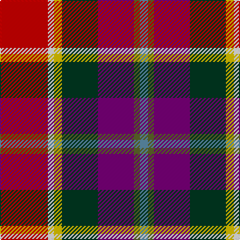

**Bands:** [RWYGBGB](/stripes/rwygbgb/) · **Stripes:** [R W LY DG DP Y T](/stripes/stripes7/) R W LY DG DP Y T

This was sourced from tartans-authority.  It is a [7 band tartan](/bands/bands7/).

Original link http://www.tartansauthority.com/tartan-ferret/display/2436/

## Thread count
R/48 W6 Y8 DG36 P36 G6 B/8

## Palette
Each colour and its ΔE from the base-6 reference it is a variant of.

| Colour | Shade | Base | ΔE (OKLab) |
|---|---|---|---|
| B | <code style="background-color:#5C8CA8;">#5C8CA8</code> `#5C8CA8` | B <code style="background-color:#2A418A;">#2A418A</code> | 0.23 |
| DG | <code style="background-color:#003820;">#003820</code> `#003820` | G <code style="background-color:#006100;">#006100</code> | 0.15 |
| G | <code style="background-color:#5C6428;">#5C6428</code> `#5C6428` | G <code style="background-color:#006100;">#006100</code> | 0.10 |
| P | <code style="background-color:#780078;">#780078</code> `#780078` | B <code style="background-color:#2A418A;">#2A418A</code> | 0.17 |
| R | <code style="background-color:#C80000;">#C80000</code> `#C80000` | R <code style="background-color:#CC0000;">#CC0000</code> | 0.01 |
| W | <code style="background-color:#FCFCFC;">#FCFCFC</code> `#FCFCFC` | W <code style="background-color:#F7F7F7;">#F7F7F7</code> | 0.01 |
| Y | <code style="background-color:#E8C000;">#E8C000</code> `#E8C000` | Y <code style="background-color:#F2BF00;">#F2BF00</code> | 0.02 |

# Sample pattern

## Nearest tartans

The nearest existing variants by ΔTartan distance.

1. [Walter](/setts/s7/r24w3ly4dg18p18dy3t4~x2/) — ΔT 0.15
1. [Culloden](/setts/s8/r5t2dp14w2k13lo13k2ly3~x2/) — ΔT 0.92
1. [Walter (Personal)](/setts/s12/r24w3ly4dg18dp18y3t4~x2/) — ΔT 1.22
1. [MacLeod Soc. of Scotland, (Comm)](/setts/s7/g3g3r22k5db22ly2w2~x2/) — ΔT 1.27
1. [Scotland's International - Away (Fas](/setts/s10/r24r24k2w6k2ly2k16lb5db6w2~x2/) — ΔT 1.32
1. [Nicolson of Taransay (Personal)](/setts/s7/w6g10r22db16g2k4k5~x2/) — ΔT 1.32
1. [Barrington Municipality](/setts/s7/ly5lr3db6o8w5r17k2/) — ΔT 1.39
1. [Culloden, Gold](/setts/s8/r5t2dp14w2k13y13k2ly3~x2/) — ΔT 1.41
1. [Maryland](/setts/s8/dt8t1db1t1m12ly6k12w2~x4/) — ΔT 1.42
1. [Khosla, Sarah and Jatin (Personal)](/setts/s9/m4dt10m18ly3m3ly5r8dt9w4~x2/) — ΔT 1.44

## Neighbour map

Every grey dot is one of 14299 variants placed by the first two principal components of the ΔTartan feature space (44% of its variance). Red is this tartan; blue dots are its nearest — click one to open its page.

<svg viewBox="0 0 640 380" role="img" style="max-width:100%;height:auto;border:1px solid #e0e0e0;border-radius:4px;display:block" xmlns="http://www.w3.org/2000/svg"><image href="/nn/cloud.v1.png" width="640" height="380"/><a href="/setts/s7/r24w3ly4dg18p18dy3t4~x2/"><circle cx="95.3" cy="151.1" r="4" fill="#3465a4"><title>Walter</title></circle></a><a href="/setts/s8/r5t2dp14w2k13lo13k2ly3~x2/"><circle cx="43.5" cy="144.5" r="4" fill="#3465a4"><title>Culloden</title></circle></a><a href="/setts/s12/r24w3ly4dg18dp18y3t4~x2/"><circle cx="67.3" cy="128.3" r="4" fill="#3465a4"><title>Walter (Personal)</title></circle></a><a href="/setts/s7/g3g3r22k5db22ly2w2~x2/"><circle cx="156.6" cy="125.3" r="4" fill="#3465a4"><title>MacLeod Soc. of Scotland, (Comm)</title></circle></a><a href="/setts/s10/r24r24k2w6k2ly2k16lb5db6w2~x2/"><circle cx="80.0" cy="100.7" r="4" fill="#3465a4"><title>Scotland's International - Away (Fas</title></circle></a><a href="/setts/s7/w6g10r22db16g2k4k5~x2/"><circle cx="104.8" cy="160.2" r="4" fill="#3465a4"><title>Nicolson of Taransay (Personal)</title></circle></a><a href="/setts/s7/ly5lr3db6o8w5r17k2/"><circle cx="71.8" cy="136.5" r="4" fill="#3465a4"><title>Barrington Municipality</title></circle></a><a href="/setts/s8/r5t2dp14w2k13y13k2ly3~x2/"><circle cx="35.5" cy="144.5" r="4" fill="#3465a4"><title>Culloden, Gold</title></circle></a><a href="/setts/s8/dt8t1db1t1m12ly6k12w2~x4/"><circle cx="68.6" cy="125.4" r="4" fill="#3465a4"><title>Maryland</title></circle></a><a href="/setts/s9/m4dt10m18ly3m3ly5r8dt9w4~x2/"><circle cx="62.2" cy="165.9" r="4" fill="#3465a4"><title>Khosla, Sarah and Jatin (Personal)</title></circle></a><circle cx="94.0" cy="149.9" r="5" fill="#c00000"/></svg>

ID: /setts/s7/r24w3ly4dg18dp18y3t4~x2/
