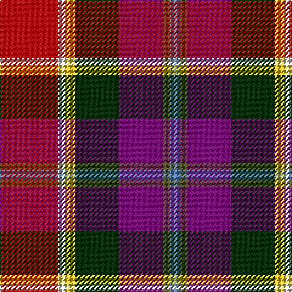

In pattern [BGBGYWR](/stripes/bgbgywr/).

This was sourced from weddslist.  It is a [7 stripe tartan](/stripes/stripes7/).

Original link http://www.weddslist.com/cgi-bin/tartans/pg.pl?source=sts

## Thread count
R/48 LN6 Y8 DG36 P36 T6 B/8

## Palette
Each colour and the base-6 reference it is a variant of.

| Colour | Shade | Base |
|---|---|---|
| B | <code style="background-color:#5480B0;">#5480B0</code> `oklch(58.8% 0.089 251.5)` <small>#5480B0</small> | B <code style="background-color:#2A418A;">#2A418A</code> |
| DG | <code style="background-color:#003000;">#003000</code> `oklch(26.8% 0.091 142.5)` <small>#003000</small> | G <code style="background-color:#006100;">#006100</code> |
| LN | <code style="background-color:#E0E0E0;">#E0E0E0</code> `oklch(90.7% 0.000 89.9)` <small>#E0E0E0</small> | W <code style="background-color:#F7F7F7;">#F7F7F7</code> |
| P | <code style="background-color:#800080;">#800080</code> `oklch(42.1% 0.193 328.4)` <small>#800080</small> | B <code style="background-color:#2A418A;">#2A418A</code> |
| R | <code style="background-color:#C00000;">#C00000</code> `oklch(50.7% 0.208 29.2)` <small>#C00000</small> | R <code style="background-color:#CC0000;">#CC0000</code> |
| T | <code style="background-color:#505020;">#505020</code> `oklch(42.0% 0.068 109.0)` <small>#505020</small> | G <code style="background-color:#006100;">#006100</code> |
| Y | <code style="background-color:#F0C000;">#F0C000</code> `oklch(82.7% 0.169 90.5)` <small>#F0C000</small> | Y <code style="background-color:#F2BF00;">#F2BF00</code> |

# Sample pattern

## Nearest tartans

The nearest existing variants by ΔTartan distance.

1. [Walter (Personal)](/setts/s7/r24w3ly4dg18dp18y3t4~x2/) — ΔT 0.15
1. [Culloden](/setts/s8/r5t2dp14w2k13lo13k2ly3~x2/) — ΔT 0.93
1. [Walter (Personal)](/setts/s12/r24w3ly4dg18dp18y3t4~x2/) — ΔT 1.24
1. [MacLeod Soc. of Scotland, (Comm)](/setts/s7/g3g3r22k5db22ly2w2~x2/) — ΔT 1.28
1. [Scotland's International - Away (Fas](/setts/s10/r24r24k2w6k2ly2k16lb5db6w2~x2/) — ΔT 1.30
1. [Nicolson of Taransay (Personal)](/setts/s7/w6g10r22db16g2k4k5~x2/) — ΔT 1.33
1. [Culloden, Gold](/setts/s8/r5t2dp14w2k13y13k2ly3~x2/) — ΔT 1.37
1. [Maryland](/setts/s8/dt8t1db1t1m12ly6k12w2~x4/) — ΔT 1.42
1. [Nicolson of Tiree & Coll (Clan)](/setts/s6/g3db8r11dt3k2dp2~x4/) — ΔT 1.44
1. [Barrington Municipality](/setts/s7/ly5lr3db6o8w5r17k2/) — ΔT 1.47

## Neighbour map

Every grey dot is one of 14299 variants placed by the first two principal components of the ΔTartan feature space (44% of its variance). Red is this tartan; blue dots are its nearest — click one to open its page.

<svg viewBox="0 0 640 380" role="img" style="max-width:100%;height:auto;border:1px solid #e0e0e0;border-radius:4px;display:block" xmlns="http://www.w3.org/2000/svg"><image href="/nn/cloud.v1.png" width="640" height="380"/><a href="/setts/s7/r24w3ly4dg18dp18y3t4~x2/"><circle cx="94.0" cy="149.9" r="4" fill="#3465a4"><title>Walter (Personal)</title></circle></a><a href="/setts/s8/r5t2dp14w2k13lo13k2ly3~x2/"><circle cx="43.5" cy="144.5" r="4" fill="#3465a4"><title>Culloden</title></circle></a><a href="/setts/s12/r24w3ly4dg18dp18y3t4~x2/"><circle cx="67.3" cy="128.3" r="4" fill="#3465a4"><title>Walter (Personal)</title></circle></a><a href="/setts/s7/g3g3r22k5db22ly2w2~x2/"><circle cx="156.6" cy="125.3" r="4" fill="#3465a4"><title>MacLeod Soc. of Scotland, (Comm)</title></circle></a><a href="/setts/s10/r24r24k2w6k2ly2k16lb5db6w2~x2/"><circle cx="80.0" cy="100.7" r="4" fill="#3465a4"><title>Scotland's International - Away (Fas</title></circle></a><a href="/setts/s7/w6g10r22db16g2k4k5~x2/"><circle cx="104.8" cy="160.2" r="4" fill="#3465a4"><title>Nicolson of Taransay (Personal)</title></circle></a><a href="/setts/s8/r5t2dp14w2k13y13k2ly3~x2/"><circle cx="35.5" cy="144.5" r="4" fill="#3465a4"><title>Culloden, Gold</title></circle></a><a href="/setts/s8/dt8t1db1t1m12ly6k12w2~x4/"><circle cx="68.6" cy="125.4" r="4" fill="#3465a4"><title>Maryland</title></circle></a><a href="/setts/s6/g3db8r11dt3k2dp2~x4/"><circle cx="128.2" cy="203.9" r="4" fill="#3465a4"><title>Nicolson of Tiree &amp; Coll (Clan)</title></circle></a><a href="/setts/s7/ly5lr3db6o8w5r17k2/"><circle cx="71.8" cy="136.5" r="4" fill="#3465a4"><title>Barrington Municipality</title></circle></a><circle cx="95.3" cy="151.1" r="5" fill="#c00000"/></svg>

ID: /setts/s7/r24w3ly4dg18p18dy3t4~x2/
