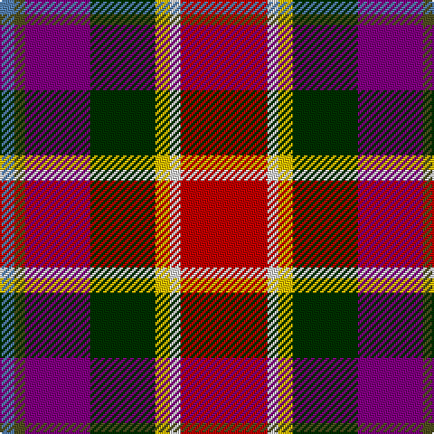

In pattern [BGBGYWR](/patterns/bgbgywr/).

This was sourced from weddslist.  It is a [7 stripes tartan](/stripes/stripes7/).

Original link http://www.weddslist.com/cgi-bin/tartans/pg.pl?source=sts

## Thread count
B/8 T6 P36 DG36 Y8 LN6 R/48

## Palette
Each colour and its ΔE from the base-6 reference it is a variant of.

| Colour | Shade | Base | ΔE (OKLab) |
|---|---|---|---|
| B | <code style="background-color:#5480B0;">#5480B0</code> `#5480B0` | B <code style="background-color:#2A418A;">#2A418A</code> | 0.19 |
| DG | <code style="background-color:#003000;">#003000</code> `#003000` | G <code style="background-color:#006100;">#006100</code> | 0.17 |
| LN | <code style="background-color:#E0E0E0;">#E0E0E0</code> `#E0E0E0` | W <code style="background-color:#F7F7F7;">#F7F7F7</code> | 0.07 |
| P | <code style="background-color:#800080;">#800080</code> `#800080` | B <code style="background-color:#2A418A;">#2A418A</code> | 0.17 |
| R | <code style="background-color:#C00000;">#C00000</code> `#C00000` | R <code style="background-color:#CC0000;">#CC0000</code> | 0.03 |
| T | <code style="background-color:#505020;">#505020</code> `#505020` | G <code style="background-color:#006100;">#006100</code> | 0.10 |
| Y | <code style="background-color:#F0C000;">#F0C000</code> `#F0C000` | Y <code style="background-color:#F2BF00;">#F2BF00</code> | 0.00 |

# Sample pattern

## Nearest tartans

The nearest existing variants by ΔTartan distance.

1. [Walter (Personal)](/setts/s7/r24w3y4g18b18ga3ba4~b780078-ba5c8ca8-g003820-ga5c6428-rc80000-wfcfcfc-ye8c000~x2/) — ΔT 0.15
1. [Culloden](/setts/s8/r5b2ba14w2k13y13k2ya3~b5c8ca8-ba780078-k101010-rc80000-wfcfcfc-ybc8c00-yae8c000~x2/) — ΔT 0.93
1. [Walter (Personal)](/setts/s12/r24w3y4g18b18ga3ba4ga3b18g18y4w3~b780078-ba5c8ca8-g003820-ga5c6428-rc80000-wfcfcfc-ye8c000~x2/) — ΔT 1.24
1. [MacLeod Soc. of Scotland, (Comm)](/setts/s7/g3ga3r22k5b22y2w2~b2c2c80-g006818-ga289c18-k101010-rc80000-wf0d0b4-ye8c000~x2/) — ΔT 1.28
1. [Scotland's International - Away (Fas](/setts/s10/r24ra24k2w6k2y2k16wa5b6w2~b2c2c80-k101010-rc80000-ra880000-we0e0e0-wa98c8e8-ye8c000~x2/) — ΔT 1.30
1. [Nicolson of Taransay (Personal)](/setts/s7/w6g10r22b16ga2k4k5~b2c2c80-g006818-ga289c18-k101010-rc80000-we0e0e0~x2/) — ΔT 1.32
1. [Culloden, Gold](/setts/s8/r5b2ba14w2k13g13k2y3~b5480b0-ba800070-g908000-k000000-rc00000-we0e0e0-yf0c000~x2/) — ΔT 1.37
1. [Maryland](/setts/s8/b8ba1bb1ba1r12y6k12w2~b003c64-ba2888c4-bb2c2c80-k101010-ra00048-we0e0e0-ye8c000~x4/) — ΔT 1.42
1. [Nicolson of Tiree & Coll (Clan)](/setts/s6/g3b8r11ba3k2bb2~b2c2c80-ba003c64-bb780078-g289c18-k101010-rc80000~x4/) — ΔT 1.44
1. [Unidentified No 14](/setts/s9/r22b6ba10y4r4w4g22ba8y3~b3c82af-ba2c4084-g005020-rdc0000-we0e0e0-ye8c000/) — ΔT 1.47

## Neighbour map

Every grey dot is one of 15726 variants placed by the first two principal components of the ΔTartan feature space (44% of its variance). Red is this tartan; blue dots are its nearest — click one to open its page.

<svg viewBox="0 0 640 380" role="img" style="max-width:100%;height:auto;border:1px solid #e0e0e0;border-radius:4px;display:block" xmlns="http://www.w3.org/2000/svg"><image href="/nn/cloud.v1.png" width="640" height="380"/><a href="/setts/s7/r24w3y4g18b18ga3ba4~b780078-ba5c8ca8-g003820-ga5c6428-rc80000-wfcfcfc-ye8c000~x2/"><circle cx="92.5" cy="148.6" r="4" fill="#3465a4"><title>Walter (Personal)</title></circle></a><a href="/setts/s8/r5b2ba14w2k13y13k2ya3~b5c8ca8-ba780078-k101010-rc80000-wfcfcfc-ybc8c00-yae8c000~x2/"><circle cx="41.3" cy="144.1" r="4" fill="#3465a4"><title>Culloden</title></circle></a><a href="/setts/s12/r24w3y4g18b18ga3ba4ga3b18g18y4w3~b780078-ba5c8ca8-g003820-ga5c6428-rc80000-wfcfcfc-ye8c000~x2/"><circle cx="65.2" cy="126.0" r="4" fill="#3465a4"><title>Walter (Personal)</title></circle></a><a href="/setts/s7/g3ga3r22k5b22y2w2~b2c2c80-g006818-ga289c18-k101010-rc80000-wf0d0b4-ye8c000~x2/"><circle cx="154.7" cy="124.7" r="4" fill="#3465a4"><title>MacLeod Soc. of Scotland, (Comm)</title></circle></a><a href="/setts/s10/r24ra24k2w6k2y2k16wa5b6w2~b2c2c80-k101010-rc80000-ra880000-we0e0e0-wa98c8e8-ye8c000~x2/"><circle cx="78.4" cy="99.9" r="4" fill="#3465a4"><title>Scotland's International - Away (Fas</title></circle></a><a href="/setts/s7/w6g10r22b16ga2k4k5~b2c2c80-g006818-ga289c18-k101010-rc80000-we0e0e0~x2/"><circle cx="102.6" cy="159.8" r="4" fill="#3465a4"><title>Nicolson of Taransay (Personal)</title></circle></a><a href="/setts/s8/r5b2ba14w2k13g13k2y3~b5480b0-ba800070-g908000-k000000-rc00000-we0e0e0-yf0c000~x2/"><circle cx="32.8" cy="144.8" r="4" fill="#3465a4"><title>Culloden, Gold</title></circle></a><a href="/setts/s8/b8ba1bb1ba1r12y6k12w2~b003c64-ba2888c4-bb2c2c80-k101010-ra00048-we0e0e0-ye8c000~x4/"><circle cx="65.8" cy="124.0" r="4" fill="#3465a4"><title>Maryland</title></circle></a><a href="/setts/s6/g3b8r11ba3k2bb2~b2c2c80-ba003c64-bb780078-g289c18-k101010-rc80000~x4/"><circle cx="126.5" cy="202.0" r="4" fill="#3465a4"><title>Nicolson of Tiree &amp; Coll (Clan)</title></circle></a><a href="/setts/s9/r22b6ba10y4r4w4g22ba8y3~b3c82af-ba2c4084-g005020-rdc0000-we0e0e0-ye8c000/"><circle cx="85.7" cy="159.6" r="4" fill="#3465a4"><title>Unidentified No 14</title></circle></a><circle cx="93.8" cy="149.7" r="5" fill="#c00000"/></svg>

ID: /setts/s7/r24w3y4g18b18ga3ba4~b800080-ba5480b0-g003000-ga505020-rc00000-we0e0e0-yf0c000~x2/
