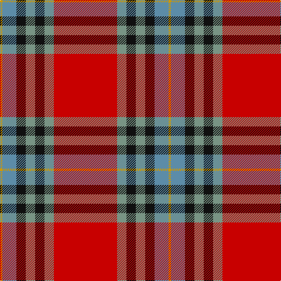

In pattern [RGKGKBY](/patterns/rgkgkby/).

This was sourced from register-of-tartans.  It is a [7 stripes tartan](/stripes/stripes7/).

Original link https://www.tartanregister.gov.uk/tartanDetails.aspx?ref=5194

## Thread count
DY/4 B24 K16 LG16 K16 LG16 R/108

## Palette
Each colour and its ΔE from the base-6 reference it is a variant of.

| Colour | Shade | Base | ΔE (OKLab) |
|---|---|---|---|
| B | <code style="background-color:#5C8CA8;">#5C8CA8</code> `#5C8CA8` | B <code style="background-color:#2A418A;">#2A418A</code> | 0.23 |
| DY | <code style="background-color:#D09800;">#D09800</code> `#D09800` | Y <code style="background-color:#F2BF00;">#F2BF00</code> | 0.12 |
| K | <code style="background-color:#101010;">#101010</code> `#101010` | K <code style="background-color:#000000;">#000000</code> | 0.17 |
| LG | <code style="background-color:#789484;">#789484</code> `#789484` | G <code style="background-color:#006100;">#006100</code> | 0.24 |
| R | <code style="background-color:#C80000;">#C80000</code> `#C80000` | R <code style="background-color:#CC0000;">#CC0000</code> | 0.01 |

# Sample pattern

## Nearest tartans

The nearest existing variants by ΔTartan distance.

1. [Livingstone MacLay MacLeay Clan Tartan Tartan Number: 1488. Earliest known date: 1934 Nothing See products available Copyright © Blair Urquhart, Comrie, 2015](/setts/s7/r28g4k4g4k4b6y1x2~b5c8ca8-g006818-k101010-rc80000-ye8c000/) — ΔT 0.45
1. [Livingstone MacLay MacLeay](/setts/s7/r28g4k4g4k4b6y1x2~b3c82af-g005020-k101010-rdc0000-ye8c000/) — ΔT 0.46
1. [MacLeay (Clan)](/setts/s7/r27g4k4g4k4b6y1x4~b2c2c80-g006818-k101010-rc80000-yd09800/) — ΔT 0.55
1. [MacPhail Clan Tartan Tartan Number: 1028. Earliest known date: pre 1950 This sample comes from the MacGregor-Hastie collection which forms the basis of the cloth archive of the Scottish Tartans Society. Some of the samples, including this one, were unmarked. One can assume that the sample dates between 1930 and 1950. See products available Copyright © Blair Urquhart, Comrie, 2015](/setts/s6/r25b7r3g13ba1k2x4~b2c2c80-ba5c8ca8-g006818-k101010-rc80000/) — ΔT 0.83
1. [Aberdeen F.C. Corporate Tartan Tartan Number: 2694. Earliest known date: 1997 The Aberdeen Football Club commissioned this design to include the colours of the teams away strip - navy and gold. See products available Copyright © Blair Urquhart, Comrie, 2015](/setts/s8/y5b1r2b4r36b22w4ya2x2~b003c64-rc80000-we0e0e0-yd87c00-yae8c000/) — ΔT 0.84
1. [MacPhail](/setts/s6/r25b7r3g13ba1k2x4~b304080-ba5480b0-g008000-k000000-rc00000/) — ΔT 0.92
1. [Elbrick Dress (Personal)](/setts/s8/r6b22r6g20y2r45b2w5x2~b1474b4-g408060-rc80000-wfcfcfc-ye8c000/) — ΔT 0.92
1. [Chisholm #2](/setts/s10/r6w1r24b6g2k1g2k1g12r1x2~b2c4084-g005020-k101010-rdc0000-we0e0e0/) — ΔT 0.94
1. [MacEdward](/setts/s10/r6y1r24g6b2k1b2k1b12r1x2~b304080-g008000-k000000-rc00000-yf0c000/) — ΔT 1.01
1. [Chisholm Clan Tartan Tartan Number: 1475. Earliest known date: 1842 Also recorded by Frank Adam in 'The Clans, Septs and Regiments of the Scottish Highlands'. Although the Vestiarium has been discredited as an authentic source, many of the tartans appear to be based on genuine older setts. In this case the 'Black Watch'. There is a specimen of both Chisholm and Chisholm Hunting in the collection of the Highland Society of London, sealed and marked "Presented by Lt. Col. Chisholm Batten, 1907." See products available Copyright © Blair Urquhart, Comrie, 2015](/setts/s10/r6w1r24b6g2k1g2k1g12r1x2~b2c2c80-g006818-k101010-rc80000-we0e0e0/) — ΔT 1.05

## Neighbour map

Every grey dot is one of 15726 variants placed by the first two principal components of the ΔTartan feature space (44% of its variance). Red is this tartan; blue dots are its nearest — click one to open its page.

<svg viewBox="0 0 640 380" role="img" style="max-width:100%;height:auto;border:1px solid #e0e0e0;border-radius:4px;display:block" xmlns="http://www.w3.org/2000/svg"><image href="/nn/cloud.v1.png" width="640" height="380"/><a href="/setts/s7/r28g4k4g4k4b6y1x2~b5c8ca8-g006818-k101010-rc80000-ye8c000/"><circle cx="330.7" cy="117.6" r="4" fill="#3465a4"><title>Livingstone MacLay MacLeay Clan Tartan Tartan Number: 1488. Earliest known date: 1934 Nothing See products available Copyright © Blair Urquhart, Comrie, 2015</title></circle></a><a href="/setts/s7/r28g4k4g4k4b6y1x2~b3c82af-g005020-k101010-rdc0000-ye8c000/"><circle cx="324.8" cy="113.5" r="4" fill="#3465a4"><title>Livingstone MacLay MacLeay</title></circle></a><a href="/setts/s7/r27g4k4g4k4b6y1x4~b2c2c80-g006818-k101010-rc80000-yd09800/"><circle cx="325.5" cy="122.4" r="4" fill="#3465a4"><title>MacLeay (Clan)</title></circle></a><a href="/setts/s6/r25b7r3g13ba1k2x4~b2c2c80-ba5c8ca8-g006818-k101010-rc80000/"><circle cx="338.0" cy="147.3" r="4" fill="#3465a4"><title>MacPhail Clan Tartan Tartan Number: 1028. Earliest known date: pre 1950 This sample comes from the MacGregor-Hastie collection which forms the basis of the cloth archive of the Scottish Tartans Society. Some of the samples, including this one, were unmarked. One can assume that the sample dates between 1930 and 1950. See products available Copyright © Blair Urquhart, Comrie, 2015</title></circle></a><a href="/setts/s8/y5b1r2b4r36b22w4ya2x2~b003c64-rc80000-we0e0e0-yd87c00-yae8c000/"><circle cx="327.9" cy="96.8" r="4" fill="#3465a4"><title>Aberdeen F.C. Corporate Tartan Tartan Number: 2694. Earliest known date: 1997 The Aberdeen Football Club commissioned this design to include the colours of the teams away strip - navy and gold. See products available Copyright © Blair Urquhart, Comrie, 2015</title></circle></a><a href="/setts/s6/r25b7r3g13ba1k2x4~b304080-ba5480b0-g008000-k000000-rc00000/"><circle cx="328.0" cy="144.6" r="4" fill="#3465a4"><title>MacPhail</title></circle></a><a href="/setts/s8/r6b22r6g20y2r45b2w5x2~b1474b4-g408060-rc80000-wfcfcfc-ye8c000/"><circle cx="308.4" cy="129.1" r="4" fill="#3465a4"><title>Elbrick Dress (Personal)</title></circle></a><a href="/setts/s10/r6w1r24b6g2k1g2k1g12r1x2~b2c4084-g005020-k101010-rdc0000-we0e0e0/"><circle cx="340.6" cy="105.1" r="4" fill="#3465a4"><title>Chisholm #2</title></circle></a><a href="/setts/s10/r6y1r24g6b2k1b2k1b12r1x2~b304080-g008000-k000000-rc00000-yf0c000/"><circle cx="343.3" cy="108.0" r="4" fill="#3465a4"><title>MacEdward</title></circle></a><a href="/setts/s10/r6w1r24b6g2k1g2k1g12r1x2~b2c2c80-g006818-k101010-rc80000-we0e0e0/"><circle cx="344.8" cy="109.0" r="4" fill="#3465a4"><title>Chisholm Clan Tartan Tartan Number: 1475. Earliest known date: 1842 Also recorded by Frank Adam in 'The Clans, Septs and Regiments of the Scottish Highlands'. Although the Vestiarium has been discredited as an authentic source, many of the tartans appear to be based on genuine older setts. In this case the 'Black Watch'. There is a specimen of both Chisholm and Chisholm Hunting in the collection of the Highland Society of London, sealed and marked &quot;Presented by Lt. Col. Chisholm Batten, 1907.&quot; See products available Copyright © Blair Urquhart, Comrie, 2015</title></circle></a><circle cx="325.3" cy="118.9" r="5" fill="#c00000"/></svg>

ID: /setts/s7/r27g4k4g4k4b6y1x4~b5c8ca8-g789484-k101010-rc80000-yd09800/
