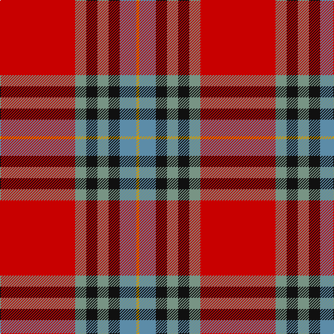

In pattern [RGKGKBY](/stripes/rgkgkby/).

This was sourced from register-of-tartans.  It is a [7 stripe tartan](/stripes/stripes7/).

Original link https://www.tartanregister.gov.uk/tartanDetails.aspx?ref=5194

## Register references

External register numbers recorded for this tartan.

- Scottish Register of Tartans: [5194](https://www.tartanregister.gov.uk/tartanDetails.aspx?ref=5194)
- Scottish Tartans Authority (ITI): 3437

## Thread count
R/108 LG16 K16 LG16 K16 B24 DY/4

## Palette
Each colour and the base-6 reference it is a variant of.

| Colour | Shade | Base |
|---|---|---|
| B | <code style="background-color:#5C8CA8;">#5C8CA8</code> `oklch(61.7% 0.067 235.0)` <small>#5C8CA8</small> | B <code style="background-color:#2A418A;">#2A418A</code> |
| DY | <code style="background-color:#D09800;">#D09800</code> `oklch(71.4% 0.147 82.1)` <small>#D09800</small> | Y <code style="background-color:#F2BF00;">#F2BF00</code> |
| K | <code style="background-color:#101010;">#101010</code> `oklch(17.3% 0.000 89.9)` <small>#101010</small> | K <code style="background-color:#000000;">#000000</code> |
| LG | <code style="background-color:#789484;">#789484</code> `oklch(64.0% 0.040 160.0)` <small>#789484</small> | G <code style="background-color:#006100;">#006100</code> |
| R | <code style="background-color:#C80000;">#C80000</code> `oklch(52.3% 0.215 29.2)` <small>#C80000</small> | R <code style="background-color:#CC0000;">#CC0000</code> |

# Sample pattern

## Nearest tartans

The nearest existing variants by ΔTartan distance, with this tartan at the top so the swatches line up against it.

ΔTartan

Tartan

Sett

—

<a href="/ttd/edit/#slug=r27y4k4y4k4t6lo1~x4">MacLeay</a> <a class="nn-out" href="/setts/s7/r27y4k4y4k4t6lo1~x4/" title="open its dictionary page">↗</a>

0.46

<a href="/ttd/edit/#slug=r28dg4k4dg4k4t6ly1~x2">Livingstone MacLay MacLeay</a> <a class="nn-out" href="/setts/s7/r28dg4k4dg4k4t6ly1~x2/" title="open its dictionary page">↗</a>

0.55

<a href="/ttd/edit/#slug=r27g4k4g4k4db6lo1~x4">MacLeay (Clan)</a> <a class="nn-out" href="/setts/s7/r27g4k4g4k4db6lo1~x4/" title="open its dictionary page">↗</a>

0.83

<a href="/ttd/edit/#slug=lo5dt1r2dt4r36dt22w4ly2~x2">Aberdeen F.C. Corporate Tartan Tartan Number: 2694. Earliest known date: 1997 The Aberdeen Football Club commissioned this design to include the colours of the teams away strip - navy and gold. See products available Copyright © Blair Urquhart, Comrie, 2015</a> <a class="nn-out" href="/setts/s8/lo5dt1r2dt4r36dt22w4ly2~x2/" title="open its dictionary page">↗</a>

0.92

<a href="/ttd/edit/#slug=r25db7r3g13t1k2~x4">MacPhail</a> <a class="nn-out" href="/setts/s6/r25db7r3g13t1k2~x4/" title="open its dictionary page">↗</a>

0.92

<a href="/ttd/edit/#slug=r6b22r6g20ly2r45b2w5~x2">Elbrick Dress (Personal)</a> <a class="nn-out" href="/setts/s8/r6b22r6g20ly2r45b2w5~x2/" title="open its dictionary page">↗</a>

0.94

<a href="/ttd/edit/#slug=r6w1r24db6dg2k1dg2k1dg12r1~x2">Chisholm #2</a> <a class="nn-out" href="/setts/s10/r6w1r24db6dg2k1dg2k1dg12r1~x2/" title="open its dictionary page">↗</a>

1.01

<a href="/ttd/edit/#slug=r6ly1r24g6db2k1db2k1db12r1~x2">MacEdward</a> <a class="nn-out" href="/setts/s10/r6ly1r24g6db2k1db2k1db12r1~x2/" title="open its dictionary page">↗</a>

1.06

<a href="/ttd/edit/#slug=r28g4k4g4k4t6ly1~x2">Livingstone, MacLay MacLeay</a> <a class="nn-out" href="/setts/s7/r28g4k4g4k4t6ly1~x2/" title="open its dictionary page">↗</a>

1.09

<a href="/ttd/edit/#slug=r36lb1db3ly1dg16r8db3lb5">Drummond of Perth</a> <a class="nn-out" href="/setts/s8/r36lb1db3ly1dg16r8db3lb5/" title="open its dictionary page">↗</a>

1.12

<a href="/ttd/edit/#slug=ly3n8w3n34r34g4r4w2~x2">Manitoba Masonic</a> <a class="nn-out" href="/setts/s8/ly3n8w3n34r34g4r4w2~x2/" title="open its dictionary page">↗</a>

## Neighbour map

Every grey dot is one of 14299 variants placed by the first two principal components of the ΔTartan feature space (44% of its variance). Red is this tartan; blue dots are its nearest — click one to open its page.

<svg viewBox="0 0 640 380" role="img" style="max-width:100%;height:auto;border:1px solid #e0e0e0;border-radius:4px;display:block" xmlns="http://www.w3.org/2000/svg"><image href="/nn/cloud.v1.png" width="640" height="380"/><a href="/setts/s7/r28dg4k4dg4k4t6ly1~x2/"><circle cx="325.1" cy="110.2" r="4" fill="#3465a4"><title>Livingstone MacLay MacLeay</title></circle></a><a href="/setts/s7/r27g4k4g4k4db6lo1~x4/"><circle cx="325.9" cy="120.6" r="4" fill="#3465a4"><title>MacLeay (Clan)</title></circle></a><a href="/setts/s8/lo5dt1r2dt4r36dt22w4ly2~x2/"><circle cx="328.4" cy="94.5" r="4" fill="#3465a4"><title>Aberdeen F.C. Corporate Tartan Tartan Number: 2694. Earliest known date: 1997 The Aberdeen Football Club commissioned this design to include the colours of the teams away strip - navy and gold. See products available Copyright © Blair Urquhart, Comrie, 2015</title></circle></a><a href="/setts/s6/r25db7r3g13t1k2~x4/"><circle cx="328.4" cy="142.6" r="4" fill="#3465a4"><title>MacPhail</title></circle></a><a href="/setts/s8/r6b22r6g20ly2r45b2w5~x2/"><circle cx="308.8" cy="128.3" r="4" fill="#3465a4"><title>Elbrick Dress (Personal)</title></circle></a><a href="/setts/s10/r6w1r24db6dg2k1dg2k1dg12r1~x2/"><circle cx="340.8" cy="103.0" r="4" fill="#3465a4"><title>Chisholm #2</title></circle></a><a href="/setts/s10/r6ly1r24g6db2k1db2k1db12r1~x2/"><circle cx="343.7" cy="106.6" r="4" fill="#3465a4"><title>MacEdward</title></circle></a><a href="/setts/s7/r28g4k4g4k4t6ly1~x2/"><circle cx="310.0" cy="107.1" r="4" fill="#3465a4"><title>Livingstone, MacLay MacLeay</title></circle></a><a href="/setts/s8/r36lb1db3ly1dg16r8db3lb5/"><circle cx="373.1" cy="93.6" r="4" fill="#3465a4"><title>Drummond of Perth</title></circle></a><a href="/setts/s8/ly3n8w3n34r34g4r4w2~x2/"><circle cx="289.2" cy="130.3" r="4" fill="#3465a4"><title>Manitoba Masonic</title></circle></a><circle cx="325.4" cy="116.8" r="5" fill="#c00000"/></svg>

ID: /setts/s7/r27y4k4y4k4t6lo1~x4/
