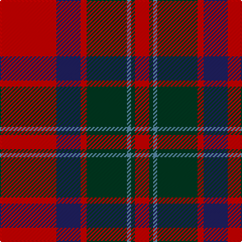

This page is one **sett** — a single exact thread-count. It belongs to the [tartan](/tartans/r28db12r3dg20t2dg2r7/)
(the same proportion at any scale), whose colour order is pattern [RBRGBGR](/stripes/rbrgbgr/).

Sourced from house-of-tartan.  It is a [7 stripe tartan](/stripes/stripes7/).

Original link http://www.house-of-tartan.scotland.net/house/TartanViewjs.asp?colr=Def&tnam=3216

## Thread count
R/56 DB24 R6 DG40 B4 DG4 R/14

## Palette

Palette: <strong>Tartan Register</strong>
<table><thead><tr><th>Colour</th><th>Threads</th><th>Shade</th><th>Base</th><th>OKLCh</th></tr></thead><tbody><tr><td>R/</td><td style="text-align:right;font-variant-numeric:tabular-nums">56</td><td><code style="background-color:#C80000;">#C80000</code> <small style="color:#888">#C80000</small></td><td>R <code style="background-color:#CC0000;">#CC0000</code></td><td><small style="color:#888">oklch(52.3% 0.215 29.2)</small></td></tr><tr><td>DB</td><td style="text-align:right;font-variant-numeric:tabular-nums">24</td><td><code style="background-color:#202060;">#202060</code> <small style="color:#888">#202060</small></td><td>B <code style="background-color:#2A418A;">#2A418A</code></td><td><small style="color:#888">oklch(28.9% 0.111 276.9)</small></td></tr><tr><td>R</td><td style="text-align:right;font-variant-numeric:tabular-nums">6</td><td><code style="background-color:#C80000;">#C80000</code> <small style="color:#888">#C80000</small></td><td>R <code style="background-color:#CC0000;">#CC0000</code></td><td><small style="color:#888">oklch(52.3% 0.215 29.2)</small></td></tr><tr><td>DG</td><td style="text-align:right;font-variant-numeric:tabular-nums">40</td><td><code style="background-color:#003820;">#003820</code> <small style="color:#888">#003820</small></td><td>G <code style="background-color:#006100;">#006100</code></td><td><small style="color:#888">oklch(30.0% 0.070 158.3)</small></td></tr><tr><td>B</td><td style="text-align:right;font-variant-numeric:tabular-nums">4</td><td><code style="background-color:#5C8CA8;">#5C8CA8</code> <small style="color:#888">#5C8CA8</small></td><td>B <code style="background-color:#2A418A;">#2A418A</code></td><td><small style="color:#888">oklch(61.7% 0.067 235.0)</small></td></tr><tr><td>DG</td><td style="text-align:right;font-variant-numeric:tabular-nums">4</td><td><code style="background-color:#003820;">#003820</code> <small style="color:#888">#003820</small></td><td>G <code style="background-color:#006100;">#006100</code></td><td><small style="color:#888">oklch(30.0% 0.070 158.3)</small></td></tr><tr><td>R/</td><td style="text-align:right;font-variant-numeric:tabular-nums">14</td><td><code style="background-color:#C80000;">#C80000</code> <small style="color:#888">#C80000</small></td><td>R <code style="background-color:#CC0000;">#CC0000</code></td><td><small style="color:#888">oklch(52.3% 0.215 29.2)</small></td></tr></tbody></table>

# Sample pattern

## Nearest tartans

The nearest existing variants by ΔTartan distance, with this tartan at the top so the swatches line up against it.

ΔTartan

Tartan

Sett

—

<a href="/ttd/edit/#slug=r28db12r3dg20t2dg2r7~x2">Carrick (Strathmore) District Tartan Tartan Number: 3216. Earliest known date: c.1999 Sales help Princess Diana Memorial Trust See products available Copyright © Blair Urquhart, Comrie, 2015</a> <a class="nn-out" href="/setts/s7/r28db12r3dg20t2dg2r7~x2/" title="open its dictionary page">↗</a>

0.62

<a href="/ttd/edit/#slug=r1db6r1dg6r12w1~x2">Fraser Red Clan Tartan Tartan Number: 1424. Earliest known date: 1842 Early references include Wilson's of Bannockburn, but Wilson did not name the sett. D W Stewart contends that this is in fact an early Grant tartan which he traced to a portrait of Robert Grant of Lurg (1678-1771), hanging at Troup House before it was closed around 1894. It is undoubtedly the most popular Fraser pattern today. See products available Copyright © Blair Urquhart, Comrie, 2015</a> <a class="nn-out" href="/setts/s6/r1db6r1dg6r12w1~x2/" title="open its dictionary page">↗</a>

0.63

<a href="/ttd/edit/#slug=r1db6r1dg6r12lr1~x2">Fraser VS</a> <a class="nn-out" href="/setts/s6/r1db6r1dg6r12lr1~x2/" title="open its dictionary page">↗</a>

0.66

<a href="/ttd/edit/#slug=r4k2r24k6db6dg16r3~x2">MacDuff #4</a> <a class="nn-out" href="/setts/s7/r4k2r24k6db6dg16r3~x2/" title="open its dictionary page">↗</a>

0.72

<a href="/ttd/edit/#slug=r8w2m30g12m3g12m3~x2">Wasko (Personal)</a> <a class="nn-out" href="/setts/s7/r8w2m30g12m3g12m3~x2/" title="open its dictionary page">↗</a>

0.77

<a href="/ttd/edit/#slug=r6dg16r4db12r16t1r2~x2">MacQuarrie #6</a> <a class="nn-out" href="/setts/s7/r6dg16r4db12r16t1r2~x2/" title="open its dictionary page">↗</a>

0.78

<a href="/ttd/edit/#slug=r3db15r3g8r20k2~x2">Finnigan (Estimated threadcount)</a> <a class="nn-out" href="/setts/s6/r3db15r3g8r20k2~x2/" title="open its dictionary page">↗</a>

0.81

<a href="/ttd/edit/#slug=k2r12db6r3dg12r4db1~x2">MacBean/MacElvain</a> <a class="nn-out" href="/setts/s7/k2r12db6r3dg12r4db1~x2/" title="open its dictionary page">↗</a>

0.86

<a href="/ttd/edit/#slug=dg28r7m7dg14m7r48k4~x2">MacNab (Crimson)</a> <a class="nn-out" href="/setts/s7/dg28r7m7dg14m7r48k4~x2/" title="open its dictionary page">↗</a>

0.87

<a href="/ttd/edit/#slug=r12dp2lb1dp2r3dg8r3dp1">Chisholm</a> <a class="nn-out" href="/setts/s8/r12dp2lb1dp2r3dg8r3dp1/" title="open its dictionary page">↗</a>

0.89

<a href="/ttd/edit/#slug=r1db6r1dg6r12lb1">Fraser VS</a> <a class="nn-out" href="/setts/s6/r1db6r1dg6r12lb1/" title="open its dictionary page">↗</a>

## Neighbour map

Every grey dot is one of 14299 variants placed by the first two principal components of the ΔTartan feature space (44% of its variance). Red is this tartan; blue dots are its nearest — click one to open its page.

<svg viewBox="0 0 640 380" role="img" style="max-width:100%;height:auto;border:1px solid #e0e0e0;border-radius:4px;display:block" xmlns="http://www.w3.org/2000/svg"><image href="/nn/cloud.v1.png" width="640" height="380"/><a href="/setts/s6/r1db6r1dg6r12w1~x2/"><circle cx="293.5" cy="188.1" r="4" fill="#3465a4"><title>Fraser Red Clan Tartan Tartan Number: 1424. Earliest known date: 1842 Early references include Wilson's of Bannockburn, but Wilson did not name the sett. D W Stewart contends that this is in fact an early Grant tartan which he traced to a portrait of Robert Grant of Lurg (1678-1771), hanging at Troup House before it was closed around 1894. It is undoubtedly the most popular Fraser pattern today. See products available Copyright © Blair Urquhart, Comrie, 2015</title></circle></a><a href="/setts/s6/r1db6r1dg6r12lr1~x2/"><circle cx="298.9" cy="196.9" r="4" fill="#3465a4"><title>Fraser VS</title></circle></a><a href="/setts/s7/r4k2r24k6db6dg16r3~x2/"><circle cx="279.0" cy="182.9" r="4" fill="#3465a4"><title>MacDuff #4</title></circle></a><a href="/setts/s7/r8w2m30g12m3g12m3~x2/"><circle cx="331.5" cy="186.3" r="4" fill="#3465a4"><title>Wasko (Personal)</title></circle></a><a href="/setts/s7/r6dg16r4db12r16t1r2~x2/"><circle cx="285.2" cy="190.3" r="4" fill="#3465a4"><title>MacQuarrie #6</title></circle></a><a href="/setts/s6/r3db15r3g8r20k2~x2/"><circle cx="286.5" cy="207.5" r="4" fill="#3465a4"><title>Finnigan (Estimated threadcount)</title></circle></a><a href="/setts/s7/k2r12db6r3dg12r4db1~x2/"><circle cx="260.0" cy="198.1" r="4" fill="#3465a4"><title>MacBean/MacElvain</title></circle></a><a href="/setts/s7/dg28r7m7dg14m7r48k4~x2/"><circle cx="298.1" cy="187.8" r="4" fill="#3465a4"><title>MacNab (Crimson)</title></circle></a><a href="/setts/s8/r12dp2lb1dp2r3dg8r3dp1/"><circle cx="330.1" cy="178.1" r="4" fill="#3465a4"><title>Chisholm</title></circle></a><a href="/setts/s6/r1db6r1dg6r12lb1/"><circle cx="281.5" cy="184.5" r="4" fill="#3465a4"><title>Fraser VS</title></circle></a><circle cx="308.9" cy="185.2" r="5" fill="#c00000"/></svg>

ID: /setts/s7/r28db12r3dg20t2dg2r7~x2/
