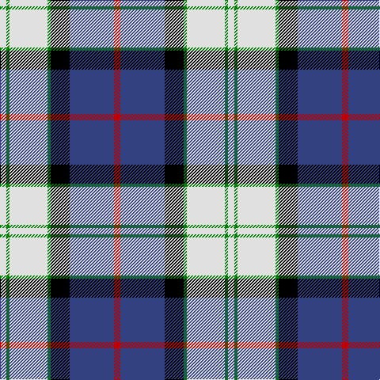

In pattern [RBKGWGW](/patterns/rbkgwgw/).

This was sourced from weddslist.  It is a [7 stripes tartan](/stripes/stripes7/).

Original link http://www.weddslist.com/cgi-bin/tartans/pg.pl?source=sts

## Thread count
LN/8 G4 LN48 G4 K24 B56 R/8

## Palette
Each colour and its ΔE from the base-6 reference it is a variant of.

| Colour | Shade | Base | ΔE (OKLab) |
|---|---|---|---|
| B | <code style="background-color:#304080;">#304080</code> `#304080` | B <code style="background-color:#2A418A;">#2A418A</code> | 0.02 |
| G | <code style="background-color:#008000;">#008000</code> `#008000` | G <code style="background-color:#006100;">#006100</code> | 0.10 |
| K | <code style="background-color:#000000;">#000000</code> `#000000` | K <code style="background-color:#000000;">#000000</code> | 0.00 |
| LN | <code style="background-color:#E0E0E0;">#E0E0E0</code> `#E0E0E0` | W <code style="background-color:#F7F7F7;">#F7F7F7</code> | 0.07 |
| R | <code style="background-color:#C00000;">#C00000</code> `#C00000` | R <code style="background-color:#CC0000;">#CC0000</code> | 0.03 |

# Sample pattern

## Nearest tartans

The nearest existing variants by ΔTartan distance.

1. [Davidson (Wedding) (Personal)](/setts/s7/r2b14k6g1w12g1w2x4~b2c2c80-g006818-k101010-rc80000-wfcfcfc/) — ΔT 0.44
1. [Ferguson Dress #2](/setts/s7/b68k42w32r5w32g4w6~b2c4084-g002814-k101010-r960028-we0e0e0/) — ΔT 0.57
1. [Ferguson, dress](/setts/s7/b68k42w32r5w32g4w6~b304080-g003000-k000000-r900030-we0e0e0/) — ΔT 0.62
1. [Ailsa Craig Trade Tartan Tartan Number: 1673. Earliest known date: 1972 Nothing See products available Copyright © Blair Urquhart, Comrie, 2015](/setts/s8/r5w2b20y2k16w18k2w5x2~b2c2c80-k101010-rc80000-we0e0e0-ye8c000/) — ΔT 0.77
1. [Culloden Dress Ancient](/setts/s8/r6b2ba21w3g19w26g3w5x2~b2c4084-ba5a008c-g002814-rdc0000-we0e0e0/) — ΔT 0.79
1. [Ailsa, Craig](/setts/s8/r5w2b20y2k16w18k2w5x2~b304080-k000000-rc00000-we0e0e0-yf0c000/) — ΔT 0.83
1. [Fraser Gathering Dress (1997)](/setts/s9/g2w24g2b5ga4g11ga2b12r2x2~b1c0070-g006818-ga003820-rc80000-we0e0e0/) — ΔT 0.90
1. [Afternoon Tea / Earl Grey](/setts/s6/r15b98ba72y25ba8w15~b5c8ca8-ba202060-rc80000-wfcfcfc-yfccc00/) — ΔT 0.95
1. [Christian Dress (Personal)](/setts/s7/r3w2b27k19w27ba2y3x2~b2c2c80-ba780078-k101010-rc80000-wf8f8f8-ye8c000/) — ΔT 0.95
1. [Arran, (Navy)](/setts/s8/b12k1b1k1b1ba8w9g2x4~b5480b0-ba000050-g808080-k000000-we0e0e0/) — ΔT 1.00

## Neighbour map

Every grey dot is one of 15726 variants placed by the first two principal components of the ΔTartan feature space (44% of its variance). Red is this tartan; blue dots are its nearest — click one to open its page.

<svg viewBox="0 0 640 380" role="img" style="max-width:100%;height:auto;border:1px solid #e0e0e0;border-radius:4px;display:block" xmlns="http://www.w3.org/2000/svg"><image href="/nn/cloud.v1.png" width="640" height="380"/><a href="/setts/s7/r2b14k6g1w12g1w2x4~b2c2c80-g006818-k101010-rc80000-wfcfcfc/"><circle cx="146.2" cy="141.7" r="4" fill="#3465a4"><title>Davidson (Wedding) (Personal)</title></circle></a><a href="/setts/s7/b68k42w32r5w32g4w6~b2c4084-g002814-k101010-r960028-we0e0e0/"><circle cx="157.0" cy="150.3" r="4" fill="#3465a4"><title>Ferguson Dress #2</title></circle></a><a href="/setts/s7/b68k42w32r5w32g4w6~b304080-g003000-k000000-r900030-we0e0e0/"><circle cx="151.6" cy="149.7" r="4" fill="#3465a4"><title>Ferguson, dress</title></circle></a><a href="/setts/s8/r5w2b20y2k16w18k2w5x2~b2c2c80-k101010-rc80000-we0e0e0-ye8c000/"><circle cx="118.7" cy="156.9" r="4" fill="#3465a4"><title>Ailsa Craig Trade Tartan Tartan Number: 1673. Earliest known date: 1972 Nothing See products available Copyright © Blair Urquhart, Comrie, 2015</title></circle></a><a href="/setts/s8/r6b2ba21w3g19w26g3w5x2~b2c4084-ba5a008c-g002814-rdc0000-we0e0e0/"><circle cx="149.9" cy="144.5" r="4" fill="#3465a4"><title>Culloden Dress Ancient</title></circle></a><a href="/setts/s8/r5w2b20y2k16w18k2w5x2~b304080-k000000-rc00000-we0e0e0-yf0c000/"><circle cx="113.6" cy="156.9" r="4" fill="#3465a4"><title>Ailsa, Craig</title></circle></a><a href="/setts/s9/g2w24g2b5ga4g11ga2b12r2x2~b1c0070-g006818-ga003820-rc80000-we0e0e0/"><circle cx="134.6" cy="137.1" r="4" fill="#3465a4"><title>Fraser Gathering Dress (1997)</title></circle></a><a href="/setts/s6/r15b98ba72y25ba8w15~b5c8ca8-ba202060-rc80000-wfcfcfc-yfccc00/"><circle cx="183.1" cy="169.4" r="4" fill="#3465a4"><title>Afternoon Tea / Earl Grey</title></circle></a><a href="/setts/s7/r3w2b27k19w27ba2y3x2~b2c2c80-ba780078-k101010-rc80000-wf8f8f8-ye8c000/"><circle cx="116.3" cy="126.4" r="4" fill="#3465a4"><title>Christian Dress (Personal)</title></circle></a><a href="/setts/s8/b12k1b1k1b1ba8w9g2x4~b5480b0-ba000050-g808080-k000000-we0e0e0/"><circle cx="150.6" cy="146.5" r="4" fill="#3465a4"><title>Arran, (Navy)</title></circle></a><circle cx="148.3" cy="144.9" r="5" fill="#c00000"/></svg>

ID: /setts/s7/r2b14k6g1w12g1w2x4~b304080-g008000-k000000-rc00000-we0e0e0/
