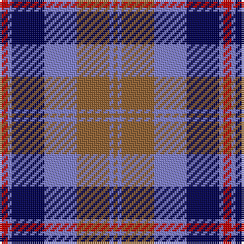

In pattern [RBBBRBR](/stripes/rbbbrbr/).

This was sourced from weddslist.  It is a [7 stripe tartan](/stripes/stripes7/).

Original link http://www.weddslist.com/cgi-bin/tartans/pg.pl?source=sts

## Thread count
R/4 B2 DB16 B16 LT16 B2 LT/2

## Palette
Each colour and the base-6 reference it is a variant of.

| Colour | Shade | Base |
|---|---|---|
| B | <code style="background-color:#8080D0;">#8080D0</code> `oklch(63.4% 0.119 282.5)` <small>#8080D0</small> | B <code style="background-color:#2A418A;">#2A418A</code> |
| DB | <code style="background-color:#000050;">#000050</code> `oklch(19.5% 0.135 264.1)` <small>#000050</small> | B <code style="background-color:#2A418A;">#2A418A</code> |
| LT | <code style="background-color:#906030;">#906030</code> `oklch(53.1% 0.089 63.7)` <small>#906030</small> | R <code style="background-color:#CC0000;">#CC0000</code> |
| R | <code style="background-color:#C00000;">#C00000</code> `oklch(50.7% 0.208 29.2)` <small>#C00000</small> | R <code style="background-color:#CC0000;">#CC0000</code> |

# Sample pattern

## Nearest tartans

The nearest existing variants by ΔTartan distance, with this tartan at the top so the swatches line up against it.

ΔTartan

Tartan

Sett

—

<a href="/ttd/edit/#slug=r2b1db8b8o8b1o1~x2">Over Mountain</a> <a class="nn-out" href="/setts/s7/r2b1db8b8o8b1o1~x2/" title="open its dictionary page">↗</a>

0.64

<a href="/ttd/edit/#slug=r2lb1db8lb8y8lb1y1~x2">Over Mountain</a> <a class="nn-out" href="/setts/s7/r2lb1db8lb8y8lb1y1~x2/" title="open its dictionary page">↗</a>

1.03

<a href="/ttd/edit/#slug=db1o8w1db4r8w1~x6">Little's (Corporate)</a> <a class="nn-out" href="/setts/s6/db1o8w1db4r8w1~x6/" title="open its dictionary page">↗</a>

1.06

<a href="/ttd/edit/#slug=r7k4t28k24t24k4t4~x2">MacCorquodale</a> <a class="nn-out" href="/setts/s7/r7k4t28k24t24k4t4~x2/" title="open its dictionary page">↗</a>

1.09

<a href="/ttd/edit/#slug=db9k7o5r1o5k1o2~x4">Greyhound Grenadiers (Corporate)</a> <a class="nn-out" href="/setts/s7/db9k7o5r1o5k1o2~x4/" title="open its dictionary page">↗</a>

1.11

<a href="/ttd/edit/#slug=lp10dp9o59dp9k59dp9lp5">Central Newcastle School</a> <a class="nn-out" href="/setts/s7/lp10dp9o59dp9k59dp9lp5/" title="open its dictionary page">↗</a>

1.13

<a href="/ttd/edit/#slug=m3db15w13dy6db2dy2m2~x2">Thompson Navy Trade Tartan Tartan Number: 1443. Earliest known date: Oregon Possibly designed by Councillor John Hannay himself. No other information is available. See products available Copyright © Blair Urquhart, Comrie, 2015</a> <a class="nn-out" href="/setts/s7/m3db15w13dy6db2dy2m2~x2/" title="open its dictionary page">↗</a>

1.14

<a href="/ttd/edit/#slug=dp3k1dp8k6dg8k1w2~x2">Baillie (Highland Society)</a> <a class="nn-out" href="/setts/s7/dp3k1dp8k6dg8k1w2~x2/" title="open its dictionary page">↗</a>

1.15

<a href="/ttd/edit/#slug=n32w4n4k24dp29k4">Grammar School at Leeds (School)</a> <a class="nn-out" href="/setts/s6/n32w4n4k24dp29k4/" title="open its dictionary page">↗</a>

1.23

<a href="/ttd/edit/#slug=r15w10db48t32r6~x2">Lands of Liberty (Fashion)</a> <a class="nn-out" href="/setts/s5/r15w10db48t32r6~x2/" title="open its dictionary page">↗</a>

1.24

<a href="/ttd/edit/#slug=r1o5k5db1k1db6ly1~x8">Lopez-Gasparotto</a> <a class="nn-out" href="/setts/s7/r1o5k5db1k1db6ly1~x8/" title="open its dictionary page">↗</a>

## Neighbour map

Every grey dot is one of 14299 variants placed by the first two principal components of the ΔTartan feature space (44% of its variance). Red is this tartan; blue dots are its nearest — click one to open its page.

<svg viewBox="0 0 640 380" role="img" style="max-width:100%;height:auto;border:1px solid #e0e0e0;border-radius:4px;display:block" xmlns="http://www.w3.org/2000/svg"><image href="/nn/cloud.v1.png" width="640" height="380"/><a href="/setts/s7/r2lb1db8lb8y8lb1y1~x2/"><circle cx="158.8" cy="198.2" r="4" fill="#3465a4"><title>Over Mountain</title></circle></a><a href="/setts/s6/db1o8w1db4r8w1~x6/"><circle cx="183.9" cy="208.6" r="4" fill="#3465a4"><title>Little's (Corporate)</title></circle></a><a href="/setts/s7/r7k4t28k24t24k4t4~x2/"><circle cx="150.1" cy="220.7" r="4" fill="#3465a4"><title>MacCorquodale</title></circle></a><a href="/setts/s7/db9k7o5r1o5k1o2~x4/"><circle cx="185.6" cy="220.7" r="4" fill="#3465a4"><title>Greyhound Grenadiers (Corporate)</title></circle></a><a href="/setts/s7/lp10dp9o59dp9k59dp9lp5/"><circle cx="204.5" cy="174.1" r="4" fill="#3465a4"><title>Central Newcastle School</title></circle></a><a href="/setts/s7/m3db15w13dy6db2dy2m2~x2/"><circle cx="159.6" cy="189.1" r="4" fill="#3465a4"><title>Thompson Navy Trade Tartan Tartan Number: 1443. Earliest known date: Oregon Possibly designed by Councillor John Hannay himself. No other information is available. See products available Copyright © Blair Urquhart, Comrie, 2015</title></circle></a><a href="/setts/s7/dp3k1dp8k6dg8k1w2~x2/"><circle cx="177.2" cy="225.7" r="4" fill="#3465a4"><title>Baillie (Highland Society)</title></circle></a><a href="/setts/s6/n32w4n4k24dp29k4/"><circle cx="207.5" cy="228.9" r="4" fill="#3465a4"><title>Grammar School at Leeds (School)</title></circle></a><a href="/setts/s5/r15w10db48t32r6~x2/"><circle cx="186.1" cy="222.9" r="4" fill="#3465a4"><title>Lands of Liberty (Fashion)</title></circle></a><a href="/setts/s7/r1o5k5db1k1db6ly1~x8/"><circle cx="132.1" cy="209.5" r="4" fill="#3465a4"><title>Lopez-Gasparotto</title></circle></a><circle cx="171.2" cy="206.4" r="5" fill="#c00000"/></svg>

ID: /setts/s7/r2b1db8b8o8b1o1~x2/
