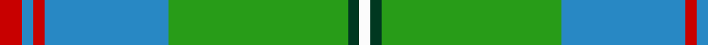

In pattern [RBRBGGW](/patterns/rbrbggw/).

This was sourced from tartans-authority.  It is a [7 stripes tartan](/stripes/stripes7/).

Original link http://www.tartansauthority.com/tartan-ferret/display/10354/

## Thread count
R/4 B2 R2 B22 G32 DG2 W/2

## Palette
Each colour and its ΔE from the base-6 reference it is a variant of.

| Colour | Shade | Base | ΔE (OKLab) |
|---|---|---|---|
| B | <code style="background-color:#2888C4;">#2888C4</code> `#2888C4` | B <code style="background-color:#2A418A;">#2A418A</code> | 0.21 |
| DG | <code style="background-color:#003820;">#003820</code> `#003820` | G <code style="background-color:#006100;">#006100</code> | 0.15 |
| G | <code style="background-color:#289C18;">#289C18</code> `#289C18` | G <code style="background-color:#006100;">#006100</code> | 0.19 |
| R | <code style="background-color:#C80000;">#C80000</code> `#C80000` | R <code style="background-color:#CC0000;">#CC0000</code> | 0.01 |
| W | <code style="background-color:#FCFCFC;">#FCFCFC</code> `#FCFCFC` | W <code style="background-color:#F7F7F7;">#F7F7F7</code> | 0.01 |

# Sample pattern

## Nearest tartans

The nearest existing variants by ΔTartan distance.

1. [Snodgrass (Clan)](/setts/s8/k3r1y1b11g13b5r1y1x4~b2888c4-g289c18-k101010-rc80000-ye8c000/) — ΔT 1.08
1. [New World Irish (Fashion)](/setts/s8/w9g2ga2w3ga18k2g33y2x2~g005834-ga006818-k101010-we0e0e0-yd87c00/) — ΔT 1.14
1. [Exabyte](/setts/s5/r3w35b4g47wa3x2~b304080-g008000-r802040-wc0c0c0-wae0e0e0/) — ΔT 1.22
1. [Boucherville (Tartan de..)](/setts/s9/g20y2ga5w4g2ga2g2ga2b6x2~b4000ff-g30a010-ga808080-we0e0e0-yf0c000/) — ΔT 1.22
1. [Chartered Accountants of Scotland](/setts/s8/y4g3r2g36b30k3b3k3x2~b1870a4-g006818-k101010-rc8002c-ye8c000/) — ΔT 1.25
1. [Boucherville](/setts/s9/g20y2r5w4g2r2g2r2b6x2~b1474b4-g289c18-r888888-wfcfcfc-ye8c000/) — ΔT 1.30
1. [Holmes (Clan?)](/setts/s8/g30k3g3k3g6b32g3b3x2~b1474b4-g289c18-k101010/) — ΔT 1.33
1. [Boucherville (Tartan de..) District Tartan Tartan Number: 2119. Earliest known date: 1990 From the notes accompanying the petition for accreditation. "Les symboles ont cette remarquable propriete de reunir en une expression imagee des notions diverses. Ils refletent l'histoire, les croyances, les idealogies et les aspirations de groupes humains habitant un territoire precis. Les tisserands, c'est nous tous....!" See products available Copyright © Blair Urquhart, Comrie, 2015](/setts/s9/g20y2r5w4g2r2g2r2b6x2~b2c2c80-g006818-r888888-we0e0e0-ye8c000/) — ΔT 1.33
1. [Michigan, State of](/setts/s10/g18w1g4w1y4ga1y2ga12r2ga4x2~g408060-ga2f4f2f-r8c1717-wffffff-ydeb887/) — ΔT 1.38
1. [Fox Hunting](/setts/s8/r4k2g36k2b18y3b18k2x2~b1474b4-g006818-k101010-rc80000-ye8c000/) — ΔT 1.39

## Neighbour map

Every grey dot is one of 15726 variants placed by the first two principal components of the ΔTartan feature space (44% of its variance). Red is this tartan; blue dots are its nearest — click one to open its page.

<svg viewBox="0 0 640 380" role="img" style="max-width:100%;height:auto;border:1px solid #e0e0e0;border-radius:4px;display:block" xmlns="http://www.w3.org/2000/svg"><image href="/nn/cloud.v1.png" width="640" height="380"/><a href="/setts/s8/k3r1y1b11g13b5r1y1x4~b2888c4-g289c18-k101010-rc80000-ye8c000/"><circle cx="223.2" cy="160.5" r="4" fill="#3465a4"><title>Snodgrass (Clan)</title></circle></a><a href="/setts/s8/w9g2ga2w3ga18k2g33y2x2~g005834-ga006818-k101010-we0e0e0-yd87c00/"><circle cx="267.4" cy="146.8" r="4" fill="#3465a4"><title>New World Irish (Fashion)</title></circle></a><a href="/setts/s5/r3w35b4g47wa3x2~b304080-g008000-r802040-wc0c0c0-wae0e0e0/"><circle cx="288.6" cy="172.0" r="4" fill="#3465a4"><title>Exabyte</title></circle></a><a href="/setts/s9/g20y2ga5w4g2ga2g2ga2b6x2~b4000ff-g30a010-ga808080-we0e0e0-yf0c000/"><circle cx="244.4" cy="155.5" r="4" fill="#3465a4"><title>Boucherville (Tartan de..)</title></circle></a><a href="/setts/s8/y4g3r2g36b30k3b3k3x2~b1870a4-g006818-k101010-rc8002c-ye8c000/"><circle cx="301.2" cy="153.3" r="4" fill="#3465a4"><title>Chartered Accountants of Scotland</title></circle></a><a href="/setts/s9/g20y2r5w4g2r2g2r2b6x2~b1474b4-g289c18-r888888-wfcfcfc-ye8c000/"><circle cx="269.6" cy="165.9" r="4" fill="#3465a4"><title>Boucherville</title></circle></a><a href="/setts/s8/g30k3g3k3g6b32g3b3x2~b1474b4-g289c18-k101010/"><circle cx="290.5" cy="189.3" r="4" fill="#3465a4"><title>Holmes (Clan?)</title></circle></a><a href="/setts/s9/g20y2r5w4g2r2g2r2b6x2~b2c2c80-g006818-r888888-we0e0e0-ye8c000/"><circle cx="255.7" cy="161.6" r="4" fill="#3465a4"><title>Boucherville (Tartan de..) District Tartan Tartan Number: 2119. Earliest known date: 1990 From the notes accompanying the petition for accreditation. &quot;Les symboles ont cette remarquable propriete de reunir en une expression imagee des notions diverses. Ils refletent l'histoire, les croyances, les idealogies et les aspirations de groupes humains habitant un territoire precis. Les tisserands, c'est nous tous....!&quot; See products available Copyright © Blair Urquhart, Comrie, 2015</title></circle></a><a href="/setts/s10/g18w1g4w1y4ga1y2ga12r2ga4x2~g408060-ga2f4f2f-r8c1717-wffffff-ydeb887/"><circle cx="266.3" cy="142.9" r="4" fill="#3465a4"><title>Michigan, State of</title></circle></a><a href="/setts/s8/r4k2g36k2b18y3b18k2x2~b1474b4-g006818-k101010-rc80000-ye8c000/"><circle cx="268.0" cy="157.9" r="4" fill="#3465a4"><title>Fox Hunting</title></circle></a><circle cx="286.8" cy="153.1" r="5" fill="#c00000"/></svg>

ID: /setts/s7/r2b1r1b11g16ga1w1x2~b2888c4-g289c18-ga003820-rc80000-wfcfcfc/
