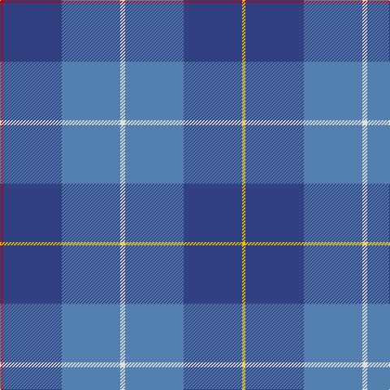

In pattern [RBBWBBY](/patterns/rbbwbby/).

This was sourced from weddslist.  It is a [7 stripes tartan](/stripes/stripes7/).

Original link http://www.weddslist.com/cgi-bin/tartans/pg.pl?source=sts

## Thread count
R/4 B72 Ba72 LN6 Ba72 B72 Y/4

## Palette
Each colour and its ΔE from the base-6 reference it is a variant of.

| Colour | Shade | Base | ΔE (OKLab) |
|---|---|---|---|
| B | <code style="background-color:#304080;">#304080</code> `#304080` | B <code style="background-color:#2A418A;">#2A418A</code> | 0.02 |
| Ba | <code style="background-color:#5480B0;">#5480B0</code> `#5480B0` | B <code style="background-color:#2A418A;">#2A418A</code> | 0.19 |
| LN | <code style="background-color:#E0E0E0;">#E0E0E0</code> `#E0E0E0` | W <code style="background-color:#F7F7F7;">#F7F7F7</code> | 0.07 |
| R | <code style="background-color:#C00000;">#C00000</code> `#C00000` | R <code style="background-color:#CC0000;">#CC0000</code> | 0.03 |
| Y | <code style="background-color:#F0C000;">#F0C000</code> `#F0C000` | Y <code style="background-color:#F2BF00;">#F2BF00</code> | 0.00 |

# Sample pattern

## Nearest tartans

The nearest existing variants by ΔTartan distance.

1. [Mercer, Charles](/setts/s8/b9ba2b2y1ba7b2r1ba4~b2c2c80-ba1474b4-rc80000-ye8c000~x4/) — ΔT 1.64
1. [MacKerrell](/setts/s12/b34ba60y3ba60b34w4b34ba60r3ba60b34w4~b5480b0-ba304080-rc00000-we0e0e0-yf0c000~x2/) — ΔT 1.65
1. [Leonard (Name)](/setts/s8/b36ba6b5r3k2r3b5ba18~b1870a4-ba2c2c80-k101010-rc80000~x2/) — ΔT 1.70
1. [Bermuda, Plaid](/setts/s7/b33r8ba12g12b8ba2b8~b5480b0-ba304080-g008000-rc00000~x2/) — ΔT 1.70
1. [Port Authority of NY & NJ](/setts/s6/b9ba2b39bb33y2bb5~b5c8ca8-ba1c0070-bb003c64-ybc8c00~x2/) — ΔT 1.75
1. [Clydebank (Fashion)](/setts/s12/g2b3g1b15ba3b9ba9b2ba16r1ba3r2~b145c88-ba6c28b8-g289c18-rc80000~x2/) — ΔT 1.87
1. [Reflections of the Sea](/setts/s12/b3ba6g12b14g2ba17b3g1b3ba17g2y3~b1474b4-ba3850c8-g285800-y0cdcb4~x2/) — ΔT 1.91
1. [Thorburn (Lochcarron)](/setts/s6/b3ba14b3r16b34ra3~b003c64-ba5c8ca8-r888888-rac80000~x2/) — ΔT 1.94
1. [Riley's Theme](/setts/s6/b20ba4g5bb14y1b2~b667aa3-ba292929-bb683c66-g6f8070-yccc7ad~x2/) — ΔT 1.95
1. [Ewell Castle School](/setts/s6/b4w1b18ba18r1ba4~b1474b4-ba202060-rc80000-wfcfcfc~x4/) — ΔT 1.96

## Neighbour map

Every grey dot is one of 15726 variants placed by the first two principal components of the ΔTartan feature space (44% of its variance). Red is this tartan; blue dots are its nearest — click one to open its page.

<svg viewBox="0 0 640 380" role="img" style="max-width:100%;height:auto;border:1px solid #e0e0e0;border-radius:4px;display:block" xmlns="http://www.w3.org/2000/svg"><image href="/nn/cloud.v1.png" width="640" height="380"/><a href="/setts/s8/b9ba2b2y1ba7b2r1ba4~b2c2c80-ba1474b4-rc80000-ye8c000~x4/"><circle cx="302.9" cy="231.5" r="4" fill="#3465a4"><title>Mercer, Charles</title></circle></a><a href="/setts/s12/b34ba60y3ba60b34w4b34ba60r3ba60b34w4~b5480b0-ba304080-rc00000-we0e0e0-yf0c000~x2/"><circle cx="398.6" cy="190.3" r="4" fill="#3465a4"><title>MacKerrell</title></circle></a><a href="/setts/s8/b36ba6b5r3k2r3b5ba18~b1870a4-ba2c2c80-k101010-rc80000~x2/"><circle cx="415.4" cy="190.4" r="4" fill="#3465a4"><title>Leonard (Name)</title></circle></a><a href="/setts/s7/b33r8ba12g12b8ba2b8~b5480b0-ba304080-g008000-rc00000~x2/"><circle cx="362.6" cy="214.9" r="4" fill="#3465a4"><title>Bermuda, Plaid</title></circle></a><a href="/setts/s6/b9ba2b39bb33y2bb5~b5c8ca8-ba1c0070-bb003c64-ybc8c00~x2/"><circle cx="379.0" cy="198.4" r="4" fill="#3465a4"><title>Port Authority of NY &amp; NJ</title></circle></a><a href="/setts/s12/g2b3g1b15ba3b9ba9b2ba16r1ba3r2~b145c88-ba6c28b8-g289c18-rc80000~x2/"><circle cx="353.0" cy="187.4" r="4" fill="#3465a4"><title>Clydebank (Fashion)</title></circle></a><a href="/setts/s12/b3ba6g12b14g2ba17b3g1b3ba17g2y3~b1474b4-ba3850c8-g285800-y0cdcb4~x2/"><circle cx="309.8" cy="191.3" r="4" fill="#3465a4"><title>Reflections of the Sea</title></circle></a><a href="/setts/s6/b3ba14b3r16b34ra3~b003c64-ba5c8ca8-r888888-rac80000~x2/"><circle cx="330.6" cy="220.5" r="4" fill="#3465a4"><title>Thorburn (Lochcarron)</title></circle></a><a href="/setts/s6/b20ba4g5bb14y1b2~b667aa3-ba292929-bb683c66-g6f8070-yccc7ad~x2/"><circle cx="344.0" cy="197.0" r="4" fill="#3465a4"><title>Riley's Theme</title></circle></a><a href="/setts/s6/b4w1b18ba18r1ba4~b1474b4-ba202060-rc80000-wfcfcfc~x4/"><circle cx="342.5" cy="200.9" r="4" fill="#3465a4"><title>Ewell Castle School</title></circle></a><circle cx="343.6" cy="205.3" r="5" fill="#c00000"/></svg>

ID: /setts/s7/r2b36ba36w3ba36b36y2~b304080-ba5480b0-rc00000-we0e0e0-yf0c000~x2/
