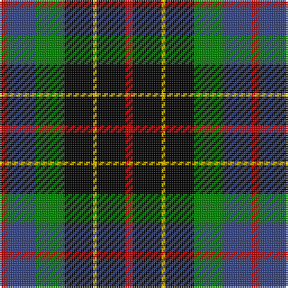

In pattern [RBGKYKR](/patterns/rbgkykr/).

This was sourced from weddslist.  It is a [7 stripes tartan](/stripes/stripes7/).

Original link http://www.weddslist.com/cgi-bin/tartans/pg.pl?source=sts

## Thread count
R/4 B16 G16 K16 Y2 K16 R/4

## Palette
Each colour and its ΔE from the base-6 reference it is a variant of.

| Colour | Shade | Base | ΔE (OKLab) |
|---|---|---|---|
| B | <code style="background-color:#304080;">#304080</code> `#304080` | B <code style="background-color:#2A418A;">#2A418A</code> | 0.02 |
| G | <code style="background-color:#008000;">#008000</code> `#008000` | G <code style="background-color:#006100;">#006100</code> | 0.10 |
| K | <code style="background-color:#000000;">#000000</code> `#000000` | K <code style="background-color:#000000;">#000000</code> | 0.00 |
| R | <code style="background-color:#C00000;">#C00000</code> `#C00000` | R <code style="background-color:#CC0000;">#CC0000</code> | 0.03 |
| Y | <code style="background-color:#F0C000;">#F0C000</code> `#F0C000` | Y <code style="background-color:#F2BF00;">#F2BF00</code> | 0.00 |

# Sample pattern

## Nearest tartans

The nearest existing variants by ΔTartan distance.

1. [BlackRock (Asymmetrical)](/setts/s7/w8r4k8ka20kb6ka3kb5~k101010-ka001e00-kb000028-rdc0000-we0e0e0~x2/) — ΔT 0.69
1. [Brodie Hunting](/setts/s7/r2b8g8k8y1g8r2~b00004c-g004c00-k000000-rc80000-yffc800/) — ΔT 0.69
1. [Vosko](/setts/s9/b25k12y4k9r6k9y4k12g25~b304080-g008000-k000000-rc00000-yf0c000~x2/) — ΔT 0.84
1. [MacCallum, of Berwick](/setts/s9/b10r7b31k25g23k8b7k8y5~b304080-g008000-k000000-rc00000-yf0c000~x2/) — ΔT 1.01
1. [Wilson's, No 233](/setts/s7/k6g6w1g6k6b6ga1~b800080-g008000-ga30a010-k000000-we0e0e0~x4/) — ΔT 1.01
1. [Wilson's, No 120](/setts/s7/k12g12w2g12k12b12r3~b800080-g008000-k000000-rc00000-we0e0e0~x2/) — ΔT 1.05
1. [Hislop hunting](/setts/s8/r2k8y1k8g8b8k2w2~b000050-g008000-k000000-rc00000-we0e0e0-yf0c000~x2/) — ΔT 1.05
1. [Wilson's, No 108](/setts/s8/k7g7k1g7k7b1ba7k1~b5480b0-ba800080-g008000-k000000~x4/) — ΔT 1.08
1. [Dahlonega (District)](/setts/s6/r5g18y2k14b5k4~b2888c4-g006818-k000000-rc80000-ye8c000~x2/) — ΔT 1.09
1. [Dyce](/setts/s6/k2y1g6k6b6w1~b304080-g008000-k000000-we0e0e0-yf0c000~x4/) — ΔT 1.10

## Neighbour map

Every grey dot is one of 15726 variants placed by the first two principal components of the ΔTartan feature space (44% of its variance). Red is this tartan; blue dots are its nearest — click one to open its page.

<svg viewBox="0 0 640 380" role="img" style="max-width:100%;height:auto;border:1px solid #e0e0e0;border-radius:4px;display:block" xmlns="http://www.w3.org/2000/svg"><image href="/nn/cloud.v1.png" width="640" height="380"/><a href="/setts/s7/w8r4k8ka20kb6ka3kb5~k101010-ka001e00-kb000028-rdc0000-we0e0e0~x2/"><circle cx="128.8" cy="209.8" r="4" fill="#3465a4"><title>BlackRock (Asymmetrical)</title></circle></a><a href="/setts/s7/r2b8g8k8y1g8r2~b00004c-g004c00-k000000-rc80000-yffc800/"><circle cx="150.7" cy="222.8" r="4" fill="#3465a4"><title>Brodie Hunting</title></circle></a><a href="/setts/s9/b25k12y4k9r6k9y4k12g25~b304080-g008000-k000000-rc00000-yf0c000~x2/"><circle cx="101.9" cy="204.2" r="4" fill="#3465a4"><title>Vosko</title></circle></a><a href="/setts/s9/b10r7b31k25g23k8b7k8y5~b304080-g008000-k000000-rc00000-yf0c000~x2/"><circle cx="116.4" cy="206.0" r="4" fill="#3465a4"><title>MacCallum, of Berwick</title></circle></a><a href="/setts/s7/k6g6w1g6k6b6ga1~b800080-g008000-ga30a010-k000000-we0e0e0~x4/"><circle cx="96.0" cy="234.6" r="4" fill="#3465a4"><title>Wilson's, No 233</title></circle></a><a href="/setts/s7/k12g12w2g12k12b12r3~b800080-g008000-k000000-rc00000-we0e0e0~x2/"><circle cx="89.4" cy="236.9" r="4" fill="#3465a4"><title>Wilson's, No 120</title></circle></a><a href="/setts/s8/r2k8y1k8g8b8k2w2~b000050-g008000-k000000-rc00000-we0e0e0-yf0c000~x2/"><circle cx="128.0" cy="190.3" r="4" fill="#3465a4"><title>Hislop hunting</title></circle></a><a href="/setts/s8/k7g7k1g7k7b1ba7k1~b5480b0-ba800080-g008000-k000000~x4/"><circle cx="160.3" cy="230.2" r="4" fill="#3465a4"><title>Wilson's, No 108</title></circle></a><a href="/setts/s6/r5g18y2k14b5k4~b2888c4-g006818-k000000-rc80000-ye8c000~x2/"><circle cx="136.9" cy="201.7" r="4" fill="#3465a4"><title>Dahlonega (District)</title></circle></a><a href="/setts/s6/k2y1g6k6b6w1~b304080-g008000-k000000-we0e0e0-yf0c000~x4/"><circle cx="96.8" cy="223.8" r="4" fill="#3465a4"><title>Dyce</title></circle></a><circle cx="135.0" cy="214.6" r="5" fill="#c00000"/></svg>

ID: /setts/s7/r2b8g8k8y1k8r2~b304080-g008000-k000000-rc00000-yf0c000~x2/
