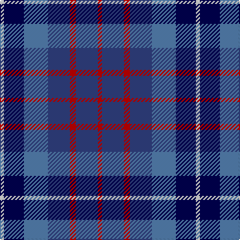

This page is one **sett** — a single exact thread-count. It belongs to the [tartan](/tartans/r2b11r3b11ba12db10ln2/)
(the same proportion at any scale), whose colour order is pattern [RBRBBBW](/stripes/rbrbbbw/).

Sourced from weddslist.  It is a [7 stripe tartan](/stripes/stripes7/).

Original link http://www.weddslist.com/cgi-bin/tartans/pg.pl?source=sts

2 attestations — the source records this cloth was collapsed from (oldest owns this page)

<ul>
<li>undated — Blue (weddslist, <a href="http://www.weddslist.com/cgi-bin/tartans/pg.pl?source=sts">record</a>)</li>
<li>undated — Blue Family Tartan Tartan Number: 1420. Earliest known date: 1985 Blue is a Sept name of MacMillan. See products available Copyright © Blair Urquhart, Comrie, 2015 (house-of-tartan, <a href="http://www.house-of-tartan.scotland.net/house/TartanViewjs.asp?colr=Def&tnam=1420">record</a>)</li>
</ul>

## Thread count
R/4 B22 R6 B22 Ba24 DB20 LN/4

## Palette
Each colour and the base-6 reference it is a variant of.

| Colour | Shade | Base |
|---|---|---|
| B | <code style="background-color:#304080;">#304080</code> `oklch(39.4% 0.109 270.2)` <small>#304080</small> | B <code style="background-color:#2A418A;">#2A418A</code> |
| Ba | <code style="background-color:#5480B0;">#5480B0</code> `oklch(58.8% 0.089 251.5)` <small>#5480B0</small> | B <code style="background-color:#2A418A;">#2A418A</code> |
| DB | <code style="background-color:#000050;">#000050</code> `oklch(19.5% 0.135 264.1)` <small>#000050</small> | B <code style="background-color:#2A418A;">#2A418A</code> |
| LN | <code style="background-color:#E0E0E0;">#E0E0E0</code> `oklch(90.7% 0.000 89.9)` <small>#E0E0E0</small> | W <code style="background-color:#F7F7F7;">#F7F7F7</code> |
| R | <code style="background-color:#C00000;">#C00000</code> `oklch(50.7% 0.208 29.2)` <small>#C00000</small> | R <code style="background-color:#CC0000;">#CC0000</code> |

# Sample pattern

## Nearest tartans

The nearest existing variants by ΔTartan distance, with this tartan at the top so the swatches line up against it.

ΔTartan

Tartan

Sett

—

<a href="/ttd/edit/#slug=r2db11r3db11t12db10w2~x2">Blue</a> <a class="nn-out" href="/setts/s7/r2db11r3db11t12db10w2~x2/" title="open its dictionary page">↗</a>

0.94

<a href="/ttd/edit/#slug=n14r4n14t15db13w3~x2">Blue</a> <a class="nn-out" href="/setts/s6/n14r4n14t15db13w3~x2/" title="open its dictionary page">↗</a>

1.20

<a href="/ttd/edit/#slug=r9dt6db13dt21y18w4~x2">Fox-Eves Wedding</a> <a class="nn-out" href="/setts/s6/r9dt6db13dt21y18w4~x2/" title="open its dictionary page">↗</a>

1.23

<a href="/ttd/edit/#slug=db11dg10y6db7lt2db3dp10lt2~x2">Hummelt, Katherine (Personal)</a> <a class="nn-out" href="/setts/s8/db11dg10y6db7lt2db3dp10lt2~x2/" title="open its dictionary page">↗</a>

1.35

<a href="/ttd/edit/#slug=dp4r1b5dp4k6lb1~x4">Benreay Medical Centre (Corporate)</a> <a class="nn-out" href="/setts/s6/dp4r1b5dp4k6lb1~x4/" title="open its dictionary page">↗</a>

1.41

<a href="/ttd/edit/#slug=t16db3t3o3t3db10r12w4~x2">Greer (Name?)</a> <a class="nn-out" href="/setts/s8/t16db3t3o3t3db10r12w4~x2/" title="open its dictionary page">↗</a>

1.41

<a href="/ttd/edit/#slug=m5g20k13db42k13g20ly5~x2">Newmill</a> <a class="nn-out" href="/setts/s7/m5g20k13db42k13g20ly5~x2/" title="open its dictionary page">↗</a>

1.42

<a href="/ttd/edit/#slug=r5o20dt13db42dt13o20lo5">Newmill Corporate Tartan Tartan Number: 2053. Earliest known date: March 1992 Designed to be used in the refurbishing of Johnstons of Elgin new mill shop and based on the colours of the mill shop house style. The lighter square is represented here as green from the 'Antique' colour range, a speciality of Johnstons of Elgin. See products available Copyright © Blair Urquhart, Comrie, 2015</a> <a class="nn-out" href="/setts/s7/r5o20dt13db42dt13o20lo5/" title="open its dictionary page">↗</a>

1.43

<a href="/ttd/edit/#slug=r2db12k5t16w2~x4">RSCDS Australia? (Corporate)</a> <a class="nn-out" href="/setts/s5/r2db12k5t16w2~x4/" title="open its dictionary page">↗</a>

1.44

<a href="/ttd/edit/#slug=ly5db24k8db18ly6dy3">Cala Homes (Corporate)</a> <a class="nn-out" href="/setts/s6/ly5db24k8db18ly6dy3/" title="open its dictionary page">↗</a>

1.44

<a href="/ttd/edit/#slug=db3k13db13db13w2db13w3~x2">Brodie Countryfare (Corporate)</a> <a class="nn-out" href="/setts/s7/db3k13db13db13w2db13w3~x2/" title="open its dictionary page">↗</a>

## Neighbour map

Every grey dot is one of 14299 variants placed by the first two principal components of the ΔTartan feature space (44% of its variance). Red is this tartan; blue dots are its nearest — click one to open its page.

<svg viewBox="0 0 640 380" role="img" style="max-width:100%;height:auto;border:1px solid #e0e0e0;border-radius:4px;display:block" xmlns="http://www.w3.org/2000/svg"><image href="/nn/cloud.v1.png" width="640" height="380"/><a href="/setts/s6/n14r4n14t15db13w3~x2/"><circle cx="148.1" cy="261.9" r="4" fill="#3465a4"><title>Blue</title></circle></a><a href="/setts/s6/r9dt6db13dt21y18w4~x2/"><circle cx="123.0" cy="254.4" r="4" fill="#3465a4"><title>Fox-Eves Wedding</title></circle></a><a href="/setts/s8/db11dg10y6db7lt2db3dp10lt2~x2/"><circle cx="108.6" cy="230.6" r="4" fill="#3465a4"><title>Hummelt, Katherine (Personal)</title></circle></a><a href="/setts/s6/dp4r1b5dp4k6lb1~x4/"><circle cx="142.6" cy="240.9" r="4" fill="#3465a4"><title>Benreay Medical Centre (Corporate)</title></circle></a><a href="/setts/s8/t16db3t3o3t3db10r12w4~x2/"><circle cx="124.6" cy="203.5" r="4" fill="#3465a4"><title>Greer (Name?)</title></circle></a><a href="/setts/s7/m5g20k13db42k13g20ly5~x2/"><circle cx="163.1" cy="220.7" r="4" fill="#3465a4"><title>Newmill</title></circle></a><a href="/setts/s7/r5o20dt13db42dt13o20lo5/"><circle cx="177.2" cy="218.3" r="4" fill="#3465a4"><title>Newmill Corporate Tartan Tartan Number: 2053. Earliest known date: March 1992 Designed to be used in the refurbishing of Johnstons of Elgin new mill shop and based on the colours of the mill shop house style. The lighter square is represented here as green from the 'Antique' colour range, a speciality of Johnstons of Elgin. See products available Copyright © Blair Urquhart, Comrie, 2015</title></circle></a><a href="/setts/s5/r2db12k5t16w2~x4/"><circle cx="182.3" cy="214.5" r="4" fill="#3465a4"><title>RSCDS Australia? (Corporate)</title></circle></a><a href="/setts/s6/ly5db24k8db18ly6dy3/"><circle cx="142.8" cy="211.7" r="4" fill="#3465a4"><title>Cala Homes (Corporate)</title></circle></a><a href="/setts/s7/db3k13db13db13w2db13w3~x2/"><circle cx="195.1" cy="259.1" r="4" fill="#3465a4"><title>Brodie Countryfare (Corporate)</title></circle></a><circle cx="163.1" cy="237.8" r="5" fill="#c00000"/></svg>

ID: /setts/s7/r2db11r3db11t12db10w2~x2/
