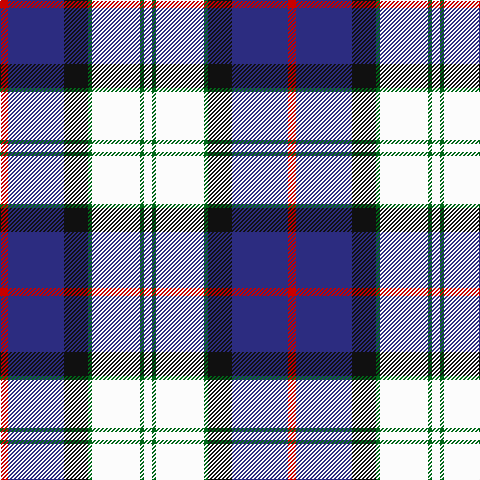

This page is one **sett** — a single exact thread-count. It belongs to the [tartan](/tartans/r2db14k6g1w12g1w2/)
(the same proportion at any scale), whose colour order is pattern [RBKGWGW](/stripes/rbkgwgw/).

Sourced from register-of-tartans.  It is a [7 stripe tartan](/stripes/stripes7/).

Original link https://www.tartanregister.gov.uk/tartanDetails.aspx?ref=892

## Also known as

This cloth is also recorded under:

- Davidson, Bride's

3 attestations — the source records this cloth was collapsed from (oldest owns this page)

<ul>
<li>01/01/1998 — Davidson (Wedding) (Personal) (register-of-tartans, <a href="https://www.tartanregister.gov.uk/tartanDetails.aspx?ref=892">record</a>)</li>
<li>April 1998 — Davidson - 1998 (Wedding) (Personal) (tartans-authority, <a href="http://www.tartansauthority.com/tartan-ferret/display/2576/">record</a>)</li>
<li>undated — Davidson, Bride's (weddslist, <a href="http://www.weddslist.com/cgi-bin/tartans/pg.pl?source=sts">record</a>)</li>
</ul>

## Register references

External register numbers recorded for this tartan.

- Scottish Register of Tartans: [892](https://www.tartanregister.gov.uk/tartanDetails.aspx?ref=892)
- Scottish Tartans Authority (ITI): 2576
- Scottish Tartans World Register: 2576

## Thread count
R/8 DB56 K24 G4 W48 G4 W/8

## Palette

Palette: <strong>Tartan Register</strong>
<table><thead><tr><th>Colour</th><th>Threads</th><th>Shade</th><th>Base</th><th>OKLCh</th></tr></thead><tbody><tr><td>R/</td><td style="text-align:right;font-variant-numeric:tabular-nums">8</td><td><code style="background-color:#C80000;">#C80000</code> <small style="color:#888">#C80000</small></td><td>R <code style="background-color:#CC0000;">#CC0000</code></td><td><small style="color:#888">oklch(52.3% 0.215 29.2)</small></td></tr><tr><td>DB</td><td style="text-align:right;font-variant-numeric:tabular-nums">56</td><td><code style="background-color:#2C2C80;">#2C2C80</code> <small style="color:#888">#2C2C80</small></td><td>B <code style="background-color:#2A418A;">#2A418A</code></td><td><small style="color:#888">oklch(35.0% 0.138 276.6)</small></td></tr><tr><td>K</td><td style="text-align:right;font-variant-numeric:tabular-nums">24</td><td><code style="background-color:#101010;">#101010</code> <small style="color:#888">#101010</small></td><td>K <code style="background-color:#000000;">#000000</code></td><td><small style="color:#888">oklch(17.3% 0.000 89.9)</small></td></tr><tr><td>G</td><td style="text-align:right;font-variant-numeric:tabular-nums">4</td><td><code style="background-color:#006818;">#006818</code> <small style="color:#888">#006818</small></td><td>G <code style="background-color:#006100;">#006100</code></td><td><small style="color:#888">oklch(45.0% 0.142 145.0)</small></td></tr><tr><td>W</td><td style="text-align:right;font-variant-numeric:tabular-nums">48</td><td><code style="background-color:#FCFCFC;">#FCFCFC</code> <small style="color:#888">#FCFCFC</small></td><td>W <code style="background-color:#F7F7F7;">#F7F7F7</code></td><td><small style="color:#888">oklch(99.1% 0.000 89.9)</small></td></tr><tr><td>G</td><td style="text-align:right;font-variant-numeric:tabular-nums">4</td><td><code style="background-color:#006818;">#006818</code> <small style="color:#888">#006818</small></td><td>G <code style="background-color:#006100;">#006100</code></td><td><small style="color:#888">oklch(45.0% 0.142 145.0)</small></td></tr><tr><td>W/</td><td style="text-align:right;font-variant-numeric:tabular-nums">8</td><td><code style="background-color:#FCFCFC;">#FCFCFC</code> <small style="color:#888">#FCFCFC</small></td><td>W <code style="background-color:#F7F7F7;">#F7F7F7</code></td><td><small style="color:#888">oklch(99.1% 0.000 89.9)</small></td></tr></tbody></table>

# Sample pattern

## Nearest tartans

The nearest existing variants by ΔTartan distance, with this tartan at the top so the swatches line up against it.

ΔTartan

Tartan

Sett

—

<a href="/ttd/edit/#slug=r2db14k6g1w12g1w2~x4">Davidson (Wedding) (Personal)</a> <a class="nn-out" href="/setts/s7/r2db14k6g1w12g1w2~x4/" title="open its dictionary page">↗</a>

0.65

<a href="/ttd/edit/#slug=db68k42w32r5w32dg4w6">Ferguson Dress #2</a> <a class="nn-out" href="/setts/s7/db68k42w32r5w32dg4w6/" title="open its dictionary page">↗</a>

0.70

<a href="/ttd/edit/#slug=r6db2dp21w3dg19w26dg3w5~x2">Culloden Dress Ancient</a> <a class="nn-out" href="/setts/s8/r6db2dp21w3dg19w26dg3w5~x2/" title="open its dictionary page">↗</a>

0.90

<a href="/ttd/edit/#slug=r3w2db27k19w27dp2ly3~x2">Christian Dress (Personal)</a> <a class="nn-out" href="/setts/s7/r3w2db27k19w27dp2ly3~x2/" title="open its dictionary page">↗</a>

0.90

<a href="/ttd/edit/#slug=t12k1t1k1t1db8w9o2~x4">Arran - 1989 (Fashion)</a> <a class="nn-out" href="/setts/s8/t12k1t1k1t1db8w9o2~x4/" title="open its dictionary page">↗</a>

0.93

<a href="/ttd/edit/#slug=t34db24w18r3w18g2w3~x2">Ferguson, dress</a> <a class="nn-out" href="/setts/s7/t34db24w18r3w18g2w3~x2/" title="open its dictionary page">↗</a>

0.94

<a href="/ttd/edit/#slug=g4w28dp8ly2db17g4~x2">Manx Dress</a> <a class="nn-out" href="/setts/s6/g4w28dp8ly2db17g4~x2/" title="open its dictionary page">↗</a>

0.95

<a href="/ttd/edit/#slug=db8r3db34b3k9w31r5w3r3w8~x2">Stewart of Appin, dress</a> <a class="nn-out" href="/setts/s10/db8r3db34b3k9w31r5w3r3w8~x2/" title="open its dictionary page">↗</a>

0.99

<a href="/ttd/edit/#slug=db8r3db36t3k10w34r4w3r3w8~x2">Stewart of Appin Htg Dress</a> <a class="nn-out" href="/setts/s10/db8r3db36t3k10w34r4w3r3w8~x2/" title="open its dictionary page">↗</a>

0.99

<a href="/ttd/edit/#slug=db8r3db34t3k9w31r5w3r3w8~x2">Stewart of Appin Dress Clan Tartan Tartan Number: 481. Earliest known date: pre 2003 The Stewarts of Appin fueded relentlessly with the Campbells, and they were supported in these pursuits and other military activities by some of the Clan MacColl, whose tartan is very similar. The Stewarts of Ardshiel, a branch of the Appin Clan, have a certified tartan of their own dating back to the 1820's, which has elements of the Appin design. Stewarts of Appin are descended from Dugald, the son of Sir John Stewart of Lorne who was murdered in 1463. Dugald established the Appin branch of the family by dividing his lands between his five sons. The tartan is worn by the Stonehaven pipe bands. See products available Copyright © Blair Urquhart, Comrie, 2015</a> <a class="nn-out" href="/setts/s10/db8r3db34t3k9w31r5w3r3w8~x2/" title="open its dictionary page">↗</a>

1.01

<a href="/ttd/edit/#slug=r15t98db72ly25db8w15">Afternoon Tea / Earl Grey</a> <a class="nn-out" href="/setts/s6/r15t98db72ly25db8w15/" title="open its dictionary page">↗</a>

## Neighbour map

Every grey dot is one of 14299 variants placed by the first two principal components of the ΔTartan feature space (44% of its variance). Red is this tartan; blue dots are its nearest — click one to open its page.

<svg viewBox="0 0 640 380" role="img" style="max-width:100%;height:auto;border:1px solid #e0e0e0;border-radius:4px;display:block" xmlns="http://www.w3.org/2000/svg"><image href="/nn/cloud.v1.png" width="640" height="380"/><a href="/setts/s7/db68k42w32r5w32dg4w6/"><circle cx="160.2" cy="148.1" r="4" fill="#3465a4"><title>Ferguson Dress #2</title></circle></a><a href="/setts/s8/r6db2dp21w3dg19w26dg3w5~x2/"><circle cx="152.5" cy="141.5" r="4" fill="#3465a4"><title>Culloden Dress Ancient</title></circle></a><a href="/setts/s7/r3w2db27k19w27dp2ly3~x2/"><circle cx="119.5" cy="124.1" r="4" fill="#3465a4"><title>Christian Dress (Personal)</title></circle></a><a href="/setts/s8/t12k1t1k1t1db8w9o2~x4/"><circle cx="156.1" cy="142.4" r="4" fill="#3465a4"><title>Arran - 1989 (Fashion)</title></circle></a><a href="/setts/s7/t34db24w18r3w18g2w3~x2/"><circle cx="159.1" cy="149.7" r="4" fill="#3465a4"><title>Ferguson, dress</title></circle></a><a href="/setts/s6/g4w28dp8ly2db17g4~x2/"><circle cx="181.6" cy="150.5" r="4" fill="#3465a4"><title>Manx Dress</title></circle></a><a href="/setts/s10/db8r3db34b3k9w31r5w3r3w8~x2/"><circle cx="165.9" cy="125.3" r="4" fill="#3465a4"><title>Stewart of Appin, dress</title></circle></a><a href="/setts/s10/db8r3db36t3k10w34r4w3r3w8~x2/"><circle cx="169.1" cy="119.5" r="4" fill="#3465a4"><title>Stewart of Appin Htg Dress</title></circle></a><a href="/setts/s10/db8r3db34t3k9w31r5w3r3w8~x2/"><circle cx="168.0" cy="126.1" r="4" fill="#3465a4"><title>Stewart of Appin Dress Clan Tartan Tartan Number: 481. Earliest known date: pre 2003 The Stewarts of Appin fueded relentlessly with the Campbells, and they were supported in these pursuits and other military activities by some of the Clan MacColl, whose tartan is very similar. The Stewarts of Ardshiel, a branch of the Appin Clan, have a certified tartan of their own dating back to the 1820's, which has elements of the Appin design. Stewarts of Appin are descended from Dugald, the son of Sir John Stewart of Lorne who was murdered in 1463. Dugald established the Appin branch of the family by dividing his lands between his five sons. The tartan is worn by the Stonehaven pipe bands. See products available Copyright © Blair Urquhart, Comrie, 2015</title></circle></a><a href="/setts/s6/r15t98db72ly25db8w15/"><circle cx="186.0" cy="168.3" r="4" fill="#3465a4"><title>Afternoon Tea / Earl Grey</title></circle></a><circle cx="149.4" cy="138.7" r="5" fill="#c00000"/></svg>

ID: /setts/s7/r2db14k6g1w12g1w2~x4/
