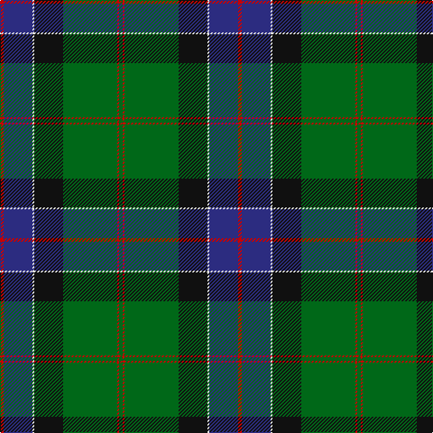

In pattern [GRGKWBR](/stripes/grgkwbr/).

This was sourced from register-of-tartans.  It is a [7 stripe tartan](/stripes/stripes7/).

Original link https://www.tartanregister.gov.uk/tartanDetails.aspx?ref=3797

## Also known as

This cloth is also recorded under:

- Sinclair Hunting
- Sinclair, hunting

## Attestations

This cloth appears in 4 source records; the oldest owns this page.

- undated — Sinclair Hunting (VS) (register-of-tartans, [record](https://www.tartanregister.gov.uk/tartanDetails.aspx?ref=3797))
- Unknown — Sinclair Htg (VS) (Clan) (tartans-authority, [record](http://www.tartansauthority.com/tartan-ferret/display/889/))
- undated — Sinclair, hunting (weddslist, [record](http://www.weddslist.com/cgi-bin/tartans/pg.pl?source=sts))
- undated — Sinclair Hunting Clan Tartan Tartan Number: 889. Earliest known date: 1842 Sinclairs wore a green tartan at the Battle of Flodden where the entire contingent were killed save the drummer. See products available Copyright © Blair Urquhart, Comrie, 2015 (house-of-tartan, [record](http://www.house-of-tartan.scotland.net/house/TartanViewjs.asp?colr=Def&tnam=889))

## Register references

External register numbers recorded for this tartan.

- Scottish Register of Tartans: [3797](https://www.tartanregister.gov.uk/tartanDetails.aspx?ref=3797)
- Scottish Tartans Authority (ITI): 889
- Scottish Tartans World Register: 889

## Thread count
R/4 DB32 LN2 K32 G60 R2 G/4

## Palette
Each colour and the base-6 reference it is a variant of.

| Colour | Shade | Base |
|---|---|---|
| DB | <code style="background-color:#2C2C80;">#2C2C80</code> `oklch(35.0% 0.138 276.6)` <small>#2C2C80</small> | B <code style="background-color:#2A418A;">#2A418A</code> |
| G | <code style="background-color:#006818;">#006818</code> `oklch(45.0% 0.142 145.0)` <small>#006818</small> | G <code style="background-color:#006100;">#006100</code> |
| K | <code style="background-color:#101010;">#101010</code> `oklch(17.3% 0.000 89.9)` <small>#101010</small> | K <code style="background-color:#000000;">#000000</code> |
| LN | <code style="background-color:#E0E0E0;">#E0E0E0</code> `oklch(90.7% 0.000 89.9)` <small>#E0E0E0</small> | W <code style="background-color:#F7F7F7;">#F7F7F7</code> |
| R | <code style="background-color:#C80000;">#C80000</code> `oklch(52.3% 0.215 29.2)` <small>#C80000</small> | R <code style="background-color:#CC0000;">#CC0000</code> |

# Sample pattern

## Nearest tartans

The nearest existing variants by ΔTartan distance.

1. [Mackay, John W. (Personal)](/setts/s9/k4g35lo1k18g3db18r3g3r3~x2/) — ΔT 0.63
1. [McFadden (Personal)](/setts/s8/db18dp2db16k13g3k2g42lo3~x2/) — ΔT 0.87
1. [Hutchens (Personal)](/setts/s9/db10k12dg3k1dg1k1dg30w4lo4~x2/) — ΔT 0.96
1. [Laurie Clan Tartan Tartan Number: 3201. Earliest known date: 2000 One of a set of three similar designs for Laurie, Lawrie and Lowry, designed by Peter MacDonald for Iain Laurie. See products available Copyright © Blair Urquhart, Comrie, 2015](/setts/s7/dp6r2dp1g25db16k2db4~x2/) — ΔT 1.00
1. [Sarafilovic (Corporate)](/setts/s9/r4db15k18g3k2g2k2g44ly4~x2/) — ΔT 1.09
1. [Lawrie Clan Tartan Tartan Number: 3202. Earliest known date: 2000 One of a set of three similar designs for Laurie, Lawrie and Lowry, designed by Peter MacDonald for Iain Laurie. See products available Copyright © Blair Urquhart, Comrie, 2015](/setts/s7/dp6o2dp1g25db16k2db4~x2/) — ΔT 1.12
1. [Young](/setts/s8/db3t3g30db25dp4r3ly2dp1~x2/) — ΔT 1.14
1. [Colquhoun](/setts/s7/db4k2db16w1k8dg24r4~x2/) — ΔT 1.16
1. [Dundas Clan Tartan Tartan Number: 1041. Earliest known date: 1842 The Dundas tartan originated in the Vestiarium Scoticum (1842). The design has the traditional green, black, blue background of the Highland military tartans with twin red stripes on the green. Dundas's played an important role in restoring the Highland way of life after the penalties imposed as a result of the '45 rebellion. It was Henry Dundas, who in 1784, introduced the bill to parliament restoring estates forfieted to the Crown after the uprising, following the repeal on the wearing of tartan in 1782. The Chief today is Sir David Dundas of Dundas, Bart. Appears in Edgars 'Old and Rare' See products available Copyright © Blair Urquhart, Comrie, 2015](/setts/s7/k4db16k12g24r1g2k2~x2/) — ΔT 1.17
1. [Sinclair Hunting](/setts/s7/dg2r1dg30k16lr1db16r2~x2/) — ΔT 1.17

## Neighbour map

Every grey dot is one of 14299 variants placed by the first two principal components of the ΔTartan feature space (44% of its variance). Red is this tartan; blue dots are its nearest — click one to open its page.

<svg viewBox="0 0 640 380" role="img" style="max-width:100%;height:auto;border:1px solid #e0e0e0;border-radius:4px;display:block" xmlns="http://www.w3.org/2000/svg"><image href="/nn/cloud.v1.png" width="640" height="380"/><a href="/setts/s9/k4g35lo1k18g3db18r3g3r3~x2/"><circle cx="294.5" cy="134.1" r="4" fill="#3465a4"><title>Mackay, John W. (Personal)</title></circle></a><a href="/setts/s8/db18dp2db16k13g3k2g42lo3~x2/"><circle cx="270.5" cy="160.1" r="4" fill="#3465a4"><title>McFadden (Personal)</title></circle></a><a href="/setts/s9/db10k12dg3k1dg1k1dg30w4lo4~x2/"><circle cx="311.7" cy="133.3" r="4" fill="#3465a4"><title>Hutchens (Personal)</title></circle></a><a href="/setts/s7/dp6r2dp1g25db16k2db4~x2/"><circle cx="299.7" cy="166.3" r="4" fill="#3465a4"><title>Laurie Clan Tartan Tartan Number: 3201. Earliest known date: 2000 One of a set of three similar designs for Laurie, Lawrie and Lowry, designed by Peter MacDonald for Iain Laurie. See products available Copyright © Blair Urquhart, Comrie, 2015</title></circle></a><a href="/setts/s9/r4db15k18g3k2g2k2g44ly4~x2/"><circle cx="302.6" cy="135.3" r="4" fill="#3465a4"><title>Sarafilovic (Corporate)</title></circle></a><a href="/setts/s7/dp6o2dp1g25db16k2db4~x2/"><circle cx="304.7" cy="169.9" r="4" fill="#3465a4"><title>Lawrie Clan Tartan Tartan Number: 3202. Earliest known date: 2000 One of a set of three similar designs for Laurie, Lawrie and Lowry, designed by Peter MacDonald for Iain Laurie. See products available Copyright © Blair Urquhart, Comrie, 2015</title></circle></a><a href="/setts/s8/db3t3g30db25dp4r3ly2dp1~x2/"><circle cx="268.8" cy="117.2" r="4" fill="#3465a4"><title>Young</title></circle></a><a href="/setts/s7/db4k2db16w1k8dg24r4~x2/"><circle cx="265.5" cy="175.1" r="4" fill="#3465a4"><title>Colquhoun</title></circle></a><a href="/setts/s7/k4db16k12g24r1g2k2~x2/"><circle cx="292.1" cy="190.9" r="4" fill="#3465a4"><title>Dundas Clan Tartan Tartan Number: 1041. Earliest known date: 1842 The Dundas tartan originated in the Vestiarium Scoticum (1842). The design has the traditional green, black, blue background of the Highland military tartans with twin red stripes on the green. Dundas's played an important role in restoring the Highland way of life after the penalties imposed as a result of the '45 rebellion. It was Henry Dundas, who in 1784, introduced the bill to parliament restoring estates forfieted to the Crown after the uprising, following the repeal on the wearing of tartan in 1782. The Chief today is Sir David Dundas of Dundas, Bart. Appears in Edgars 'Old and Rare' See products available Copyright © Blair Urquhart, Comrie, 2015</title></circle></a><a href="/setts/s7/dg2r1dg30k16lr1db16r2~x2/"><circle cx="292.9" cy="154.6" r="4" fill="#3465a4"><title>Sinclair Hunting</title></circle></a><circle cx="292.4" cy="150.1" r="5" fill="#c00000"/></svg>

ID: /setts/s7/r2db16w1k16g30r1g2~x2/
