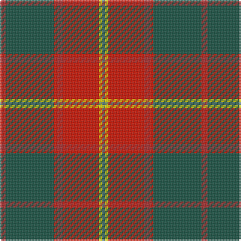

**Bands:** [RGRRRYG](/stripes/rgrrryg/) · **Stripes:** [R DG R R R LY Y](/stripes/stripes7/) R DG R R R LY Y

This was sourced from register-of-tartans.  It is a [7 band tartan](/bands/bands7/).

Original link https://www.tartanregister.gov.uk/tartanDetails.aspx?ref=10162

## Register references

External register numbers recorded for this tartan.

- Scottish Register of Tartans: [10162](https://www.tartanregister.gov.uk/tartanDetails.aspx?ref=10162)

## Thread count
DR/4 Ga32 R2 DR4 R24 Y2 G/2

## Palette
Each colour and its ΔE from the base-6 reference it is a variant of.

| Colour | Shade | Base | ΔE (OKLab) |
|---|---|---|---|
| DR | <code style="background-color:#A62A2A;">#A62A2A</code> `#A62A2A` | R <code style="background-color:#CC0000;">#CC0000</code> | 0.08 |
| G | <code style="background-color:#547C73;">#547C73</code> `#547C73` | G <code style="background-color:#006100;">#006100</code> | 0.17 |
| Ga | <code style="background-color:#165041;">#165041</code> `#165041` | G <code style="background-color:#006100;">#006100</code> | 0.10 |
| R | <code style="background-color:#CC1100;">#CC1100</code> `#CC1100` | R <code style="background-color:#CC0000;">#CC0000</code> | 0.01 |
| Y | <code style="background-color:#FFE600;">#FFE600</code> `#FFE600` | Y <code style="background-color:#F2BF00;">#F2BF00</code> | 0.10 |

# Sample pattern

## Nearest tartans

The nearest existing variants by ΔTartan distance.

1. [Unidentified 35](/setts/s7/db4dr2db2w2dr9o27r4~x3/) — ΔT 0.72
1. [Spragg (Name)](/setts/s7/r2g16r1r2r12ly1t1~x2/) — ΔT 0.80
1. [Leckie (Personal)](/setts/s7/r3db1r12o3dg12lb1dg2~x4/) — ΔT 0.99
1. [Duminiak (Trevose, Pennsylvania)](/setts/s6/y47w6r24w3dp5lo3~x2/) — ΔT 0.99
1. [Ulster Ancestry (Fashion)](/setts/s9/n47r8k22r7lb3r24n9r10lo3~x2/) — ΔT 1.11
1. [Bronte](/setts/s5/g24b2r25ly2k3~x2/) — ΔT 1.14
1. [Redpath, Robert A (Personal)](/setts/s8/r26n4r1p2dg1n4dg14w2~x2/) — ΔT 1.16
1. [21st Century (Fashion)](/setts/s8/w4dt38g6r2g6r38lo2r3~x2/) — ΔT 1.20
1. [Manitoba Masonic](/setts/s8/ly3n8w3n34r34g4r4w2~x2/) — ΔT 1.20
1. [Leach (1995)](/setts/s9/r24lb1k3lb1g14r8k3dp3lb2~x4/) — ΔT 1.25

## Neighbour map

Every grey dot is one of 14299 variants placed by the first two principal components of the ΔTartan feature space (44% of its variance). Red is this tartan; blue dots are its nearest — click one to open its page.

<svg viewBox="0 0 640 380" role="img" style="max-width:100%;height:auto;border:1px solid #e0e0e0;border-radius:4px;display:block" xmlns="http://www.w3.org/2000/svg"><image href="/nn/cloud.v1.png" width="640" height="380"/><a href="/setts/s7/db4dr2db2w2dr9o27r4~x3/"><circle cx="324.6" cy="160.6" r="4" fill="#3465a4"><title>Unidentified 35</title></circle></a><a href="/setts/s7/r2g16r1r2r12ly1t1~x2/"><circle cx="299.2" cy="152.4" r="4" fill="#3465a4"><title>Spragg (Name)</title></circle></a><a href="/setts/s7/r3db1r12o3dg12lb1dg2~x4/"><circle cx="275.0" cy="180.8" r="4" fill="#3465a4"><title>Leckie (Personal)</title></circle></a><a href="/setts/s6/y47w6r24w3dp5lo3~x2/"><circle cx="335.4" cy="166.8" r="4" fill="#3465a4"><title>Duminiak (Trevose, Pennsylvania)</title></circle></a><a href="/setts/s9/n47r8k22r7lb3r24n9r10lo3~x2/"><circle cx="253.9" cy="155.7" r="4" fill="#3465a4"><title>Ulster Ancestry (Fashion)</title></circle></a><a href="/setts/s5/g24b2r25ly2k3~x2/"><circle cx="284.0" cy="182.7" r="4" fill="#3465a4"><title>Bronte</title></circle></a><a href="/setts/s8/r26n4r1p2dg1n4dg14w2~x2/"><circle cx="347.2" cy="140.0" r="4" fill="#3465a4"><title>Redpath, Robert A (Personal)</title></circle></a><a href="/setts/s8/w4dt38g6r2g6r38lo2r3~x2/"><circle cx="291.8" cy="145.3" r="4" fill="#3465a4"><title>21st Century (Fashion)</title></circle></a><a href="/setts/s8/ly3n8w3n34r34g4r4w2~x2/"><circle cx="289.2" cy="130.3" r="4" fill="#3465a4"><title>Manitoba Masonic</title></circle></a><a href="/setts/s9/r24lb1k3lb1g14r8k3dp3lb2~x4/"><circle cx="330.7" cy="129.6" r="4" fill="#3465a4"><title>Leach (1995)</title></circle></a><circle cx="302.5" cy="154.1" r="5" fill="#c00000"/></svg>

ID: /setts/s7/r2dg16r1r2r12ly1y1~x2/
