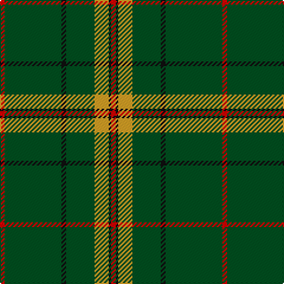

**Bands:** [RKYGKGR](/stripes/rkygkgr/) · **Stripes:** [R K LO DG K DG R](/stripes/stripes7/) R K LO DG K DG R

This was sourced from register-of-tartans.  It is a [7 band tartan](/bands/bands7/).

Original link https://www.tartanregister.gov.uk/tartanDetails.aspx?ref=11586

## Register references

External register numbers recorded for this tartan.

- Scottish Register of Tartans: [11586](https://www.tartanregister.gov.uk/tartanDetails.aspx?ref=11586)

## Thread count
R/4 G48 K4 G24 Y12 K2 R/4

## Palette
Each colour and its ΔE from the base-6 reference it is a variant of.

| Colour | Shade | Base | ΔE (OKLab) |
|---|---|---|---|
| G | <code style="background-color:#005020;">#005020</code> `#005020` | G <code style="background-color:#006100;">#006100</code> | 0.07 |
| K | <code style="background-color:#101010;">#101010</code> `#101010` | K <code style="background-color:#000000;">#000000</code> | 0.17 |
| R | <code style="background-color:#DC0000;">#DC0000</code> `#DC0000` | R <code style="background-color:#CC0000;">#CC0000</code> | 0.03 |
| Y | <code style="background-color:#E0A126;">#E0A126</code> `#E0A126` | Y <code style="background-color:#F2BF00;">#F2BF00</code> | 0.08 |

# Sample pattern

## Nearest tartans

The nearest existing variants by ΔTartan distance.

1. [Island Weavers (Corporate)](/setts/s10/g33db2g33r2db12r12g4r2g4w3~x2/) — ΔT 1.14
1. [Glenfeshie (Personal)](/setts/s9/r4g3dp3g44dp16g10w2g2dp2~x2/) — ΔT 1.14
1. [St. Christopher (Corporate)](/setts/s8/dg5r3dg3lo2dg1ly8dg24lo2~x2/) — ΔT 1.15
1. [Skene or Tribe of Mar](/setts/s5/r1k2dg16k2ly1~x2/) — ΔT 1.31
1. [Welsh Assembly (Fashion)](/setts/s8/g5o9g4w5g30r2g4r2~x2/) — ΔT 1.33
1. [Sir Billi](/setts/s10/dg12w5k11dg42k3dg42k11w5dg12r8~x2/) — ΔT 1.33
1. [Marshall University](/setts/s8/g25w1dg2w1g6k2w2dg3~x2/) — ΔT 1.40
1. [Kinfauns Castle (Corporate)](/setts/s6/r4dp12g2dp2g46w1~x2/) — ΔT 1.40
1. [Sarros (Personal) XX](/setts/s8/k2w2db8k4g33r2g16w2~x2/) — ΔT 1.43
1. [Celtic Pride](/setts/s8/g10lo3w2k2g8k22g43lo4~x2/) — ΔT 1.47

## Neighbour map

Every grey dot is one of 14299 variants placed by the first two principal components of the ΔTartan feature space (44% of its variance). Red is this tartan; blue dots are its nearest — click one to open its page.

<svg viewBox="0 0 640 380" role="img" style="max-width:100%;height:auto;border:1px solid #e0e0e0;border-radius:4px;display:block" xmlns="http://www.w3.org/2000/svg"><image href="/nn/cloud.v1.png" width="640" height="380"/><a href="/setts/s10/g33db2g33r2db12r12g4r2g4w3~x2/"><circle cx="414.5" cy="167.7" r="4" fill="#3465a4"><title>Island Weavers (Corporate)</title></circle></a><a href="/setts/s9/r4g3dp3g44dp16g10w2g2dp2~x2/"><circle cx="449.9" cy="147.7" r="4" fill="#3465a4"><title>Glenfeshie (Personal)</title></circle></a><a href="/setts/s8/dg5r3dg3lo2dg1ly8dg24lo2~x2/"><circle cx="442.4" cy="158.4" r="4" fill="#3465a4"><title>St. Christopher (Corporate)</title></circle></a><a href="/setts/s5/r1k2dg16k2ly1~x2/"><circle cx="489.5" cy="201.3" r="4" fill="#3465a4"><title>Skene or Tribe of Mar</title></circle></a><a href="/setts/s8/g5o9g4w5g30r2g4r2~x2/"><circle cx="434.0" cy="181.9" r="4" fill="#3465a4"><title>Welsh Assembly (Fashion)</title></circle></a><a href="/setts/s10/dg12w5k11dg42k3dg42k11w5dg12r8~x2/"><circle cx="406.3" cy="185.1" r="4" fill="#3465a4"><title>Sir Billi</title></circle></a><a href="/setts/s8/g25w1dg2w1g6k2w2dg3~x2/"><circle cx="472.2" cy="144.1" r="4" fill="#3465a4"><title>Marshall University</title></circle></a><a href="/setts/s6/r4dp12g2dp2g46w1~x2/"><circle cx="518.5" cy="140.9" r="4" fill="#3465a4"><title>Kinfauns Castle (Corporate)</title></circle></a><a href="/setts/s8/k2w2db8k4g33r2g16w2~x2/"><circle cx="406.6" cy="156.0" r="4" fill="#3465a4"><title>Sarros (Personal) XX</title></circle></a><a href="/setts/s8/g10lo3w2k2g8k22g43lo4~x2/"><circle cx="383.2" cy="151.2" r="4" fill="#3465a4"><title>Celtic Pride</title></circle></a><circle cx="472.7" cy="171.7" r="5" fill="#c00000"/></svg>

ID: /setts/s7/r2dg24k2dg12lo6k1r2~x2/
